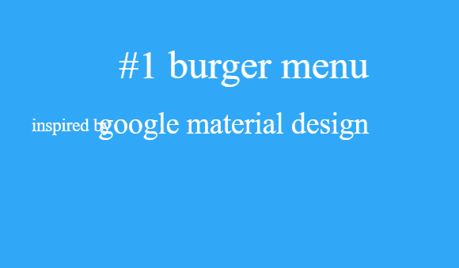

# Dương review bài học viên lớp FE-K3 Day10

## [Nguyễn Khắc Tú](https://tunguyenhd.github.io/FrontEnd-F8-K3)

    Sớm nhất*

- [x] [Bài 1](https://tunguyenhd.github.io/FrontEnd-F8-K3)

  Bài làm tốt \*

  Thiếu phần thông tin ở màn hình chính.

  Có thể sử dụng thuộc tính `hidden` trong `input:checkbox` thay vì `display: none`.

  Thay vì sử dụng size là 1000px \* 8 thì có thể viết là 8000px. Tuy nhiên vẫn chưa tối ưu. Có thể sử dụng viewport để tối ưu hơn.

- [x] [Bài 2](https://tunguyenhd.github.io/FrontEnd-F8-K3)

  Bài làm tốt \*

  Chưa có tab hiển thị trước cho màn hình chính.

  Nếu sử dụng input radio thì có thể sử dụng thuộc tính `checked` để mặc định cho input được chọn.

  Animation gần giống bản mẫu. Tuy nhiên cần xem "Kỹ" hơn.

  - Các phần tab được đổi nội dung sau khi xoay được một chút chứ không phải xoay quá nhiều.

- [x] [Bài 3](https://tunguyenhd.github.io/FrontEnd-F8-K3)

  Bài làm rất tốt \*

---

- [x] Đánh giá chung bài tập về nhà: Bài làm rất tốt. Cần chú ý tối ưu code và xem kỹ lại bản mẫu.

## [Bảo Anh](https://baoanh2004.github.io/Frontend-Offline-K3/Day-10)

- [x] [Bài 1](https://baoanh2004.github.io/Frontend-Offline-K3/Day-10)

  Cần chú ý hơn vào thẻ meta title vì chúng rất quan trọng trong SEO và trải nghiệm người dùng.

  Bài làm tốt \*

  Các phần thông tin ở màn hình chính bé hơn ở bản mẫu.

  Thay vì sử dụng size là 256vh||vw 8 thì có thể viết là 100vh||vw để xử lý tối ưu hơn.

- [x] [Bài 2](https://baoanh2004.github.io/Frontend-Offline-K3/Day-10)

  Bài làm tốt \*

  Animation gần giống bản mẫu. Tuy nhiên cần xem "Kỹ" hơn.

  - Các phần tab được đổi nội dung sau khi xoay được một chút chứ không phải sau khi xoay quá ít.

- [x] [Bài 3](https://baoanh2004.github.io/Frontend-Offline-K3/Day-10)

  Bài làm rất tốt \*

  Sau khi di chuột ra ngoài, bức thư có phần hơi giật xuống.

---

- [x] Đánh giá chung bài tập về nhà: Bài làm rất tốt. Cần chú ý tối ưu code và xem kỹ lại bản mẫu.

## [Nguyễn Đức Hải](https://duchainguyen.github.io/F8-FE-K3/day-10)

- [x] [Bài 1](https://duchainguyen.github.io/F8-FE-K3/day-10)

  Cần chú ý hơn vào thẻ meta title vì chúng rất quan trọng trong SEO và trải nghiệm người dùng.

  Bài làm tốt

  Các phần thông tin ở màn hình chính bé hơn ở bản mẫu.

  Phần hiệu ứng chuyển icon ở navbar chưa giống bản mẫu.

  Chưa làm action tương tác khi focus vào các navlink.

  Xử lý chưa tốt phần `.overlay`.

  Xử lý chưa tốt khiến hiện thanh cuộn ngang.

- [x] [Bài 2](https://duchainguyen.github.io/F8-FE-K3/day-10)

  Bài làm tốt \*

  Sai màu chữ của các tab.

  Animation gần giống bản mẫu. Tuy nhiên cần xem "Kỹ" hơn.

  - Các phần tab được đổi nội dung sau khi xoay được một chút chứ không phải sau khi xoay nhiều.

- [x] [Bài 3](https://duchainguyen.github.io/F8-FE-K3/day-10)

  Cần chú ý hơn vào thẻ meta title vì chúng rất quan trọng trong SEO và trải nghiệm người dùng.

  Bài làm chưa tốt \*

  Các hiệu ứng chưa giống bản mẫu.

---

- [x] Đánh giá chung bài tập về nhà: Bài làm tốt. Cần chú ý xem kỹ lại bản mẫu.

## [Gia Bảo Đỗ](https://dogiaba.github.io/F8-Fe-K3/Day10)

- [x] [Bài 1](https://dogiaba.github.io/F8-Fe-K3/Day10)

  Bài làm rất tốt \*

  Không cần thiết sử dụng animation mà chỉ cần sử dụng transition là đủ

- [x] [Bài 2](https://dogiaba.github.io/F8-Fe-K3/Day10)

  Bài làm tốt \*

  Chưa có tab hiển thị trước cho màn hình chính.

  Animation gần giống bản mẫu. Tuy nhiên cần xem "Kỹ" hơn.

  - Các phần tab được đổi nội dung sau khi xoay được một chút chứ không phải sau khi quá ít.

- [x] [Bài 3](https://dogiaba.github.io/F8-Fe-K3/Day10)

  Bài làm rất tốt \*

  Thừa một phần đóng thư khi phần lá thư được mở hết và đóng lại.

---

- [x] Đánh giá chung bài tập về nhà: Bài làm rất tốt. Cần chú ý xem kỹ lại bản mẫu để bài làm được tốt hơn.

## [Nguyễn Đình Khánh](https://khanhngoolearn.github.io/F8-homework-fe-k3/day10)

- [x] [Bài 1](https://khanhngoolearn.github.io/F8-homework-fe-k3/day10)

  Cần chú ý hơn vào thẻ meta title vì chúng rất quan trọng trong SEO và trải nghiệm người dùng.

  Bài làm tốt

  Tất cả các animate của bài làm đều không giống bản mẫu.

  Sai font chữ, font chữ ở bản mẫu là một font chữ không chân.

- [x] [Bài 2](https://khanhngoolearn.github.io/F8-homework-fe-k3/day10)

  Bài làm tốt \*

  Chưa có tab hiển thị trước cho màn hình chính.

  Animation gần giống bản mẫu. Tuy nhiên cần xem "Kỹ" hơn.

  - Các phần tab được đổi nội dung sau khi xoay được một chút chứ không phải sau khi quá ít.

  Có bug ở tab đầu tiên khi click vào tab đó thì nội dung của tab đó không hiển thị.

- [x] [Bài 3](https://khanhngoolearn.github.io/F8-homework-fe-k3/day10)

  Cần chú ý hơn vào thẻ meta title vì chúng rất quan trọng trong SEO và trải nghiệm người dùng.

  Bài làm rất tốt \*

  Thừa một phần đóng thư khi phần lá thư được mở hết và đóng lại.

  Chưa hoàn thiện, chưa vẽ xong hình lá thư.

  Bài làm sai màu.

---

- [x] Đánh giá chung bài tập về nhà: Bài làm tốt. Cần chú ý xem kỹ lại bản mẫu để bài làm được tốt hơn.

## [thuy nguyen](https://khanhngoolearn.github.io/F8-homework-fe-k3/day10)

- [x] [Bài 1](https://khanhngoolearn.github.io/F8-homework-fe-k3/day10)

  Bài làm rất tốt \*

  Các font chữ ở bản mẫu hơi bé hơn.

- [x] [Bài 2](https://khanhngoolearn.github.io/F8-homework-fe-k3/day10)

  Bài làm tốt \*

  Animation gần giống bản mẫu. Tuy nhiên cần xem "Kỹ" hơn.

  - Các phần tab được đổi nội dung sau khi xoay được một chút chứ không phải sau khi quá ít.

  Có bug ở khi click vào tab đó thì nội dung của tab đó bị giật.

- [x] [Bài 3](https://khanhngoolearn.github.io/F8-homework-fe-k3/day10)

  Bài làm rất tốt \*

---

- [x] Đánh giá chung bài tập về nhà: Bài làm tốt. Cần chú ý xem kỹ lại bản mẫu để bài làm được hoàn thiện.

## [Đỗ Ngọc Tiến](https://dongoctien17.github.io/F8-frontend-k3)

- [x] [Bài 1](https://dongoctien17.github.io/F8-frontend-k3)

  Bài làm chưa tốt

  Chưa xử lý animate chuyển icon ở navbar.

  Chưa xử lý tốt khiến hiện thanh cuộn ngang và dọc.

- [x] [Bài 2](https://dongoctien17.github.io/F8-frontend-k3)

  Bài làm tốt \*

  Animation gần giống bản mẫu. Tuy nhiên cần xem "Kỹ" hơn.

  - Các phần tab được đổi nội dung sau khi xoay được một chút chứ không phải sau khi quá ít.

- [x] [Bài 3](https://dongoctien17.github.io/F8-frontend-k3)

  Bài làm rất tốt \*

  Khi di chuột ra ngoài, bức thư hơi giật xuống.

---

- [x] Đánh giá chung bài tập về nhà: Bài làm tốt. Cần chú ý xem kỹ lại bản mẫu để bài làm được hoàn thiện.

## [Nguyen Le Quyen](https://github.com/NguyenLeQuyen2004/f8-frontend-k3/tree/main/Day10)

**Chưa gửi link Github page**

Cần cấu trúc lại folder để dễ quản lý hơn.

- [x] [Bài 1](https://github.com/NguyenLeQuyen2004/f8-frontend-k3/tree/main/Day10)

  Bài làm tốt

  Chưa xử lý animate chuyển icon ở navbar.

  Sai font chữ, font chữ ở bản mẫu là một font chữ không chân.

  Có một chút lỗi ở trang home

  

- [x] [Bài 2](https://github.com/NguyenLeQuyen2004/f8-frontend-k3/tree/main/Day10)

  Bài làm tốt \*

  Animation gần giống bản mẫu. Tuy nhiên cần xem "Kỹ" hơn.

  - Các phần tab được đổi nội dung sau khi xoay được một chút chứ không phải sau khi quá ít.

  Có một chút lỗi, khi click vào tab đó thì nội dung của tab đó bị giật.

- [x] [Bài 3](https://github.com/NguyenLeQuyen2004/f8-frontend-k3/tree/main/Day10)

  Bài làm rất tốt \*

---

- [x] Đánh giá chung bài tập về nhà: Bài làm rất tốt. Cần chú ý xem kỹ lại bản mẫu để bài làm được hoàn thiện.
