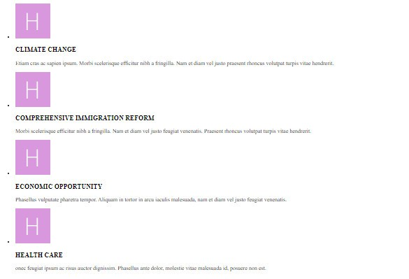

# Dương review bài học viên FE K3.

## [Nguyễn Đức Hải](https://github.com/duchainguyen/F8-FE-K3/tree/main/day-2)

    Sớm nhất *

- [x] [Bài 1](https://github.com/duchainguyen/F8-FE-K3/tree/main/day-2)

  Bài làm rất tốt \*

  Vì chưa học CSS nên có thể sử dụng `th` để gộp hàng tạo khoảng cách giữa các cột

  Nếu đã biết CSS, có thể sửa như sau:

  ```html
  <style>
    input {
      width: 80%; /*Sửa từ 100 về 80% để tạo khoảng trống ở giữa */
    }
    #_country {
      width: 80%;
    }
  </style>

  <th>First name</th>
  <!-- <th width="10%" rowspan="8"></th> -->
  <!-- Ẩn cột th thừa -->
  <th>Last name</th>
  ```

  Nếu có thể, sửa lại màu text bên trong `button` để giống bản mẫu hơn, sửa lại kích thước của `select`, hiện tại chiều cao và chiều rộng của `select` đều đang lệch so với các `input`.

---

- [x] [Bài 2](https://github.com/duchainguyen/F8-FE-K3/tree/main/day-2)

  Bài làm tốt
  Sử dụng thẻ `th` bừa bãi, sai semantic.

  ```html
  <th class="first-row" colspan="4">9+9</th>
  <th>1</th>
  <th>2</th>
  <th>3</th>
  <th>+</th>
  ...
  <th>C</th>
  <th>0</th>
  <th>=</th>
  <th>/</th>
  ```

  Tất cả các cột trên đều không phải là một tiêu đề, vì vậy. Nên sử dụng `td` thay cho `th`
  Đề xuất sửa thành:

  ```html
  <td class="first-row" colspan="4">9+9</td>
  <td>1</td>
  <td>2</td>
  <td>3</td>
  <td>+</td>
  ...
  <td>C</td>
  <td>0</td>
  <td>=</td>
  <td>/</td>
  ```

---

- [x] [Bài 3](https://github.com/duchainguyen/F8-FE-K3/tree/main/day-2)

  Bài làm tốt \*

  Các cột không có thì có thể bỏ qua, không cần thêm `td` vào

  ```html
  <td><input type="text" placeholder="* Enter your subject" /></td>
  <td></td>
  ```

  Đề xuất sửa thành:

  ```html
  <td><input type="text" placeholder="* Enter your subject" /></td>
  ```

  Phần `textarea` không nên đưa giá trị mặc định vào, nên để trống để người dùng tự nhập và chỉ đưa vào placeholder để cho người dùng biết cần nhập gì.

  ```html
  <textarea name="message">* Your message here </textarea>
  ```

  Đề xuất sửa thành:

  ```html
  <textarea name="message" placeholder="* Your message here"></textarea>
  ```

---

- [x] [Bài 4](https://github.com/duchainguyen/F8-FE-K3/tree/main/day-2)

  Bài làm rất tốt \*

---

- [x] [Bài 5](https://github.com/duchainguyen/F8-FE-K3/tree/main/day-2)

  Bài làm rất tốt \*

---

- Đánh giá chung bài tập về nhà: Bài tập làm rất tốt, chỉ có một số lỗi nhỏ về semantic, nhưng vẫn có thể sửa lại được.

## [Bảo Anh](https://github.com/Baoanh2004/Frontend-Offline-K3/tree/main/Day-2)

- [x] [Bài 1](https://github.com/Baoanh2004/Frontend-Offline-K3/tree/main/Day-2)

  Bài làm rất tốt \*

  Nên chú ý thêm về phần meta title, vì nó rất quan trọng trong SEO và trải nghiệm người dùng

---

- [x] [Bài 2](https://github.com/Baoanh2004/Frontend-Offline-K3/tree/main/Day-2)

  Bài làm rất tốt \*

  Nên chú ý thêm về phần meta title, vì nó rất quan trọng trong SEO và trải nghiệm người dùng

---

- [x] [Bài 3](https://github.com/Baoanh2004/Frontend-Offline-K3/tree/main/Day-2)

  Bài làm rất tốt \*

  Nên chú ý thêm về phần meta title, vì nó rất quan trọng trong SEO và trải nghiệm người dùng

---

- [x] [Bài 4](https://github.com/Baoanh2004/Frontend-Offline-K3/tree/main/Day-2)

  Vì đây là một list bài viết, chú ý dấu chấm của list ở đầu mỗi list.

  

  Nên sử dụng thẻ `ul>li` để làm list, thay vì không có như hiện tại.

---

- [x] [Bài 5](https://github.com/Baoanh2004/Frontend-Offline-K3/tree/main/Day-2)

  Bài làm tốt

  Vì các phần này là các tiêu đề trong section `footer`, nên sử dụng thẻ `heading` thay vì thẻ `span` như hiện tại

  ```html
  <span>About Us</span>
  <span>Quick Links</span>
  <span>Follow Us</span>
  ```

  Đề xuất sửa thành:

  ```html
  <h2>About Us</h2>
  <h2>Quick Links</h2>
  <h2>Follow Us</h2>
  ```

---

- Đánh giá chung bài tập về nhà: Bài tập làm tốt, chỉ có một số lỗi nhỏ về semantic, nhưng vẫn có thể sửa lại được.

## [Nguyễn Khắc Tú](https://github.com/tunguyen34hd/FrontEnd-F8-Offline/tree/main/Bai_tap/Day_2)

- [x] [Bài 1](https://github.com/tunguyen34hd/FrontEnd-F8-Offline/tree/main/Bai_tap/Day_2)

  Bài làm tốt

  Các phần title của các cột || hàng tương ứng nên sử dụng thẻ `th` thay vì `td`

  ```html
  <td><b>First Name</b></td>
  <td><b>Last Name</b></td>
  <td><b>Email address</b></td>
  <td><b>Address</b></td>
  <td><b>City</b></td>
  <td><b>State</b><span> (optional)</span></td>
  <td><b>Zip code</b></td>
  <td><b>Country</b></td>
  ```

  Đề xuất sửa thành:

  ```html
  <th align="left">First Name</th>
  <th align="left">Last Name</th>
  <th align="left">Email address</th>
  <th align="left">Address</th>
  <th align="left">City</th>
  <th align="left">State<span> (optional)</span></th>
  <th align="left">Zip code</th>
  <th align="left">Country</th>
  ```

  Phần chọn state trong bản mẫu là một `select`, nên sử dụng thẻ `select` thay vì `input`

  ```html
  <td><input type="text" placeholder="" /></td>
  ```

  Đề xuất sửa thành:

  ```html
  <td>
    <select name="state" id="state">
      <option value="state">State</option>
      <option value="state">State</option>
      <option value="state">State</option>
      <option value="state">State</option>
    </select>
  </td>
  ```

---

- [x] [Bài 2](https://github.com/tunguyen34hd/FrontEnd-F8-Offline/tree/main/Bai_tap/Day_2)

  Bài làm tốt \*

  Trong bản mẫu, phần hiển thị kết quả && phép tính không có in đậm. Vì vậy, không nên thêm thẻ `<b>` vào

  ```html
  <td colspan="4" style="text-align: right"><b>9 x 9</b></td>
  ```

  Đề xuất sửa thành:

  ```html
  <td colspan="4" style="text-align: right">9 x 9</td>
  ```

---

- [x] [Bài 3](https://github.com/tunguyen34hd/FrontEnd-F8-Offline/tree/main/Bai_tap/Day_2)

  Bài làm không tốt \*

  Thẻ `<br>` chỉ được sử dụng để ngắt dòng trong một đoạn văn, không được sử dụng để tạo khoảng trống giữa các phần tử.

  ```html
  <input type="text" placeholder="* Enter your email address" />
  <br />
  <input ... />
  <br />
  <textarea ...></textarea>
  <br />
  <button>send message</button>
  ```

  Phần input để nhập email nên sử dụng `type="email"` để kiểm tra email nhập vào có đúng định dạng hay không.

---

- [x] [Bài 4](https://github.com/tunguyen34hd/FrontEnd-F8-Offline/tree/main/Bai_tap/Day_2)

  Bài làm rất tốt \*

---

- [x] [Bài 5](https://github.com/tunguyen34hd/FrontEnd-F8-Offline/tree/main/Bai_tap/Day_2)

  Bài làm tốt

  Thuộc tính `href` trong thẻ `a` bắt buộc có value. Nếu không có value thì có thể sử dụng `#` || `#!`

---

- Đánh giá chung bài tập về nhà: Bài tập làm tốt, chỉ có một số lỗi nhỏ về semantic, nhưng vẫn có thể sửa lại được.

## [Đỗ Ngọc Tiến](https://github.com/DoNgocTien17/F8-frontend-k3/tree/main/Day-2)

- [x] [Bài 1](https://github.com/DoNgocTien17/F8-frontend-k3/tree/main/Day-2)

  Thuộc tính `for` thẻ `label` sử dụng để liên kết với `id` của `input` || `select` || `textarea` để khi click vào `label` thì sẽ focus vào `input` || `select` || `textarea` tương ứng.

  ```html
  <label for="">Email address</label>
  <input type="text" placeholder="john@example.com" />
  ```

  Đề xuất sửa thành:

  ```html
  <label for="email">Email address</label>
  <input type="text" id="email" placeholder="john@example.com" />
  ```

  Input sử dụng để nhập email nên có `type="email"` để kiểm tra email nhập vào có đúng định dạng hay không.

  Sai chính tả `qptional` => `optional`

  Phần chọn country là một `select`, nên sử dụng thẻ `select` thay vì `input`

  ```html
  <label for="">Country</label>
  <input type="text" placeholder="United Kingdom" />
  ```

  Đề xuất sửa thành:

  ```html
  <label for="country">Country</label>
  <select name="country" id="country">
    <option value="country">United Kingdom</option>
    <option value="country">United Kingdom</option>
    <option value="country">United Kingdom</option>
    <option value="country">United Kingdom</option>
  </select>
  ```

  Layout chưa giống với bản mẫu, có phần hơi xấu. Nên xem lại phần layout.

---

- [x] [Bài 2](https://github.com/DoNgocTien17/F8-frontend-k3/tree/main/Day-2)

  Bài làm tốt \*

  Nên chú ý tới thẻ meta title vì nó rất quan trọng trong SEO và trải nghiệm người dùng

---

- [x] [Bài 3](https://github.com/DoNgocTien17/F8-frontend-k3/tree/main/Day-2)

  Bài làm tốt

  Nên chú ý tới thẻ meta title vì nó rất quan trọng trong SEO và trải nghiệm người dùng

  Code không format rất khó nhìn.

---

- [x] [Bài 4](https://github.com/DoNgocTien17/F8-frontend-k3/tree/main/Day-2)

  Bài làm tốt

  Nên chú ý tới thẻ meta title vì nó rất quan trọng trong SEO và trải nghiệm người dùng

  Chưa rõ ý đồ của thẻ `div` đang bao bọc thẻ `img`

  ```html
  <div>
    
  </div>
  ```

  Không nên set cả chiều rộng và chiều cao cho img vì có thể làm ảnh bị méo, sai tỷ lệ, khi muốn thay đổi kích thước ảnh thì phải tính toán và thay đổi cả 2.

  Các phần title trong list các bài viết là các title quan trọng chỉ sau title chính. Nên sử dụng thẻ `h2` thay vì `h3`

  ```html
  <h3>...</h3>
  ```

  Đề xuất sửa thành:

  ```html
  <h2>>...</h2>
  ```

  Code không format rất khó nhìn.

---

- [x] [Bài 5](https://github.com/DoNgocTien17/F8-frontend-k3/tree/main/Day-2)

  Nên chú ý tới thẻ meta title vì nó rất quan trọng trong SEO và trải nghiệm người dùng

  Các phần title chính trong từng phần của `footer` nên sử dụng các thẻ `heading` thay vì thẻ `span`

  ```html
  <span>About us</span>
  <span>Quick Links</span>
  <span>Follow Us</span>
  ```

  Đề xuất sửa thành:

  ```html
  <h2>About us</h2>
  <h2>Quick Links</h2>
  <h2>Follow Us</h2>
  ```

  Các icon trong bài là một đường dẫn, nên sử dụng thẻ `a` để bao bọc các icon

  ```html
  <li><i class="fa-brands fa-facebook"></i></li>
  ```

  Đề xuất sửa thành:

  ```html
  <li>
    <a href="#"><i class="fa-brands fa-facebook"></i></a>
  </li>
  ```

---

- Đánh giá chung bài tập về nhà: Bài tập làm chưa tốt, có nhiều lỗi về semantic, cách sử dụng thẻ, cách sử dụng thuộc tính. Nên xem lại phần layout và cách sử dụng thẻ.

## [Nguyen Tuan Anh](https://github.com/fanbaday/f8-fullstack-offline-K3/tree/main/Day2)

- [x] [Bài 1](https://github.com/fanbaday/f8-fullstack-offline-K3/tree/main/Day2)

  Các phần title của các cột || hàng tương ứng nên sử dụng thẻ `th` thay vì `td`

  ```html
  <td>First name</td>
  <td>Last name</td>
  <td>Email address</td>
  <td>Address</td>
  <td>City</td>
  <td>State (optional)</td>
  <td>ZIP code</td>
  <td>Country</td>
  ```

  Đề xuất sửa thành:

  ```html
  <th>First name</th>
  <th>Last name</th>
  <th>Email address</th>
  <th>Address</th>
  <th>City</th>
  <th>State (optional)</th>
  <th>ZIP code</th>
  <th>Country</th>
  ```

  Phần input nhập email nên sử dụng `type="email"` để kiểm tra email nhập vào có đúng định dạng hay không.

  Phần chọn Country là một `select`, nên sử dụng thẻ `select` thay vì `input`

  ```html
  <td>
    <input type="text" />
  </td>
  ```

  Cần chú ý thêm về phần meta title, vì nó rất quan trọng trong SEO và trải nghiệm người dùng

  Cần format lại code, quá xấu, quá khó đọc.

---

- [x] [Bài 2](https://github.com/fanbaday/f8-fullstack-offline-K3/tree/main/Day2)

  Thẻ `th` chỉ được sử dụng khi đó là một tiêu đề của cột || hàng tương ứng. Không được sử dụng để thể hiện data của các cột. Việc thể hiện đó đã được thẻ `td`(table data) thể hiện

  ```html
  <th colspan="4" align="right">9+9</th>
  ...
  <th>x</th>
  <th>x</th>
  <th>x</th>
  <th>x</th>
  ```

  Đề xuất sửa thành:

  ```html
  <td colspan="4" align="right">9+9</td>
  ...
  <td>x</td>
  <td>x</td>
  <td>x</td>
  <td>x</td>
  ```

  Không có file `main.css` ở cùng cấp với file `index.html`, nên không thể sử dụng được file `main.css`

  ```html
  <link rel="stylesheet" href="./main.css" />
  ```

  Cần chú ý hơn vào phần meta title, vì nó rất quan trọng trong SEO và trải nghiệm người dùng

  Format lại code, quá xấu, quá khó đọc.

---

- [x] [Bài 3](https://github.com/fanbaday/f8-fullstack-offline-K3/tree/main/Day2)

  Phần title chính của trang nên sử dụng `h1` thay vì `h2`

  ```html
  <h2>Get in touch with us by filling contact form below</h2>
  ```

  Đề xuất sửa thành:

  ```html
  <h1>Get in touch with us by filling contact form below</h1>
  ```

  Phần input nhập email nên sử dụng `type="email"` để kiểm tra email nhập vào có đúng định dạng hay không.

  ```html
  <input type="text" name="" id="" placeholder="* Enter your email address" />
  ```

  Các attribute `name` && `id` nên có giá trị, không nên để trống hoặc nếu không có thì nên xóa đi.

  Đặt tên className không hợp lý:

  ```html
  <div class="info1">...</div>
  <div class="info1">...</div>
  ```

  Đề xuất sửa thành:

  ```html
  <div class="info">...</div>
  <div class="info">...</div>
  ```

  Cần chú ý hơn vào phần meta title, vì nó rất quan trọng trong SEO và trải nghiệm người dùng.

  Format lại code, quá xấu, quá khó đọc.

---

- [x] [Bài 4](https://github.com/fanbaday/f8-fullstack-offline-K3/tree/main/Day2)

  Thẻ `h1` được dùng để thể hiện tiêu đề **QUAN TRỌNG NHẤT!** của trang web, không được sử dụng cho nhiều tiêu đề trên một trang web.

  ```html
  <h1>CLIMATE CHANGE</h1>
  <h1>CLIMATE CHANGE</h1>
  <h1>CLIMATE CHANGE</h1>
  <h1>CLIMATE CHANGE</h1>
  ```

  Trong HTML, không có thẻ nào là thẻ `<P>` cả, chỉ có thẻ `<p>` thôi.

  Cần chú ý thêm về phần meta title, vì nó rất quan trọng trong SEO và trải nghiệm người dùng

  Ở các danh sách bài viết, hình ảnh thường để biểu thị cho bài viết đó. Vì vậy, thuộc tính `alt` của `img` nên có giá trị, không nên để trống.

  ```html
  
  ```

  Không nên sử dụng đường dẫn `/` vì có thể gây lỗi khi deploy lên server.

  Đề xuất sửa thành:

  ```html
  
  ```

  Không có file `main.css` ở cùng cấp với file `index.html`, nên không thể sử dụng được file `main.css`

  ```html
  <link rel="stylesheet" href="./main.css" />
  ```

  Cần chú ý hơn vào phần meta title, vì nó rất quan trọng trong SEO và trải nghiệm người dùng.

  Format lại code, quá xấu, quá khó đọc.

---

- [x] [Bài 5](https://github.com/fanbaday/f8-fullstack-offline-K3/tree/main/Day2)

  Thẻ `h1` được dùng để thể hiện tiêu đề **QUAN TRỌNG NHẤT!** của trang web, không được sử dụng cho nhiều tiêu đề trên một trang web.

  ```html
  <h1>About us</h1>
  <h1>Quick links</h1>
  <h1>Follow Us</h1>
  ```

  Đề xuất sửa thành:

  ```html
  <h2>About us</h2>
  <h2>Quick links</h2>
  <h2>Follow Us</h2>
  ```

  Thuộc tính `href` trong thẻ `a` bắt buộc có value. Nếu không có value thì có thể sử dụng `#` || `#!`

  ```html
  <li><a href="">...</a></li>
  ```

  Đề xuất sửa thành:

  ```html
  <li><a href="#">...</a></li>
  ```

---

- Đánh giá chung bài tập về nhà: Bài tập làm **KHÔNG TỐT**,
  có nhiều lỗi về semantic, cách sử dụng thẻ, cách sử dụng thuộc tính.
  Nên xem lại phần layout và cách sử dụng thẻ.

  \* Lưu ý: CODE LẠI TOÀN BỘ. KHÔNG SỬA LẠI CODE CŨ.

## [Gia Bảo Đỗ](https://github.com/Dogiaba/F8-Fe-K3/tree/main/Day2)

- [x] [Bài 1](https://github.com/Dogiaba/F8-Fe-K3/tree/main/Day2)

  Bài làm tốt \*

  Phần button submit không phải là một tiêu đề trong bảng. Không nên bọc bằng thẻ `th`

  ```html
  <th><button type="submit">SEND ME FREE COFEE</button></th>
  ```

  Sai chính tả `COFEE` => `COFFEE`

  Đề xuất sửa thành:

  ```html
  <td>
    <button type="submit">SEND ME FREE COFFEE</button>
  </td>
  ```

  Nếu muốn `submit` được `form` thì `.form-input` cần là thẻ form và các field cần có thuộc tính `name`

  ```html
  <div class="form-input">...</div>
  ```

  Đề xuất sửa thành:

  ```html
  <form class="form-input">...</form>
  ```

---

- [x] [Bài 2](https://github.com/Dogiaba/F8-Fe-K3/tree/main/Day2)

  Bài làm tốt \*

  Phần hiển thị kết quả && phép tính không phải là một tiêu đề của bảng. Không nên bọc bằng thẻ `th`

  ```html
  <th colspan="4">9 + 9</th>
  ```

  Đề xuất sửa thành:

  ```html
  <td colspan="4">9 + 9</td>
  ```

---

- [x] [Bài 3](https://github.com/Dogiaba/F8-Fe-K3/tree/main/Day2)

---

- [x] [Bài 4](https://github.com/Dogiaba/F8-Fe-K3/tree/main/Day2)

---

- [x] [Bài 5](https://github.com/Dogiaba/F8-Fe-K3/tree/main/Day2)

---

- Đánh giá chung bài tập về nhà: Bài tập làm
