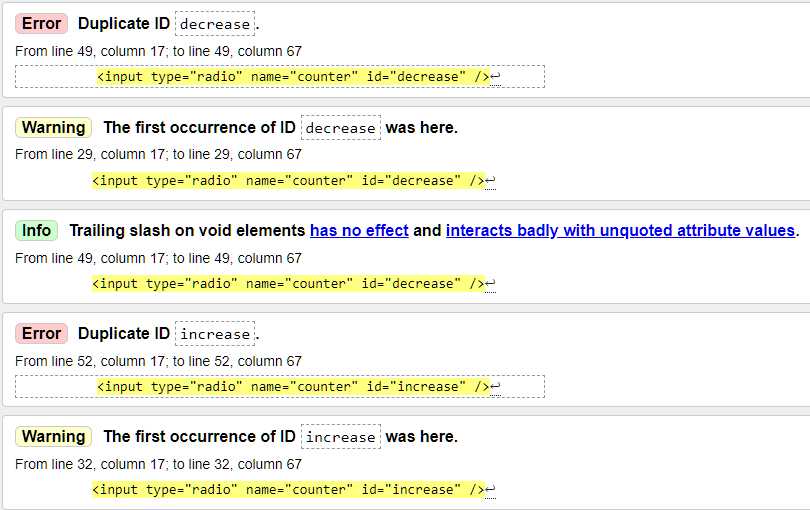

# Dương review bài học viên FE K3.

## [Nguyễn Đức Hải](https://duchainguyen.github.io/F8-FE-K3/day-8/deloy.html)

    Sớm nhất*

- [x] [Bài 1](https://duchainguyen.github.io/F8-FE-K3/day-8/deloy.html)

  Bài làm tốt \*

  Ở giao diện mẫu, padding vào trong của mega menu lớn hơn.

  Ở giao diện mẫu mọi list-item đều căn trái chứ không phải căn giữa.

  Vị trí các list-item không đúng với giao diện mẫu.

  Vì phần menu navbar và mega menu là một phần điều hướng nên nên đặt chung trong một thẻ nav.

  Không nên sử dụng font-weight 700 ở \* vì nó sẽ làm cho font bị mất chất, mỗi lần muốn sử dụng thì phải đưa về font-weight mong muốn.

  HTML5 bổ xung thêm một số thẻ bao bọc semantics như `header...`. Nên sử dụng chúng để tăng khả năng đọc hiểu source code.

  Phần `div.logo-img` sử dụng max-width nhưng thẻ img không có width 100% nên không có tác dụng.

  Không nên đặt tên class như `menu-item-1, menu-item-2...` vì nó không nói lên được nội dung của nó, và khi cần thêm một menu-item mới thì phải sửa lại tên class.

  - Như trường hợp này là một ví dụ:

  ```css
  .menu-item-1 li:nth-child(4),
  .menu-item-4 li:nth-child(1),
  .menu-item-5 li:nth-child(1),
  .menu-item-5 li:nth-child(5),
  .menu-item-5 li:nth-child(4),
  .menu-item-2 li:nth-child(1),
  .menu-item-2 li:nth-child(3),
  .menu-item-2 li:nth-child(4),
  .menu-item-2 li:nth-child(5),
  .menu-item-2 li:nth-child(8) {
    opacity: 0;
  }
  ```

  - Nên đặt tên class như sau:

  ```css
  .menu-item li {
    opacity: 0;
  }
  ```

  - Hơn nữa khi muốn tạo một khoảng trống, không nên cho content vào rồi để opacity: 0 mà nên sử dụng `margin` hoặc `padding` để tạo khoảng trống.

  Nên bổ dung hiệu ứng highlight màu cho menu-nav khi hover vào mega menu con của nó.

  Thiếu background nền.

- [x] [Bài 2](https://duchainguyen.github.io/F8-FE-K3/day-8/deloy.html)

  Bài làm tốt \*

  Ở HTML5 có thêm các thẻ bao bọc semantics như `header, footer, main, section...` nên nên sử dụng chúng để tăng khả năng đọc hiểu source code.

  Đang có một chút lỗi về giao diện khiến hiện thanh scroll ngang:

  

  Không nên sử dụng `padding: 10px 0` để căn giữa ảnh ở 1 `div.logo-car` vì nếu resize kích thước div thì có thể sẽ khiến bức ảnh không còn được căn giữa theo chiều dọc.

  

  - Các dễ nhất để căn giữa một bức ảnh theo div cha theo chiều dọc là:

  ```css
  .logo-car {
    display: flex;
    justify-content: center;
    align-items: center;
  }
  ```

  <!-- Hoặc -->

  ```css
  .logo-car {
    position: relative;
  }
  .logo-car img {
    position: absolute;
    top: 50%;
    left: 50%;
    transform: translate(-50%, -50%);
  }
  ```

  <!-- Hoặc -->

  ```css
  .logo-car {
    display: grid;
    place-items: center;
  }
  ```

  ID trong 1 trang web chỉ nên sử dụng 1 lần, nên sử dụng class thay thế.

  

  Phần mini cart nên sử dụng thẻ `aside` để bao bọc.

  Tiêu đề của mini cart không phải là một `heading`, không nên sử dụng `h2` mà nên sử dụng `p` hoặc `span`.

  Tất cả các heading bên trong đều chỉ là đầu mục, không nên sử dụng `heading` mà nên sử dụng `p` hoặc `span`.

  Hình ảnh của sản phẩm trong giỏ hàng cần một giá trị alt đủ ý nghĩa thích hợp thay vì để trống vì khi hình ảnh không hiển thị thì sẽ không có giá trị nào để thay thế.

  Màu chữ ở các `.title` bị sai với giao diện mẫu.

  Phần font-weight ở `.foot-text span` cân đậm hơn.

  Phần hiển thị chữ ở `.item-price span` sai với giao diện mẫu.

  Các màu chữ ở `.counter` sai với giao diện mẫu.

  Phần `.title-h2 h2` cần cho font chữ nhỏ hơn và font-weight đậm hơn.

  Nếu là tiêu đề chính, nên sử dụng một class như `.main-title` thay vì class `.title-h2`.

  Phần màu của đường kẻ tại `.product::before` cần cho nhạt hơn.

  Nên chia rõ hơn các product nên gom nhóm vào một class là `.products` để có thể xử lý tốt hơn.

  Các phần thông tin phụ như tổng tiền, lưu ý, các nút button nên bao bọc bằng một thẻ `footer`.

  **Ở bài rút gọn**. Hầu hết các lỗi đều giống ở bài chính, chỉ trừ việc không bị hiện thanh scroll ngang.

  Nên chú ý thêm vào thẻ meta title vì chúng rất quan trọng trong SEO và trải nghiệm người dùng.

- [x] [Bài 3](https://duchainguyen.github.io/F8-FE-K3/day-8/deloy.html)

  Bài làm rất tốt \*

  Font chữ ở các phần title đều sai, ở bản mẫu sử dụng một font chữ có chân nhọn.

  Sai chính tả **Read-Mode** thành **Read More**.

  Phần `.content` thiếu khoảng cách phía dưới.

---

- [x] Đánh giá chung bài tập về nhà: Bài làm rất tốt, chỉ có một số lỗi nhỏ về giao diện và sai chính tả. Cần chú ý thêm về việc sử dụng các thẻ bao bọc semantics để tăng khả năng đọc hiểu source code. Nên chú ý thêm vào thẻ meta title vì chúng rất quan trọng trong SEO và trải nghiệm người dùng.

## [Nguyen Le Quyen (FPL HN)](https://github.com/NguyenLeQuyen2004/f8-frontend-k3/tree/main/Day8/Baitap)

    Sớm nhất*

- [x] [Bài 1](file:///D:/F8_Office/Review_GIT/F8-FE-K3/NguyenLeQuyen2004/f8-frontend-k3/Day8/Baitap/ex01.html)

  Bài làm rất tốt\*

  Chú ý kỹ hơn về `font-weight` thiết kế bài mẫu

  Các icon như **info** và **search** cần bổ sung action khi `hover` dùng `cursor: pointer` để tăng trải nghiệm người dùng.

- [x] [Bài 2](https://github.com/NguyenLeQuyen2004/f8-frontend-k3/blob/main/Day8/Baitap/ex02.html)

  Bài làm tốt

  Phần hiển thị số lượng sản phẩm trong giỏ hàng không nên dùng `::after` sau này tương tác với backend hơi rắc rối. Nên dùng thẻ `span`.

  Nút xoá sản phẩm cũng không dùng `::after`, nên dùng `span` để sau này dễ dàng xử lý sự kiện.

  Phần **product** nên cho vào `div` là **product-lists** bọc lại và dùng `overflow-Y: scroll` theo trục Y và đặt max-height để khi người dùng thêm nhiều sản phẩm giúp phần **cart** được gọn gàng hơn.

  Nên đặt tên class đúng ngữ cảnh, tường minh tránh kiểu **box-1** có thể chia thành **box-left**, **box-right**.

  Để ý phần `font-family` đang dùng là font không chân.

- [x] [Bài 3](https://github.com/NguyenLeQuyen2004/f8-frontend-k3/blob/main/Day8/Baitap/ex03.html)

  Bài làm chưa tốt

  Chưa đúng với thiết kế bài mẫu.

  Nội dung mô tả trong các div chưa co đều lại.

  Các `button` đang bị dính sát vào phần nội dung, và không đều nhau.

---

- [x] Đánh giá chung bài tập về nhà: Bài làm tốt, chú ý kỹ về thiết kế ở bài mẫu, phân tích layout kỹ trước khi làm. Nên xem lại cách đặt tên class tường minh hơn, đúng ngữ cảnh hơn.

## [Vũ Thành Khang](https://github.com/countduck4819/f8-frontend/tree/main/Day8)

- [x] [Bài 1](https://github.com/countduck4819/f8-frontend/tree/main/Day8)

  Bài làm chưa tốt

  Nên hiển thị **MEGA MENU** với nền trắng theo đúng thiết kế.

  Xử lý nút khi `hover` chưa tốt. Khi `hover` trỏ xuống phần **MEGA MENU** sẽ bị mất luôn.

  Các icon như **info** và **search** cần bổ sung action khi `hover` dùng `cursor: pointer` để tăng trải nghiệm người dùng. Nút **info** đang bị méo

- [x] [Bài 2](https://github.com/countduck4819/f8-frontend/tree/main/Day8)

  Bài làm chưa tốt

  Phần **items** không đúng với thiết kế bài mẫu. Không nên dùng `background-color`.

  Phần **increment** thiết kế sai.

- [x] [Bài 3](https://github.com/countduck4819/f8-frontend/tree/main/Day8)

  Bài làm tốt

  Chú ý phần hình ảnh không nên để cứng cả `width` và `height`. Chỉ nên để cứng 1 trong cái `width` hoặc `height`.

  Nên sử dụng `display: flex` trong các thẻ `li` để căn chỉnh các item con bên trong, không dùng `margin` cho nội dung item mà nên dùng `padding`

  Không nên reset CSS `text-align: center`

---

- [x] Đánh giá chung bài tập về nhà: Bài làm đa số đều chưa hoàn thiện tốt, chưa đúng với bản mẫu. Cần chú ý chỉn chu hơn vào tiểu tiết và giao diện mẫu để làm đúng.

## [Gia Bảo Đỗ](https://github.com/Dogiaba/F8-Fe-K3/tree/main/Day8)

- [x] [Bài 1](https://github.com/Dogiaba/F8-Fe-K3/tree/main/Day8)

  Bài làm rất tốt

  Chú ý kỹ hơn về `font-weight` cho các text theo như thiết kế bài mẫu.

  Chú ý các icon xổ xuống bé hơn xíu như bài mẫu.

  Các icon như **info** và **search** cần bổ sung action khi `hover` dùng `cursor: pointer` để tăng trải nghiệm người dùng.

  Chú ý dùng `transform: all 0.4s ease;` là sai.

- [x] [Bài 2](https://github.com/Dogiaba/F8-Fe-K3/tree/main/Day8)

  Bài làm tốt \*

  Phần hiển thị số lượng sản phẩm trong giỏ hàng không nên dùng `::after` sau này tương tác với backend hơi rắc rối. Nên dùng thẻ `span`. Căn chỉnh lại số lượng ra giữa.

  Chú ý phần **quantity_product** thiết kế chưa giống với bài mẫu. Chưa có action khi `hover` vào nút tăng giảm, dùng `cursor: pointer` để tăng trải nghiệm người dùng.

  Phần **products** nên đặt max-height và dùng `overflow-Y: scroll` theo trục Y để khi người dùng thêm nhiều sản phẩm giúp phần **cart** được gọn gàng hơn.

- [x] [Bài 3](https://github.com/Dogiaba/F8-Fe-K3/tree/main/Day8)

  Bài làm chưa tốt

  Có ý tưởng chia layout, bố cục các item đúng nhưng chưa sát với thiết kế bài mẫu.

  Code lại.

---

- [x] Đánh giá chung bài tập về nhà: Bài làm đa số đều hoàn thiện tốt. Nên chú ý phân tích layout trước khi làm. Cần chú ý chỉn chu hơn vào tiểu tiết và giao diện mẫu để làm đúng.

## [thuy nguyen](https://github.com/tnnhungoc/F8-FE-K3/tree/main/FEK3/Day8)

- [x] [Bài 1](https://github.com/tnnhungoc/F8-FE-K3/tree/main/FEK3/Day8)

  Bài làm rất tốt

  Chú ý kỹ hơn về `font-weight` cho các text theo như thiết kế bài mẫu.

  Các icon như **info** và **search** cần bổ sung action khi `hover` dùng `cursor: pointer` để tăng trải nghiệm người dùng.

- [x] [Bài 2](https://github.com/tnnhungoc/F8-FE-K3/tree/main/FEK3/Day8)

  Bài làm tốt \*

  Chú ý các hình ảnh sản phẩm đều nằm trong 1 nền màu.

  Chú ý `button` add cần đặt `background-color` theo thiết kế bài mẫu.

  Nên nhóm các **item** vào trong **items** chứ không tách lẻ ra.

  Phần **items** nên đặt max-height và dùng `overflow-Y: scroll` theo trục Y để khi người dùng thêm nhiều sản phẩm giúp phần **cart** được gọn gàng hơn.

  Chú ý cách đặt class cần đúng ngữ cảnh, tường minh. Ví dụ **items** là số nhiều thì bên trong **items** phải có nhiều **item**.

  Nên thêm sự kiện `hover` cho các nút xoá sản phẩm `cursor: pointer` để tăng tính trải nghiệm người dùng.

- [x] [Bài 3](https://github.com/tnnhungoc/F8-FE-K3/tree/main/FEK3/Day8)

  Bài làm **KHÔNG TỐT\***

  Bài làm chưa đúng với thiết kế mẫu.

  Cần phân tích lại Layout để chia bố cục.

  Code lại.

---

- [x] Đánh giá chung bài tập về nhà: Bài làm đa số đều hoàn thiện tốt. Nên chú ý phân tích layout trước khi làm. Cần chú ý chỉn chu hơn vào tiểu tiết và giao diện mẫu để làm đúng.

---
