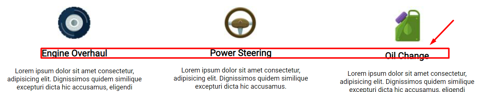
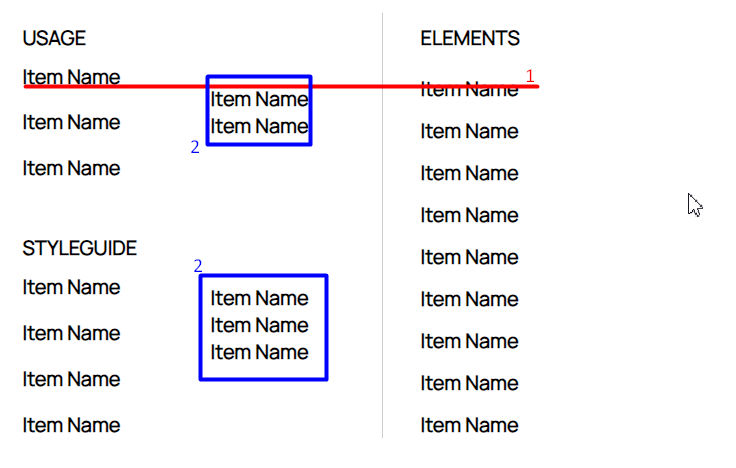
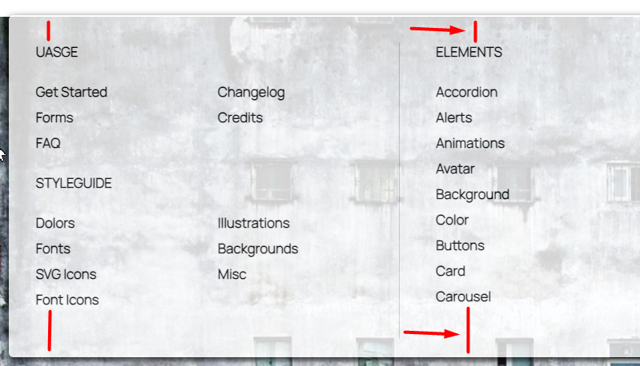
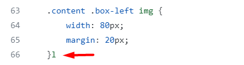
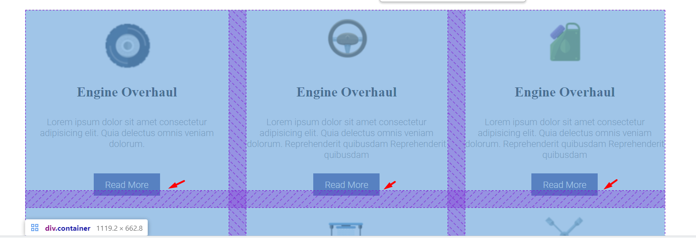
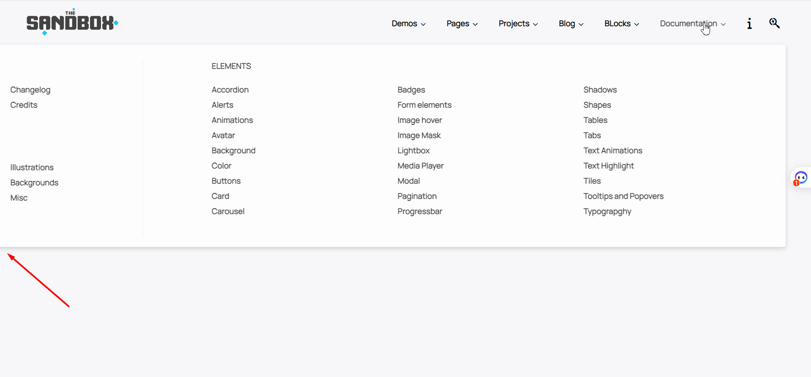
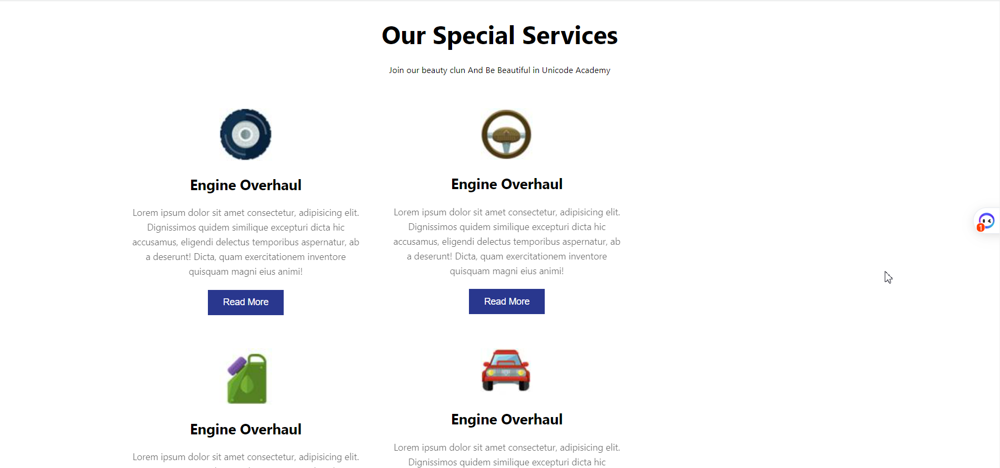
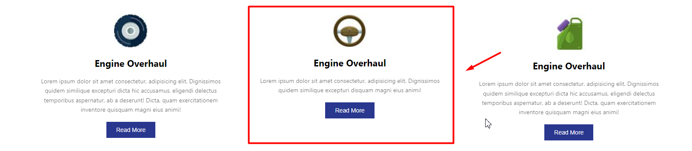

# Dương review bài học viên FE K3.

## [Nguyễn Đức Hải](https://duchainguyen.github.io/F8-FE-K3/day-8/deloy.html)

    Sớm nhất*

- [x] [Bài 1](https://duchainguyen.github.io/F8-FE-K3/day-8/deloy.html)

  Bài làm tốt \*

  Ở giao diện mẫu, padding vào trong của mega menu lớn hơn.

  Ở giao diện mẫu mọi list-item đều căn trái chứ không phải căn giữa.

  Vị trí các list-item không đúng với giao diện mẫu.

  Vì phần menu navbar và mega menu là một phần điều hướng nên nên đặt chung trong một thẻ nav.

  Không nên sử dụng font-weight 700 ở \* vì nó sẽ làm cho font bị mất chất, mỗi lần muốn sử dụng thì phải đưa về font-weight mong muốn.

  HTML5 bổ xung thêm một số thẻ bao bọc semantics như `header...`. Nên sử dụng chúng để tăng khả năng đọc hiểu source code.

  Phần `div.logo-img` sử dụng max-width nhưng thẻ img không có width 100% nên không có tác dụng.

  Không nên đặt tên class như `menu-item-1, menu-item-2...` vì nó không nói lên được nội dung của nó, và khi cần thêm một menu-item mới thì phải sửa lại tên class.

  - Như trường hợp này là một ví dụ:

  ```css
  .menu-item-1 li:nth-child(4),
  .menu-item-4 li:nth-child(1),
  .menu-item-5 li:nth-child(1),
  .menu-item-5 li:nth-child(5),
  .menu-item-5 li:nth-child(4),
  .menu-item-2 li:nth-child(1),
  .menu-item-2 li:nth-child(3),
  .menu-item-2 li:nth-child(4),
  .menu-item-2 li:nth-child(5),
  .menu-item-2 li:nth-child(8) {
    opacity: 0;
  }
  ```

  - Nên đặt tên class như sau:

  ```css
  .menu-item li {
    opacity: 0;
  }
  ```

  - Hơn nữa khi muốn tạo một khoảng trống, không nên cho content vào rồi để opacity: 0 mà nên sử dụng `margin` hoặc `padding` để tạo khoảng trống.

  Nên bổ dung hiệu ứng highlight màu cho menu-nav khi hover vào mega menu con của nó.

  Thiếu background nền.

- [x] [Bài 2](https://duchainguyen.github.io/F8-FE-K3/day-8/deloy.html)

  Bài làm tốt \*

  Ở HTML5 có thêm các thẻ bao bọc semantics như `header, footer, main, section...` nên nên sử dụng chúng để tăng khả năng đọc hiểu source code.

  Đang có một chút lỗi về giao diện khiến hiện thanh scroll ngang:

  

  Không nên sử dụng `padding: 10px 0` để căn giữa ảnh ở 1 `div.logo-car` vì nếu resize kích thước div thì có thể sẽ khiến bức ảnh không còn được căn giữa theo chiều dọc.

  

  - Các dễ nhất để căn giữa một bức ảnh theo div cha theo chiều dọc là:

  ```css
  .logo-car {
    display: flex;
    justify-content: center;
    align-items: center;
  }
  ```

  <!-- Hoặc -->

  ```css
  .logo-car {
    position: relative;
  }
  .logo-car img {
    position: absolute;
    top: 50%;
    left: 50%;
    transform: translate(-50%, -50%);
  }
  ```

  <!-- Hoặc -->

  ```css
  .logo-car {
    display: grid;
    place-items: center;
  }
  ```

  ID trong 1 trang web chỉ nên sử dụng 1 lần, nên sử dụng class thay thế.

  

  Phần mini cart nên sử dụng thẻ `aside` để bao bọc.

  Tiêu đề của mini cart không phải là một `heading`, không nên sử dụng `h2` mà nên sử dụng `p` hoặc `span`.

  Tất cả các heading bên trong đều chỉ là đầu mục, không nên sử dụng `heading` mà nên sử dụng `p` hoặc `span`.

  Hình ảnh của sản phẩm trong giỏ hàng cần một giá trị alt đủ ý nghĩa thích hợp thay vì để trống vì khi hình ảnh không hiển thị thì sẽ không có giá trị nào để thay thế.

  Màu chữ ở các `.title` bị sai với giao diện mẫu.

  Phần font-weight ở `.foot-text span` cân đậm hơn.

  Phần hiển thị chữ ở `.item-price span` sai với giao diện mẫu.

  Các màu chữ ở `.counter` sai với giao diện mẫu.

  Phần `.title-h2 h2` cần cho font chữ nhỏ hơn và font-weight đậm hơn.

  Nếu là tiêu đề chính, nên sử dụng một class như `.main-title` thay vì class `.title-h2`.

  Phần màu của đường kẻ tại `.product::before` cần cho nhạt hơn.

  Nên chia rõ hơn các product nên gom nhóm vào một class là `.products` để có thể xử lý tốt hơn.

  Các phần thông tin phụ như tổng tiền, lưu ý, các nút button nên bao bọc bằng một thẻ `footer`.

  **Ở bài rút gọn**. Hầu hết các lỗi đều giống ở bài chính, chỉ trừ việc không bị hiện thanh scroll ngang.

  Nên chú ý thêm vào thẻ meta title vì chúng rất quan trọng trong SEO và trải nghiệm người dùng.

- [x] [Bài 3](https://duchainguyen.github.io/F8-FE-K3/day-8/deloy.html)

  Bài làm rất tốt \*

  Font chữ ở các phần title đều sai, ở bản mẫu sử dụng một font chữ có chân nhọn.

  Sai chính tả **Read-Mode** thành **Read More**.

  Phần `.content` thiếu khoảng cách phía dưới.

---

- [x] Đánh giá chung bài tập về nhà: Bài làm rất tốt, chỉ có một số lỗi nhỏ về giao diện và sai chính tả. Cần chú ý thêm về việc sử dụng các thẻ bao bọc semantics để tăng khả năng đọc hiểu source code. Nên chú ý thêm vào thẻ meta title vì chúng rất quan trọng trong SEO và trải nghiệm người dùng.

---

# Tuyết review bài học viên FE K3.

---

## [Nguyễn Khắc Tú](https://tunguyenhd.github.io/FrontEnd-F8-K3/)

- [x] [Bài 1](https://tunguyenhd.github.io/FrontEnd-F8-K3/Bai_tap/Day_8/Bai-1/)

  Bài làm tốt

  - Nên dùng thẻ semantic `<header>` bọc ngoài cùng phần header và dùng `<nav>` bọc ngoài các nav-item.

  - Ảnh logo cần set thêm kích thước, để nếu là ảnh khác với kích thước bất kì thì sẽ không bị vỡ giao diện. Và thêm dung cho thuộc tính `alt` của ảnh để tốt cho SEO.

  - Icon mũi tên cạnh nav-item đang to hơn so với design.

  - Thêm css `text-transform:uppercase` cho những chữ kiểu in hoa và `text-transform:capitalize` cho những kiểu chữ viết hoa chữ cái đầu.

  - Width của `subnav` chưa đúng. Cần set lại bằng với width của `nav-bar`.

  - Thiếu đường kẻ ở giữa 2 `megabox-wrap-column`.

  - Phần `megabox-wrap-column` width chưa đúng. Cần set width rộng chiếm trọn phần bên phải còn lại của `subnav`.

- [x] [Bài 2](https://tunguyenhd.github.io/FrontEnd-F8-K3/Bai_tap/Day_8/Bai-2/)

  Bài làm tốt

  - Phần `cart` height chưa đúng. Cần set height full màn hình đúng như design.

  - Thiếu icon `"x"` bên phải ở mỗi `cart__item`.

  - Ảnh sản phẩm: Chưa có phần màu background sau ảnh. Nên set thêm `height / max-height`. Vì nếu là ảnh khác có chiều dài dài hơn thì cả `cart__item` sẽ bị dài ra theo, nhìn sẽ không đồng đều với các `cart__item` khác.

  - Màu chữ `cart__item-price` chưa đúng.

  - Dấu `+`, `-` ở phần `cart__item-quantity` có thể click được, nên dùng thẻ `button` và set kích thước lớn hơn để trải nghiệm của người dùng tốt hơn.

  - border của `.cart__item` chưa đúng, ở design là border full theo width của `cart__body`.

  - Nên thêm đường kẻ giữa 2 phần `cart__list-item` và `cart__total` nhìn vào có thể dễ phân tách 2 nội dung đó.

  - Font-size của phần `cart__total` chưa đúng design.

  - `button` chưa đúng font-family. Font-size đang lớn hơn design.

- [x] [Bài 3](https://tunguyenhd.github.io/FrontEnd-F8-K3/Bai_tap/Day_8/Bai-3/)

  Bài làm tốt\*

  - Sửa lại tên file "index..html --> index.html" để xem được bài deploy trên github page.

  - `service-item__title` không bằng nhau --> cần set thêm height cho ảnh để các ảnh có height bằng nhau.

    

  - Phần `service-item__dsc` chưa đúng màu chữ và line-height.

  - `button` chưa đúng font-family.

---

- [x] Đánh giá chung bài tập về nhà: Bài làm đa số đều tốt, chỉ có một số lỗi nhỏ, chú ý hơn về sử dụng thẻ semantic / non-semantic, set kích thước cho ảnh, font-family button và chú ý tiểu tiết và giao diện mẫu để làm đúng.

## [Bảo Anh](https://baoanh2004.github.io/Frontend-Offline-K3/Day-8/)

- [x] [Bài 1](https://baoanh2004.github.io/Frontend-Offline-K3/Day-8/bai1.html)

  Bài làm chưa tốt

  - icon mũi tên đang lớn hơn design.

  - Thiếu `box-shadow` cho phần mega menu.

  - Thêm css `text-transform:uppercase` cho những chữ kiểu in hoa và `text-transform:capitalize` cho những kiểu chữ viết hoa chữ cái đầu.

  - Các cột đang không set width. Cần set thêm width / max-width cho các cột trong mega menu, để đảm bảo khi text dài thì width của cột sẽ không bị dài quá mong muốn.

  - Các item trong mega menu chưa ngang hàng với nhau, khoảng cách trên dưới giữa 2 item chưa đều nhau.

    

  - Các `Item Name` là link trong mega menu, nên sử dụng thẻ `a`.

- [x] [Bài 2](https://baoanh2004.github.io/Frontend-Offline-K3/Day-8/bai2.html)

  Bài làm tốt\*

  - Có thể bỏ CSS `body{padding:40px}` vì không có tác dụng gì trong bài.

  - Thiếu icon `"x"` bên phải ở mỗi `item`.

  - Icon `"x"` ở `heading` và dấu `+`, `-` ở phần `num` có thể click được, nên dùng thẻ `button` và set kích thước lớn hơn để trải nghiệm của người dùng tốt hơn.

  - Ảnh sản phẩm: chưa có phần màu background dưới ảnh.

  - Phần `.row + span` font-size hơi nhỏ.

  - Phần `.foot span` font-weight chưa đúng, cần đậm hơn.

- [x] [Bài 3](https://baoanh2004.github.io/Frontend-Offline-K3/Day-8/bai3.html)

  Bài làm tốt

  - Font-family chưa đúng theo yêu cầu là font `Roboto`.

  - Thêm css `text-transform:capitalize` cho những kiểu chữ viết hoa chữ cái đầu.

  - Cần thêm nội dung cho thuộc tính `alt` của ảnh để tốt cho SEO.

  - Phần text trong `li > p` chưa đúng line-height.

---

- [x] Đánh giá chung bài tập về nhà: Bài làm tốt, chú ý xem kỹ những tiểu tiết trong design để sử dụng thẻ HTML semantic, non-semantic phù hợp và set style CSS giống với design hơn.

---

## [Nguyễn Đình Khánh](https://github.com/khanhngoolearn/F8-homework-fe-k3/tree/main/day8)

- [x] [Bài 1](https://khanhngoolearn.github.io/F8-homework-fe-k3/day8/exercise1/)

  Bài làm tốt\*

  - Nên dùng thẻ semantic `<header>` thay cho `div.header`, và dùng thẻ `<nav>` ngoài `ul.header-menu`.

  - Thêm css `object-fit` cho ảnh logo, để nếu là ảnh khác với kích thước khác thì ảnh sẽ không bị méo.

  - màu chữ `Documentation` chưa đúng design. Cần nhạt hơn.

  - Thêm css `text-transform:uppercase` cho những chữ kiểu in hoa và `text-transform:capitalize` cho những kiểu chữ viết hoa chữ cái đầu.

  - Các chữ in hoa: có style giống nhau nên đặt tên class giống nhau, và set css theo tên class chung đó, thay vì phải css cho từng cái một. Và phần này đang có font-weight đậm hơn so với design.

  - Phần `.menuBox-item1 ul li` nên tăng padding lên 1 chút nữa để có khoảng cách giữa 2 item giống với design hơn.

  - Check xóa bỏ code css thừa.

- [x] [Bài 2](https://khanhngoolearn.github.io/F8-homework-fe-k3/day8/exercise2/)

  Bài làm chưa tốt. Cần chú ý design để làm giống hơn.

  - Phần `cart-box`: Sai vị trí. Theo design là sát bên phải màn hình. Chiều cao chưa đúng, cần set full màn hình.

  - Phần số ở trên chữ `cart-title` quá nhỏ.

  - Ảnh: Nên set thêm `height/max-height, object-fit` Vì nếu là ảnh khác có chiều dài dài hơn thì cả `product-item` sẽ bị dài ra theo, nhìn sẽ không đồng đều với các `product-item` khác.

  - Dấu `+`, `-`, ở phần `quantity` và icon dấu `x` ở mỗi sản phẩm có thể click được, nên dùng thẻ `button` và set css `cursor:pointer`, kích thước lớn hơn để trải nghiệm người dùng tốt hơn.

- `button` chưa đúng font-family, khoảng cách.

- [x] [Bài 3](https://khanhngoolearn.github.io/F8-homework-fe-k3/day8/exercise3/)

  Bài làm tốt\*

  - Nên thay thẻ `h2` bằng thẻ `p` vì đây là dòng chữ mô tả thêm cho `h1`. Chứ không phải một tiêu đề.

  - Phần title `h3` font-size đang nhỏ hơn design.

  - Font-weight của phần `.box-info > p` đang đậm hơn so với design.

  - Chưa xử lý phần `box-item` có ít dòng chữ hơn.

    

  - Cần set thêm css `height / max-height` cho ảnh, để tránh trường hợp là ảnh khác có kích thước bất kì thì các ảnh vẫn có chiều cao đều nhau.

  - `button` chưa đúng font-family.

---

- [x] Đánh giá chung bài tập về nhà: Bài làm tốt, chú ý xem kỹ những tiểu tiết trong design để sử dụng thẻ HTML semantic, non-semantic phù hợp và set style CSS giống với design hơn.

## [Đỗ Ngọc Tiến](https://github.com/DoNgocTien17/F8-frontend-k3/tree/main/Day8)

- [x] [Bài 1](https://dongoctien17.github.io/F8-frontend-k3/Day8/Bai1.html)

  Bài làm chưa tốt

  - Nên dùng thẻ semantic `<header>, <nav>` thay vì dùng thẻ `div`.

  - Phần `icon` lớn hơn so với design.

  - Nên dùng thẻ `a` bọc chữ trong `menu-content > li` vì đây là link trong mega menu.

  - Ảnh: Ảnh logo cần thêm `height` vì khi là ảnh khác có kích thước bất kì thì vẫn đảm bảo chiều cao ảnh không bị dài quá. Ảnh Background chưa set kích thước, nên với những màn hình nhỏ dưới 1700px, sẽ bị xuất hiện thanh cuộn ngang.

  - Khoảng cách trên dưới chưa giống design. Ở design content sẽ sát đều về 2 phía trên dưới.

    

  - Thêm css `text-transform:uppercase` cho những chữ kiểu in hoa và `text-transform:capitalize` cho những kiểu chữ viết hoa chữ cái đầu.

  - File HTML: Nên để phần link css thư viện lên trên, link css bài tập xuống dưới. Để có thể ghi đè được những css của thư viện nếu cần.

- [x] [Bài 2](https://dongoctien17.github.io/F8-frontend-k3/Day8/Bai2.html)

  Bài làm chưa tốt

  - Phần `.container` không nên set width là %. Vì sẽ không đảm bảo không đảm bảo các nội dung bên trong sẽ hiển thị đúng khi màn hình to /nhỏ hơn. Nên set width cứng bằng `px`.

  - Căn lề các nội dung chưa thẳng hàng như design

    

  - Ảnh: Nên set thêm `height / max-height`. Vì nếu là ảnh khác có chiều dài dài hơn thì cả `content` sẽ bị dài ra theo.

  - Dấu `+`, `-`, ở phần `quantity` và icon dấu `x` ở mỗi sản phẩm có thể click được, nên dùng thẻ `button` và set css `cursor:pointer`, kích thước lớn hơn để trải nghiệm người dùng tốt hơn.

  - File HTML: Nên để phần link css thư viện lên trên, link css bài tập xuống dưới. Để có thể ghi đè được những css của thư viện nếu cần.

  - Check xóa code thừa

    

  - Chưa format code.

- [x] [Bài 3](https://dongoctien17.github.io/F8-frontend-k3/Day8/Bai3.html)

  Bài làm tốt

  - Không nên set height cố định cho `content > p`

  - Ảnh: chưa set kích thước. Cần thêm nội dung cho thuộc tính `alt`.

  - Phần `".content > p"`: không nên set height cố định. Line-height chưa đúng.

    

  - Thêm css `text-transform:capitalize` cho những kiểu chữ viết hoa chữ cái đầu.

---

- [x] Đánh giá chung bài tập về nhà: Bài làm tốt, chú ý xem kỹ những tiểu tiết trong design để sử dụng thẻ HTML semantic, non-semantic phù hợp và set style CSS giống với design hơn.

## [Nguyen Tuan Anh](https://github.com/fanbaday/f8-fullstack-offline-K3/blob/main/homework.html)

- [x] [Bài 1](https://fanbaday.github.io/f8-fullstack-offline-K3/day8/ex1/)

  Bài làm chưa tốt

  - mega menu vị trí chưa đúng. Bị lệch trái quá nhiều.

    

  - Nên dùng thẻ semantic `<header>, <nav>` thay vì dùng thẻ `div`.

  - Phần `icon` lớn hơn so với design.

  - Check HTML Validate W3C: Thẻ `div` không được là con trực tiếp của thẻ `ul`. Có thẻ đóng `</li>` mà Không có thẻ mở `<li>`.

    

  - Nên dùng thẻ `a` bọc chữ trong `menu-elements > li` vì đây là link trong mega menu.

  - Ảnh: Ảnh logo cần thêm `height` vì khi là ảnh khác có kích thước bất kì thì vẫn đảm bảo chiều cao ảnh không bị dài quá.

  - Khoảng cách trên dưới của mega-menu chưa giống design. Ở design content sẽ sát đều về 2 phía trên dưới.

  - Thêm css `text-transform:uppercase` cho những chữ kiểu in hoa và `text-transform:capitalize` cho những kiểu chữ viết hoa chữ cái đầu.

  - File HTML: Nên để phần link css thư viện lên trên, link css bài tập xuống dưới. Để có thể ghi đè được những css của thư viện nếu cần.

  - Xóa ảnh không dùng trong thư mục `img`.

  - Chưa format code.

- [x] [Bài 2](https://fanbaday.github.io/f8-fullstack-offline-K3/day8/ex2/)

  Bài làm tốt

  - Chưa có màu background cho body.

  - Ảnh: Nên set thêm `height / max-height`. Vì nếu là ảnh khác có chiều dài dài hơn thì cả `content` sẽ bị dài ra theo.

  - Dấu `+`, `-`, ở phần `quantity` và icon dấu `x` ở mỗi sản phẩm có thể click được, nên dùng thẻ `button`.

  - Phần `cart-product` font-size đang lớn hơn so với design.

  - Phần `product-value` font-weight cần đậm hơn.

  - `button` chưa đúng font-family.

  - File HTML: Nên để phần link css thư viện lên trên, link css bài tập xuống dưới. Để có thể ghi đè được những css của thư viện nếu cần.

  - Xóa ảnh không dùng trong thư mục `img`.

  - Check xóa code thừa, comment thừa.

  - Chưa Format code.

- [x] [Bài 3](https://fanbaday.github.io/f8-fullstack-offline-K3/day8/ex3/)

  Bài làm chưa tốt

  - Nên dùng thẻ semantic `<section>` thay cho `div.services-section`

  - Layout chưa đúng. Khi màn hình nhỏ:

    

    Khi màn hình lớn:

    

  - Cả bài dùng Font-family chưa đúng.

  - Chưa xử lý với `service` có chữ dòng chữ hơn.

    

  - Cần set thêm css `height / max-height` cho ảnh, để tránh trường hợp là ảnh khác có kích thước bất kì thì các ảnh vẫn có chiều cao đều nhau.

---

- [x] Đánh giá chung bài tập về nhà: Bài làm chưa tốt, cần chú ý xem kỹ những tiểu tiết trong design để sử dụng thẻ HTML semantic, non-semantic phù hợp và set style CSS giống với design hơn. Cần check code, format code lần cuối trước khi gửi bài để bài được chỉnh chu hơn.

---

## [Nguyen Le Quyen (FPL HN)](https://github.com/NguyenLeQuyen2004/f8-frontend-k3/tree/main/Day8/Baitap)

- [x] [Bài 1](file:///D:/F8_Office/Review_GIT/F8-FE-K3/NguyenLeQuyen2004/f8-frontend-k3/Day8/Baitap/ex01.html)

  Bài làm rất tốt\*

  Chú ý kỹ hơn về `font-weight` thiết kế bài mẫu

  Các icon như **info** và **search** cần bổ sung action khi `hover` dùng `cursor: pointer` để tăng trải nghiệm người dùng.

- [x] [Bài 2](https://github.com/NguyenLeQuyen2004/f8-frontend-k3/blob/main/Day8/Baitap/ex02.html)

  Bài làm tốt

  Phần hiển thị số lượng sản phẩm trong giỏ hàng không nên dùng `::after` sau này tương tác với backend hơi rắc rối. Nên dùng thẻ `span`.

  Nút xoá sản phẩm cũng không dùng `::after`, nên dùng `span` để sau này dễ dàng xử lý sự kiện.

  Phần **product** nên cho vào `div` là **product-lists** bọc lại và dùng `overflow-Y: scroll` theo trục Y và đặt max-height để khi người dùng thêm nhiều sản phẩm giúp phần **cart** được gọn gàng hơn.

  Nên đặt tên class đúng ngữ cảnh, tường minh tránh kiểu **box-1** có thể chia thành **box-left**, **box-right**.

  Để ý phần `font-family` đang dùng là font không chân.

- [x] [Bài 3](https://github.com/NguyenLeQuyen2004/f8-frontend-k3/blob/main/Day8/Baitap/ex03.html)

  Bài làm chưa tốt

  Chưa đúng với thiết kế bài mẫu.

  Nội dung mô tả trong các div chưa co đều lại.

  Các `button` đang bị dính sát vào phần nội dung, và không đều nhau.

---

- [x] Đánh giá chung bài tập về nhà: Bài làm tốt, chú ý kỹ về thiết kế ở bài mẫu, phân tích layout kỹ trước khi làm. Nên xem lại cách đặt tên class tường minh hơn, đúng ngữ cảnh hơn.

## [Vũ Thành Khang](https://github.com/countduck4819/f8-frontend/tree/main/Day8)

- [x] [Bài 1](https://github.com/countduck4819/f8-frontend/tree/main/Day8)

  Bài làm chưa tốt

  Nên hiển thị **MEGA MENU** với nền trắng theo đúng thiết kế.

  Xử lý nút khi `hover` chưa tốt. Khi `hover` trỏ xuống phần **MEGA MENU** sẽ bị mất luôn.

  Các icon như **info** và **search** cần bổ sung action khi `hover` dùng `cursor: pointer` để tăng trải nghiệm người dùng. Nút **info** đang bị méo

- [x] [Bài 2](https://github.com/countduck4819/f8-frontend/tree/main/Day8)

  Bài làm chưa tốt

  Phần **items** không đúng với thiết kế bài mẫu. Không nên dùng `background-color`.

  Phần **increment** thiết kế sai.

- [x] [Bài 3](https://github.com/countduck4819/f8-frontend/tree/main/Day8)

  Bài làm tốt

  Chú ý phần hình ảnh không nên để cứng cả `width` và `height`. Chỉ nên để cứng 1 trong cái `width` hoặc `height`.

  Nên sử dụng `display: flex` trong các thẻ `li` để căn chỉnh các item con bên trong, không dùng `margin` cho nội dung item mà nên dùng `padding`

  Không nên reset CSS `text-align: center`

---

- [x] Đánh giá chung bài tập về nhà: Bài làm đa số đều chưa hoàn thiện tốt, chưa đúng với bản mẫu. Cần chú ý chỉn chu hơn vào tiểu tiết và giao diện mẫu để làm đúng.

## [Gia Bảo Đỗ](https://github.com/Dogiaba/F8-Fe-K3/tree/main/Day8)

- [x] [Bài 1](https://github.com/Dogiaba/F8-Fe-K3/tree/main/Day8)

  Bài làm rất tốt

  Chú ý kỹ hơn về `font-weight` cho các text theo như thiết kế bài mẫu.

  Chú ý các icon xổ xuống bé hơn xíu như bài mẫu.

  Các icon như **info** và **search** cần bổ sung action khi `hover` dùng `cursor: pointer` để tăng trải nghiệm người dùng.

  Chú ý dùng `transform: all 0.4s ease;` là sai.

- [x] [Bài 2](https://github.com/Dogiaba/F8-Fe-K3/tree/main/Day8)

  Bài làm tốt \*

  Phần hiển thị số lượng sản phẩm trong giỏ hàng không nên dùng `::after` sau này tương tác với backend hơi rắc rối. Nên dùng thẻ `span`. Căn chỉnh lại số lượng ra giữa.

  Chú ý phần **quantity_product** thiết kế chưa giống với bài mẫu. Chưa có action khi `hover` vào nút tăng giảm, dùng `cursor: pointer` để tăng trải nghiệm người dùng.

  Phần **products** nên đặt max-height và dùng `overflow-Y: scroll` theo trục Y để khi người dùng thêm nhiều sản phẩm giúp phần **cart** được gọn gàng hơn.

- [x] [Bài 3](https://github.com/Dogiaba/F8-Fe-K3/tree/main/Day8)

  Bài làm chưa tốt

  Có ý tưởng chia layout, bố cục các item đúng nhưng chưa sát với thiết kế bài mẫu.

  Code lại.

---

- [x] Đánh giá chung bài tập về nhà: Bài làm đa số đều hoàn thiện tốt. Nên chú ý phân tích layout trước khi làm. Cần chú ý chỉn chu hơn vào tiểu tiết và giao diện mẫu để làm đúng.

## [thuy nguyen](https://github.com/tnnhungoc/F8-FE-K3/tree/main/FEK3/Day8)

- [x] [Bài 1](https://github.com/tnnhungoc/F8-FE-K3/tree/main/FEK3/Day8)

  Bài làm rất tốt

  Chú ý kỹ hơn về `font-weight` cho các text theo như thiết kế bài mẫu.

  Các icon như **info** và **search** cần bổ sung action khi `hover` dùng `cursor: pointer` để tăng trải nghiệm người dùng.

- [x] [Bài 2](https://github.com/tnnhungoc/F8-FE-K3/tree/main/FEK3/Day8)

  Bài làm tốt \*

  Chú ý các hình ảnh sản phẩm đều nằm trong 1 nền màu.

  Chú ý `button` add cần đặt `background-color` theo thiết kế bài mẫu.

  Nên nhóm các **item** vào trong **items** chứ không tách lẻ ra.

  Phần **items** nên đặt max-height và dùng `overflow-Y: scroll` theo trục Y để khi người dùng thêm nhiều sản phẩm giúp phần **cart** được gọn gàng hơn.

  Chú ý cách đặt class cần đúng ngữ cảnh, tường minh. Ví dụ **items** là số nhiều thì bên trong **items** phải có nhiều **item**.

  Nên thêm sự kiện `hover` cho các nút xoá sản phẩm `cursor: pointer` để tăng tính trải nghiệm người dùng.

- [x] [Bài 3](https://github.com/tnnhungoc/F8-FE-K3/tree/main/FEK3/Day8)

  Bài làm **KHÔNG TỐT\***

  Bài làm chưa đúng với thiết kế mẫu.

  Cần phân tích lại Layout để chia bố cục.

  Code lại.

---

- [x] Đánh giá chung bài tập về nhà: Bài làm đa số đều hoàn thiện tốt. Nên chú ý phân tích layout trước khi làm. Cần chú ý chỉn chu hơn vào tiểu tiết và giao diện mẫu để làm đúng.

---
