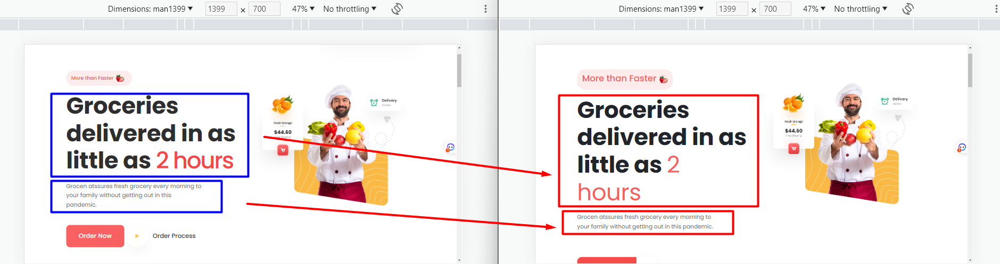
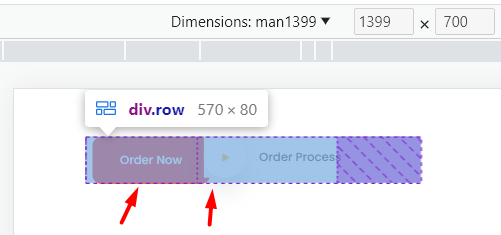
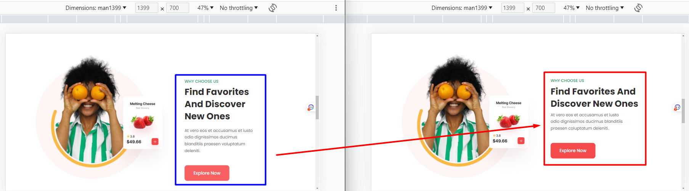
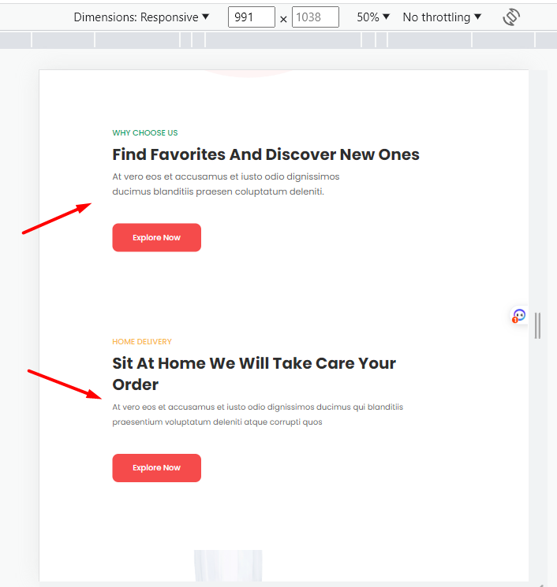
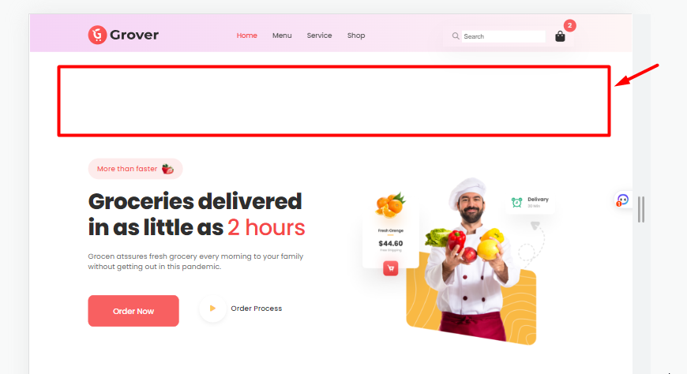

# Dương đánh giá bài học viên

**Note:**

- Màn hình:

  - max-width: 1500px

  - max-width: 1399px

  - max-width: 1199px

  - max-width: 991px

  - max-width: 767px

  - max-width: 575px

  - max-width: 420px

  - max-width: 375px

- Đường dẫn:

  - Root: `https://reviewf8.vercel.app/Review`

  - HTML: `/Fullstack_nodeJs_K1/Day11/index.html`

  - Hình ảnh: `/Fullstack_nodeJs_K1/Day11/images`

## [Dương Hiệp](https://github.com/duonghiep416/duonghiep_f8_fullstack.git)

- Sớm nhất \*

- [x] Bài 1: Màn hình: max-width: 1500px

Bài làm rất tốt \*

Chiều rộng phần hiển thị các phần tử đang bé hơn bản mẫu.

Phần bóng của `.hero-order img` quá đậm so với bản mẫu.

Chiều rộng các `.service-item` lớn hơn bản mẫu một chút.

Chưa xử lý action hover cho `.service-item`.

Màu chữ ở `section-title` sai so với bản mẫu.

Hình ảnh ở `.delivery .hero-img, .favorite .hero-img, .download .hero-img` lớn hơn so với bản mẫu.

Phần `.footer .section-desc` sai hoàn toàn so với bản mẫu.

**[Xem ảnh](https://reviewf8.vercel.app/Review/Fullstack_nodeJs_K1/Day11/images/duonghiep1500.png)**

---

- [x] Bài 2: Màn hình: max-width: 1399px

Bài làm chưa tốt

Chưa xử lý action hover cho `.service-item`.

Chưa có responsive ở màn hình này.

**[Xem ảnh](https://reviewf8.vercel.app/Review/Fullstack_nodeJs_K1/Day11/images/duonghiep1399.png)**

---

- [x] Bài 3: Màn hình: max-width: 1199px

Bài làm chưa tốt

Chưa xử lý action hover cho `.service-item`.

Chưa có responsive ở màn hình này.

**[Xem ảnh](https://reviewf8.vercel.app/Review/Fullstack_nodeJs_K1/Day11/images/duonghiep1199.png)**

---

- [x] Bài 4: Màn hình: max-width: 991px

Bài làm tốt

Các item trong `.hero-content` ở bản mẫu là căn trái chứ không phải căn giữa.

Các `.service-item` chưa đúng với bản mẫu, ở bản mẫu cả 3 item cùng trên một hàng.

Các item ở `.delivery-content, .favorite-content, .download-links` ở bản mẫu là căn trái chứ không phải căn giữa.

Các item ở `.copyright, .copyright-links` trong bản mẫu là cùng một hàng, không phải là 2 hàng.

**[Xem ảnh](https://reviewf8.vercel.app/Review/Fullstack_nodeJs_K1/Day11/images/duonghiep991.png)**

---

- [x] Bài 5: Màn hình: max-width: 767px

Bài làm rất tốt \*

Các phần `.hero-title, .section-title` có font-size nhỏ hơn bản mẫu.

Các phần `.download-btn, .order-link` có kích thước nhỏ hơn bản mẫu.

**[Xem ảnh](https://reviewf8.vercel.app/Review/Fullstack_nodeJs_K1/Day11/images/duonghiep767.png)**

---

- [x] Bài 6: Màn hình: max-width: 575px

Bài làm rất tốt \*

Các lỗi sai giống ở màn hình max-width: 767px.

**[Xem ảnh](https://reviewf8.vercel.app/Review/Fullstack_nodeJs_K1/Day11/images/duonghiep575.png)**

---

- [x] Bài 7: Màn hình: max-width: 420px

Bài làm rất tốt \*

**[Xem ảnh](https://reviewf8.vercel.app/Review/Fullstack_nodeJs_K1/Day11/images/duonghiep420.png)**

---

- [x] Bài 8: Màn hình: max-width: 375px

Bài làm rất tốt \*

**[Xem ảnh](https://reviewf8.vercel.app/Review/Fullstack_nodeJs_K1/Day11/images/duonghiep375.png)**

---

- [x] Đánh giá chung bài tập về nhà: Bài làm rất tốt, cần chú ý thêm một số màn hình ở mức giữa, chú ý thêm về size các ảnh và các phần tử.

## [Nguyen Xuan Tuan Anh](https://github.com/xuananh2212/full_stack_01/tree/main/day_11)

- [x] Bài 1: Màn hình: max-width: 1500px

Bài làm tốt \*

Chú ý chữ hoa, chữ thường

Phần `.heading.lv2.cta--lv2.feature-cta--lv2` chưa có max-width.

Hình ảnh ở `.cta__img` to hơn bản mẫu.

Phần `.service__items__inner` có chiều rộng lớn hơn bản mẫu.

Sai chính tả **hourse** -> **hours**.

**[Xem ảnh](https://reviewf8.vercel.app/Review/Fullstack_nodeJs_K1/Day11/images/xuananh1500.png)**

---

- [x] Bài 2: Màn hình: max-width: 1399px

Bài làm tốt \*

Một số lỗi sai giống như ở màn hình max-width: 1500px.

**[Xem ảnh](https://reviewf8.vercel.app/Review/Fullstack_nodeJs_K1/Day11/images/xuananh1399.png)**

---

- [x] Bài 3: Màn hình: max-width: 1199px

Bài làm rất tốt \*

Chiều rộng phần hiển thị các phần tử đang to hơn bản mẫu.

**[Xem ảnh](https://reviewf8.vercel.app/Review/Fullstack_nodeJs_K1/Day11/images/xuananh1199.png)**

---

- [x] Bài 4: Màn hình: max-width: 991px

Bài làm rất tốt \*

Animation hiển thị menu chưa giống bản mẫu.

Một số chiều rộng của các phần tử chưa giống bản mẫu.

**[Xem ảnh](https://reviewf8.vercel.app/Review/Fullstack_nodeJs_K1/Day11/images/xuananh991.png)**

---

- [x] Bài 5: Màn hình: max-width: 767px

Bài làm tốt \*

Một số lỗi sai vẫn giống như ở màn hình max-width: 991px.

**[Xem ảnh](https://reviewf8.vercel.app/Review/Fullstack_nodeJs_K1/Day11/images/xuananh767.png)**

---

- [x] Bài 6: Màn hình: max-width: 575px

Bài làm rất tốt \*

**[Xem ảnh](https://reviewf8.vercel.app/Review/Fullstack_nodeJs_K1/Day11/images/xuananh575.png)**

---

- [x] Bài 7: Màn hình: max-width: 420px

Bài làm tốt \*

Phần `.heading.lv2.service--lv2` chưa thu nhỏ font-size.

Các `.service__items__inner` chưa thu nhỏ chiều cao.

**[Xem ảnh](https://reviewf8.vercel.app/Review/Fullstack_nodeJs_K1/Day11/images/xuananh420.png)**

---

- [x] Bài 8: Màn hình: max-width: 375px

Bài làm tốt \*

Các lỗi sai tương tự như ở màn hình max-width: 420px.

**[Xem ảnh](https://reviewf8.vercel.app/Review/Fullstack_nodeJs_K1/Day11/images/xuananh375.png)**

---

- [x] Đánh giá chung bài tập về nhà: Bài làm tốt, cần chú ý thêm một số màn hình ở mức giữa, chú ý thêm về size các ảnh và các phần tử.

---

## [Bi11-043 Đỗ Hà Chi](https://serenaha12.github.io/grover)

- [x] Bài 1: Màn hình: max-width: 1500px

Bài làm tốt \*

Chưa có action hover cho `.item-content`.

Thiếu đổ bóng cho `.header .banner .btn img`

Để ý thêm một chút về kích thước max-width của một số phần tử text.

**[Xem ảnh](https://reviewf8.vercel.app/Review/Fullstack_nodeJs_K1/Day11/images/serenaha12-1500.png)**

---

- [x] Bài 2: Màn hình: max-width: 1399px

Chưa có responsive ở màn hình này.

**[Xem ảnh](https://reviewf8.vercel.app/Review/Fullstack_nodeJs_K1/Day11/images/serenaha12-1399.png)**

---

- [x] Bài 3: Màn hình: max-width: 1199px

Chưa có responsive ở màn hình này.

**[Xem ảnh](https://reviewf8.vercel.app/Review/Fullstack_nodeJs_K1/Day11/images/serenaha12-1199.png)**

---

- [x] Bài 4: Màn hình: max-width: 991px

Chưa có responsive ở màn hình này.

**[Xem ảnh](https://reviewf8.vercel.app/Review/Fullstack_nodeJs_K1/Day11/images/serenaha12-991.png)**

---

- [x] Bài 5: Màn hình: max-width: 767px

Bài làm chưa tốt

Trong file `responsive.css`, dòng 133-135, responsive từ màn hình 853px:

```css
.nav-logo img {
  margin-right: 240%;
}
```

Điều này làm cho phần icon đẩy ra ngoài rất nhiều, gây nên lỗi responsive, hiện scroll bar ngang một cách rõ rệt.

Các item trong bản mẫu là căn giữa chứ không phải căn trái.

Phần `.download .content` để width là 100% nhưng chưa xóa `margin-left 100px` nên bị đẩy ra ngoài.

**[Xem ảnh](https://reviewf8.vercel.app/Review/Fullstack_nodeJs_K1/Day11/images/serenaha12-767.png)**

---

- [x] Bài 6: Màn hình: max-width: 575px

Bài làm chưa tốt

Các lỗi sai giống như ở màn hình max-width: 767px.

**[Xem ảnh](https://reviewf8.vercel.app/Review/Fullstack_nodeJs_K1/Day11/images/serenaha12-575.png)**

---

- [x] Bài 7: Màn hình: max-width: 420px

Các lỗi sai giống như ở màn hình max-width: 575px.

**[Xem ảnh](https://reviewf8.vercel.app/Review/Fullstack_nodeJs_K1/Day11/images/serenaha12-420.png)**

---

- [x] Bài 8: Màn hình: max-width: 375px

Các lỗi sai giống như ở màn hình max-width: 575px.

**[Xem ảnh](https://reviewf8.vercel.app/Review/Fullstack_nodeJs_K1/Day11/images/serenaha12-375.png)**

---

- [x] Đánh giá chung bài tập về nhà: Bài làm chưa tốt, cần chú ý thêm một số màn hình ở nhỏ, chú ý thêm về size các ảnh và các phần tử.

---

## [Sơn Ngô Mạnh](https://ngomanhson.github.io/f8-fullstack-exercises)

- [x] Bài 1: Màn hình: max-width: 1500px

  Bài làm tốt \*

  Không nên để transition-property là all, nên chỉ định rõ transition-property cụ thể. Vì khi load trang, các phần tử sẽ có hiệu ứng chuyển động, không đẹp.

  Cấu trúc header hơi thừa thẻ div. (header > .container > .header-inner) => (header > .header-inner) hoặc viết luôn vào header nếu nghiệp vụ đơn giản.

  Thuộc tính `href` của thẻ a bao bọc vào logo ở header thường dùng để back về trang chủ, không nên để đường dẫn là `./` mà nên để là `/`

  Phần `header-search` hầu hết không sử dụng để điều hướng, nên không nên đặt trong phần `nav.nav`. Nên tách ra thành một phần riêng.

  Phần `.text-img__title` không phải là một tiêu đề, chỉ là một đoạn text thông thường được làm khác đi để nhấn mạnh. Nên dùng thẻ `strong` hoặc `span` thay cho h3.

  Không nên fix cứng width của `.cta-group__btn` vì ở ngoài đã có chiều rộng rồi. Nên để width là 100% hoặc auto.

  Các tiêu đề ở `footer` không phải là một heading, nên không nên dùng thẻ h4. Nên dùng thẻ `b` hoặc `span` thay cho h4.

  Không cần thiết phải tạo animation và keyframe ở đây:

  ```css
  @keyframes slip {
    from {
      transform: translateY(-10%);
    }
    to {
      transform: translateY(0);
    }
  }
  ```

  Phần hiển thị nội dung hơi to so với bản mẫu.

  Các hình ảnh đều to hơn bản mẫu.

  **[Xem ảnh](https://reviewf8.vercel.app/Review/Fullstack_nodeJs_K1/Day11/images/ngomanhson1500.png)**

---

- [x] Bài 2: Màn hình: max-width: 1399px

  Bài làm tốt

  Các lỗi sai giống như ở màn hình max-width: 1500px.

  Chưa thu nhỏ các font-size, kích cỡ ảnh phù hợp.

  Chưa có responsive ở màn hình này.

  **[Xem ảnh](https://reviewf8.vercel.app/Review/Fullstack_nodeJs_K1/Day11/images/ngomanhson1399.png)**

---

- [x] Bài 3: Màn hình: max-width: 1199px

  Bài làm rất tốt \*

  Các lỗi sai giống như ở màn hình max-width: 1399px.

  **[Xem ảnh](https://reviewf8.vercel.app/Review/Fullstack_nodeJs_K1/Day11/images/ngomanhson1199.png)**

---

- [x] Bài 4: Màn hình: max-width: 991px

  Bài làm tốt \*

  Các lỗi sai giống như ở màn hình max-width: 1199px.

  Phần `.feature-content-two` sai vị trí so với bản mẫu.

  Hiệu ứng đóng, mở menu chưa giống bản mẫu.

  **[Xem ảnh](https://reviewf8.vercel.app/Review/Fullstack_nodeJs_K1/Day11/images/ngomanhson991.png)**

---

- [x] Bài 5: Màn hình: max-width: 767px

  Bài làm tốt \*

  Các lỗi sai giống như ở màn hình max-width: 991px.

  Các hình ảnh quá to so với bản mẫu.

  **[Xem ảnh](https://reviewf8.vercel.app/Review/Fullstack_nodeJs_K1/Day11/images/ngomanhson767.png)**

---

- [x] Bài 6: Màn hình: max-width: 575px

  Bài làm chưa tốt \*

  Các lỗi sai giống như ở màn hình max-width: 767px.

  Vỡ layout khi mở menu ở header, do phần menu chiếm 228px (input search)

  - Phần ảnh logo mặc định chiếm thêm 155px (Kích thước mặc định)

  - Thêm kích thước của nút menu toggle.

  - Nên kích thước thực vượt quá 390px, các phần tử sẽ bị đẩy ra ngoài.

  - Nên để kích thước của các phần đã set 390px là 100% để tránh vỡ layout.

  **[Xem ảnh](https://reviewf8.vercel.app/Review/Fullstack_nodeJs_K1/Day11/images/ngomanhson575.png)**

---

- [x] Bài 7: Màn hình: max-width: 420px

  Bài làm chưa tốt \*

  Các lỗi sai giống như ở màn hình max-width: 575px.

  **[Xem ảnh](https://reviewf8.vercel.app/Review/Fullstack_nodeJs_K1/Day11/images/ngomanhson420.png)**

---

- [x] Bài 8: Màn hình: max-width: 375px

  Bài làm chưa tốt \*

  Các lỗi sai giống như ở màn hình max-width: 420px.

  **[Xem ảnh](https://reviewf8.vercel.app/Review/Fullstack_nodeJs_K1/Day11/images/ngomanhson375.png)**

## [Hoài Nam Đỗ](https://oaihman25.github.io/btvn/day11/ex01.html)

- [x] [Bài 1](https://oaihman25.github.io/btvn/day11/ex01.html)

  Bài làm **không tốt** \*

  Chưa hoàn thiện responsive cho những breakpoint sau:

  - `width:1399px`: chưa css lại các khoảng cách.

  - `width:1199px`: mới chỉ có responsive phần footer. Chưa css lại các khoảng cách. Giao diện bị lệch sang phải do ảnh ở các section set width cứng, khi màn nhỏ nó không co lại theo.

  - `width:991px, 757px, 575px, 420px, 375px`: Chưa hoàn thiện ( xác định sai một breakpoint, bài mẫu là `575px`, bạn đang làm là `576px`.)

- [x] [Màn min-width: 1400px]

  CÁC ĐIỂM CHƯA TỐT, LỖI TRONG TOÀN BÀI CẦN CHÚ Ý VÀ SỬA:

  - Các section: Khoảng cách trên, dưới, trái, phải chưa đúng.

  - `Ảnh`: Nhiều ảnh chưa set kích thước / set kích thước chưa đúng. Trường hợp đổi ảnh khác với kích thước bất kì khác thì giao diện sẽ bị vỡ. Nên set width bằng 100% thẻ cha, hoặc set cứng một giá trị cụ thể phù hợp và thêm max-width, height, object-fit,... để căn chỉnh thêm.

  - `Chữ`: Mã màu của tất cả những chữ đen chưa đúng. Rất nhiều phần chữ chưa được set line-height như bài mẫu (vd: h2, p). Cần chú ý thêm css `text-transform: uppercase` cho những phần chữ in hoa, thêm `text-transform: capitalize` cho những phần chữ viết hoa chữ cái đầu.

  - `button`: chưa đúng font-family. Chưa xử lý hover. Chưa set `cursor:pointer`.

  - Chưa format code. Xóa phần nhúng link fontawesome nếu không dùng đến. Check xóa comment css thừa.

  CÁC ĐIỂM CHƯA TỐT, LỖI Ở CÁC PHẦN RIÊNG:

  Phần Header: chưa hoàn thiện.

  - Các item chưa căn giữa theo chiều ngang (set thêm align-items:center). Phần search thiếu icon kính lúp. Thiếu phần giỏ hàng.

  - Các nav item: Chưa active `Home`, Chưa xử lý hover đổi màu chữ. Kích thước của nav item đang bị nhỏ nên sẽ hơi khó để cho người dùng chọn được đúng vào.

  Phần secttion: 2 cột trái phải trong section chưa được căn giữa nhau theo chiều ngang.

  Phần `What we Serve` chưa đúng: màu của hình icon, Khoảng cách giữa ảnh và `h3`, lớp layer màu có vị trí và animation chưa đúng chưa đúng.

  Phần section tải app: 2 button link nên dùng `a` bọc ngoài, vì đây là link.

  Phần Footer:

  - Chưa hoàn thiện nội dung, thiếu phần nội dung cuối cùng: Copyright.

  - Các cột đang căn giữa (do set align-items:center) theo chiều ngang, khác với bản mẫu là căn top.

  - Các link ở `footer` chưa xử lý khi hover ở PC sẽ đổi màu chữ.

---

- [x] Đánh giá chung bài tập về nhà: Bài làm chưa tốt. HTML cần chú ý dùng thẻ semantic, đặt tên class phù hợp. CSS: chú ý những tiểu tiết ở bản mẫu để căn chỉnh khoảng cách, style kiểu chữ, màu, kích thước hình ảnh, xử lý hover sao cho giống bản mẫu nhất có thể ở các kích thước màn hình. Cần làm thêm responsive đầy đủ, hoàn thiện và nộp lại.

## [Minh Quang](https://taminhquang13.github.io/F8_Fullstack/BT11/)

- [x] [Bài 1](https://taminhquang13.github.io/F8_Fullstack/BT11/)

  Bài làm tốt \*

  CÁC ĐIỂM CHƯA TỐT, LỖI TRONG TOÀN BÀI CẦN CHÚ Ý VÀ SỬA:

  - CSS @media các phần `grid system`, `container` dùng của boostrap đang set toàn bộ là `min-width`. Nhưng trong bài ở file `style.css` lại set toàn bộ là `max-width`. Nên đổi lại theo một cách, để có không có những sai lệch khi responsive.

  - Phần `Header` chưa hiển thị đúng với màn hình desktop.

  - Nên đặt class chung cho những phần nội dung có style giống nhau và set css cho class đó: các section, những thành phần trong section (h5, h2, p), các button.

  - `Ảnh`: Nhiều ảnh chưa có nội dung thuộc tính `alt`. Chưa set kích thước / set kích thước chưa đúng. Trường hợp với ảnh khác có kích thước bất kì thì giao diện có thể sẽ bị vỡ. Nên set width bằng 100% thẻ cha, hoặc set cứng một giá trị cụ thể phù hợp và thêm max-width, height, object-fit,... để căn chỉnh thêm.

  - `Chữ`: Mã màu của tất cả những chữ đen chưa đúng. Rất nhiều phần chữ chưa được set line-height như bài mẫu (vd: h2, p). Cần chú ý thêm css `text-transform: uppercase` cho những phần chữ in hoa, thêm `text-transform: capitalize` cho những phần chữ viết hoa chữ cái đầu.

  - Link css vào file HTML nên để link css của cách thư viện ở trên, link css của bài ở dưới cùng. Để có thể ghi đè CSS của thư viện nếu cần.

  CÁC ĐIỂM CHƯA TỐT, LỖI Ở CÁC PHẦN RIÊNG:

  Phần `header-end`:

  - Button `btn-order` hover vào bị giật, do khi hover có thêm border. Nên dùng `outline` để thêm đường viền vì outline không thay đổi kích thước, vị trí của phần tử nên sẽ không bị giật.

  Phần section `service`:

  - Khoảng cách: khoảng cách từ phía trên của section với phần nội dung (tổng 160px) đang lớn hơn bài mẫu (100px). Khoảng cách giữa `h2` và `service-detail` chưa đúng.

  Phần section `choose` , `home`: Khoảng cách giữa `h2` và chữ ở thẻ `p` chưa giống bài mẫu.

  Phần `footer`: Khoảng cách trên dưới chưa đúng, cần lớn hơn. Ở bài mẫu không có đường kẻ ngăn cách `footer-bottom-line`.

- [x] [Màn max-width: 1500px]: Làm bài tốt. Chỉ có những lưu ý & lỗi chung ở trên. Và thêm lỗi này:

  - Phần `left-content-top-text`: kích thước cả phần này đang to hơn bài mẫu, do font-size lớn. Phần `h1 > span` có font-weight chưa đúng, cần đậm hơn.

- [x] [Màn max-width: 1399px]:

  - Phần `left-content-top-text` lỗi như ở màn max-width: 1500px.

  Phần chữ chưa đúng:

  

  Phần `left-content-bottom-btn`: 2 button này đang bị đè lên nhau. Cần chỉnh lại phần flexbox này.

  

  Phần section `choose`: Nội dung chữ bên cột phải chưa đúng

  

- [x] [Màn max-width: 1199px]: Bài làm tốt. Xác định sai breakpoint, ở bài mẫu breakpoint 1199px, bạn đang làm là 1200px. Phần `left-content-bottom-btn` chữ và ảnh bị lệch, không căn giữa.

- [x] [Màn max-width: 991px]: Bài làm chưa tốt. Chưa giống bài mẫu về các khoảng cách, font-size chữ.

  - Phần `service-detail` 3 item chiều cao không bằng nhau. Cần set 3 item có chiều cao bằng nhau.

  - Sai bố cục: thứ tự đúng là ảnh -> chữ -> ảnh -> chữ

    

- [x] [Màn max-width: 767px], [Màn max-width: 575px], [Màn max-width: 420px]: Bài làm chưa tốt. Các lỗi tương tự như ở màn 991px

  Phần `app-content-btn` chưa căn giữa, khoảng cách giữa 2 button chưa đúng.

---

- [x] Đánh giá chung bài tập về nhà: Bài làm tốt. Nên set @media cho toàn bài theo 1 chiều (hoặc `min-width`, hoặc `max-width`). HTML cần chú ý đặt tên class chung cho những phần có style giống nhau. CSS: chú ý những tiểu tiết ở bản mẫu để căn chỉnh khoảng cách, style kiểu chữ, màu, kích thước hình ảnh, xử lý hover sao cho giống bản mẫu nhất có thể ở các kích thước màn hình.

# Tuyết đánh giá bài học viên

## [Trung Le](https://github.com/Trungdeptraii/09-07-2023-Le-Van_Trung-Day11.git)

- [x] [Bài 1](https://github.com/Trungdeptraii/09-07-2023-Le-Van_Trung-Day11)

  Bài làm **không tốt** \*

  CÁC LỖI TRONG TOÀN BÀI CẦN CHÚ Ý VÀ FIX:

  - Chưa làm responsive: Cần làm thêm, nộp lại đầy đủ.

  - Màu chưa đúng: background section, text, background button link.

  - Font chữ, line-height lớn hơn bản mẫu. Các phần chữ có kiểu chữ đậm chưa giống bản mẫu.

  - Cần chú ý thêm css `text-transform: uppercase` cho những phần chữ in hoa, thêm `text-transform: capitalize` cho những phần chữ viết hoa chữ cái đầu.

  - Nên sử dụng `margin` và `padding` hợp lý. Xác định khoảng cách nào dùng `margin`, khoảng cách nào dùng `padding`.

  - Chưa thêm nội dung `alt` cho nhiều ảnh.

  - Nhiều ảnh chưa set kích thước, chưa set "object-fit" cho ảnh. Trường hợp đổi ảnh khác với kích thước khác thì giao diện sẽ bị vỡ, ảnh bị méo.

  - Đặt tên class phù hợp ("lists" --> "list"). Xóa bỏ những class không cần thiết `"logo-header col-sm-"`, những comment CSS dư.

  ***

  LỖI Ở CÁC PHẦN RIÊNG:

  Phần `headrer`:

  - Chưa xử lý hover vào ".nav-item".

  Phần section `.policy`:

  - Khoảng cách padding lớn hơn so với bản mẫu.

  - Phần `.product`: Chưa xử lý hover.

  Phần section `WHY CHOOSE US`, `HOME DELIVERY`:

  - Khoảng cách giữa 2 section này chưa giống như bản mẫu, cần tăng khoảng cách lên.

  - Chưa xử lý button link khi hover vào.

  Phần section `download app`

  - Chưa có màu background và khoảng cách trên dưới của section.

  - Sử dụng thẻ `div` cho phần 2 button link `.appstore` tải app là chưa đúng. Ở đây là link nên cần dùng thẻ `a`. Khoảng cách giữa hai link này chưa đúng.

  Phần `footer`:

  - Chưa hoàn thiện nội dung, thiếu phần nội dung cuối cùng:

    **[Xem ảnh](https://reviewf8.vercel.app/Review/Fullstack_nodeJs_K1/Day11/images/trung-le-1.1.png)**

  - Nên set padding cho thẻ cha (`.footer`), chứ không nên set `margin-top` cho từng thẻ con bên trong (`.content`)

  - Các link đang có font-weight đậm, không giống bản mẫu là font-weight mảnh.

---

- [x] Đánh giá chung bài tập về nhà: Bài không tốt. HTML cần chú ý dùng thẻ semantic, đặt tên class phù hợp, thêm nội dung 'alt' cho ảnh đầy đủ để tốt cho SEO. CSS: chú ý những tiểu tiết ở bản mẫu để căn chỉnh khoảng cách, style kiểu chữ, màu, kích thước hình ảnh, xử lý hover sao cho giống bản mẫu nhất có thể. Cần làm thêm responsive đầy đủ, hoàn thiện và nộp lại.

## [Luu Anh Quan](https://github.com/anhquan2211/F8-OFFLINE/tree/main/f8-offline-day11)

- [x] [Bài 1](https://anhquan2211.github.io/F8-OFFLINE/f8-offline-day11/index.html)

  Bài làm tốt \*

  CÁC LỖI TRONG TOÀN BÀI CẦN CHÚ Ý VÀ FIX:

  - Chưa có responsive cho những màn hình sau:

    - Màn hình: max-width: 1199px.

    - Màn hình: từ width: 575px trở xuống (max-width:420px, max-width:375px). Cần check lại break-point và xử lý responsive thêm

  - Ảnh: Nhiều ảnh set kích thước chưa đúng. Trường hợp đổi ảnh khác với kích thước bất kì khác thì giao diện sẽ bị vỡ. Vậy nên không nên chỉ set `width:auto`, nên set width bằng 100% thẻ cha, hoặc set cứng một giá trị cụ thể phù hợp và thêm max-width, height, object-fit,... để căn chỉnh thêm.

  - Bố cục trang HTML nên dùng thẻ semantic `<main></main>`, `<footer></footer>` bọc ngoài cùng các phần nội dung chính lớn.

  - Chú ý nên comment HTML thống nhất: 'ENDS-->END', chữ 'END' viết đầu cả / viết cuối cả

    **[Xem ảnh](https://reviewf8.vercel.app/Review/Fullstack_nodeJs_K1/Day11/images/luu_anh_quan_1.3.png)**

  - Cần xóa bỏ code và comment thừa trong HTML:

    **[Xem ảnh](https://reviewf8.vercel.app/Review/Fullstack_nodeJs_K1/Day11/images/luu_anh_quan_1.1.png)**

  LỖI Ở CÁC PHẦN RIÊNG:

  Phần `link-order`:

  - Cần chỉnh css flexbox lại để các item có width ôm cả content, tránh không để chèn như thế này:

    **[Xem ảnh](https://reviewf8.vercel.app/Review/Fullstack_nodeJs_K1/Day11/images/luu_anh_quan_1.2.png)**

  - `btn-process` cần thêm `cursor:pointer` cho màn PC.

  Phần `footer`:

  - Các link ở `footer` chưa xử lý khi hover ở PC sẽ đổi màu chữ.

  - Phần copyright chưa đúng, ở bản mẫu không có khoảng cách bên trái.

---

- [x] [Màn hình: max-width: 1500px]

  - Bài làm rất tốt \*

---

- [x] [Màn hình: max-width: 1399px]

  - Xác định break-point 1200px <==> **1399px** là chưa đúng với bản mẫu. Ở bài mẫu là 1200px <==> **1398px**.

  - Phần `link-order` width nhỏ hơn bản mẫu.

  - 3 section `feature, feature-2, cta`: content của 2 cột trái-phải đang căn top theo chiều dọc. Bản mẫu là căn giữa. (Để linh hoạt cho 2 item này luôn nằm giữa theo chiều dọc khi ở cha đã dùng flex column, thì nên dùng `align-items:center`, thay vì dùng `margin-top` cho thẻ con). width các cột chưa đúng, lớn hơn bản mẫu.

  - Phần `cta-btn`: khoảng cách giữa 2 button link nhỏ hơn bản mẫu.

  - Phần `logo-desc`: width lớn hơn bản mẫu.

---

- [x] [Màn hình: max-width: 991px]

  - Xử lý responsive lại phần này cho tất cả màn hình từ 991px trở xuống. Lỗi khi resize về màn nhỏ, chọn mở menu, resize ra màn lớn thì menu vẫn còn bug này:

    **[Xem ảnh](https://reviewf8.vercel.app/Review/Fullstack_nodeJs_K1/Day11/images/luu_anh_quan_1.4.png)**

  - Chưa responsive cho khoảng cách trên dưới của 3 section `feature, feature-2, cta`.

---

- [x] [Màn hình: max-width: 991px]

  - Bài làm rất tốt \*

---

- [x] Đánh giá chung bài tập về nhà: Bài làm rất tốt. Cần để ý thêm về xác định break-point, những khả năng bug css của các item: kích thước, vị trí, khoảng cách, màu, action khi màn hình thay đổi và check xóa code thừa, file thừa không dùng đến để bài hoàn thiện hơn.

---

## [Tuấn Phạm](https://github.com/phamtuan162/phamtuan-nodejs-01)

- [x] Bài 1: Màn hình: max-width: 1500px

Bài làm rất tốt \*

Phần `.hero__attention-tittle` không hẳn là một heading, chỉ là một đoạn text thông thường. Nên dùng thẻ `span` thay cho h3.

Phần `nav.navbar` chỉ được sử dụng để hiển thị các thanh điều hướng (navigation). Còn phần search thì không phải là thanh điều hướng, nên không nên đặt trong phần này.

Phần `.hero__heading`, `.serve__heading`, `.favorite__title`, `.app__tittle`... có font-size nhỏ hơn bản mẫu.

Các phần hình ảnh đều to hơn bản mẫu.

**[Xem ảnh](https://reviewf8.vercel.app/Review/Fullstack_nodeJs_K1/Day11/images/phamtuan162-1500.png)**

---

- [x] Bài 2: Màn hình: max-width: 1399px

Bài làm rất tốt \*

Chiều rộng phần hiển thị các phần tử đang to hơn bản mẫu.

Khoảng cách giữa các phần tử chưa giống bản mẫu.

**[Xem ảnh](https://reviewf8.vercel.app/Review/Fullstack_nodeJs_K1/Day11/images/phamtuan162-1399.png)**

---

- [x] Bài 3: Màn hình: max-width: 1199px

Chưa responsive tốt ở màn hình này.

Chiều rộng phần hiển thị các phần tử đang to hơn bản mẫu.

Các font chữ, hình ảnh chưa thu nhỏ.

**[Xem ảnh](https://reviewf8.vercel.app/Review/Fullstack_nodeJs_K1/Day11/images/phamtuan162-1199.png)**

---

- [x] Bài 4: Màn hình: max-width: 991px

Chưa responsive tốt ở màn hình này.

Chiều rộng phần hiển thị các phần tử đang to hơn bản mẫu.

Các font chữ, hình ảnh chưa thu nhỏ.

**[Xem ảnh](https://reviewf8.vercel.app/Review/Fullstack_nodeJs_K1/Day11/images/phamtuan162-991.png)**

---

- [x] Bài 5: Màn hình: max-width: 767px

Các lỗi sai vẫn giống như ở màn hình max-width: 991px.

**[Xem ảnh](https://reviewf8.vercel.app/Review/Fullstack_nodeJs_K1/Day11/images/phamtuan162-767.png)**

---

- [x] Bài 6: Màn hình: max-width: 575px

Các lỗi sai vẫn giống như ở màn hình max-width: 767px.

**[Xem ảnh](https://reviewf8.vercel.app/Review/Fullstack_nodeJs_K1/Day11/images/phamtuan162-575.png)**

---

- [x] Bài 7: Màn hình: max-width: 420px

Các lỗi sai vẫn giống như ở màn hình max-width: 575px.

**[Xem ảnh](https://reviewf8.vercel.app/Review/Fullstack_nodeJs_K1/Day11/images/phamtuan162-420.png)**

---

- [x] Bài 8: Màn hình: max-width: 375px

Các lỗi sai vẫn giống như ở màn hình max-width: 420px.

**[Xem ảnh](https://reviewf8.vercel.app/Review/Fullstack_nodeJs_K1/Day11/images/phamtuan162-375.png)**

---

- [x] Đánh giá chung bài tập về nhà: Bài làm tốt, cần chú ý chia thêm nhiều breakpoint ở mức thấp nữa, không nên chặn 2 đầu của một mức breakpoint.

---

## [Nam Nguyễn](https://namnguyen2603.github.io/nguyentrungnam_bai11/ex1)

- [x] Bài 1: Màn hình: max-width: 1500px

Chưa có action hover cho các nút.

Chưa có action hover cho `.service-grover .free-shipping, .service-grover .returns, .service-grover .checkout`

- Các style chung, nên gộp lại vào một class, không nên sử dụng các class khác nhau, rất khó sử dụng.

Phần `nav.navbar` không nên đặt phần search vào đây vì phần này chỉ dùng để hiển thị các thanh điều hướng (navigation).

Thiếu action ẩn placeholder khi focus vào input.

Không đặt max-width cho phần tử bao bọc lớn nhất `.main` nên khi màn hình rộng hơn bản mẫu thì các phần tử sẽ căng ra.

ClassName `.main` thường được biểu thị cho các phần nội dung chính. Không nên bọc cả `header`, `.footer`

Nên sử dụng các thẻ bao bọc có semantics như `section, header, footer` thay cho `div`.

Không nên sử dụng màu chữ `#000` vì sự tương phản quá cao sẽ khiến người dùng khó đọc.

Phần **More than Faster** không phải là một tiêu đề cho mục nào cả, chỉ đơn giản là một dòng chữ được style khác đi để nhấn mạnh thông điệp. Nên sử dụng thẻ `span` thay cho `h3`.

Các thẻ heading đặt quá bừa bãi.

Các phần `.content h5` là một heading bổ nghĩa cho heading `h2` nên nên sử dụng thẻ `h3` thay cho `h5`.

Các phần in đậm biểu thị cho một list ở footer không phải là một heading, không nên sử dụng `h4` cho các phần này.

Font-size ở **heading** chưa đúng, quá bé so với bản mẫu.

Chưa xử lý khoảng cách 2 bên cho `.service-grover p`.

Có dòng code thừa trong file CSS

```css
@media screen and (min-width: 992px) {
}
```

**[Xem ảnh](https://reviewf8.vercel.app/Review/Fullstack_nodeJs_K1/Day11/images/namnguyen2603-1500.png)**

---

- [x] Bài 2: Màn hình: max-width: 1399px

Chưa có responsive ở màn hình này.

Các lỗi sai giống như ở màn hình max-width: 1500px.

**[Xem ảnh](https://reviewf8.vercel.app/Review/Fullstack_nodeJs_K1/Day11/images/namnguyen2603-1399.png)**

---

- [x] Bài 3: Màn hình: max-width: 1199px

Bài làm rất tốt \*

Phần hiển thị các phần tử đang to hơn bản mẫu.

Các lỗi sai giống như ở màn hình max-width: 1399px.

**[Xem ảnh](https://reviewf8.vercel.app/Review/Fullstack_nodeJs_K1/Day11/images/namnguyen2603-1199.png)**

## [Mai Việt Hoàng](https://viethoang-mai.github.io/MVH-fullstack-nodejs-F8-01/Bai_tap/Bai_tap_buoi_11/Bt1/Exercise11.html)

- [x] [Bài 1](https://viethoang-mai.github.io/MVH-fullstack-nodejs-F8-01/Bai_tap/Bai_tap_buoi_11/Bt1/Exercise11.html)

  Bài làm rất tốt \*

  CÁC ĐIỂM TRONG TOÀN BÀI CẦN CHÚ Ý ĐỂ BÀI HOÀN THIỆN HƠN:

  - Nên dùng thẻ HTML semantic `<nav>` cho phần `list-items` và dùng thẻ `<section>` cho phần `hero` thay vì dùng `div`.

  - Phần `search` icon hình kính lúp chưa đúng vị trí. Cần được set nằm trong ô input.

  - Phần chữ ở thẻ `h1` font-weight đậm hơn bài mẫu.

  - Ở section `service`: width của `service__row` lớn hơn bài mẫu.

  - Phần `footer__logo--desc` có width lớn hơn bải mẫu. Phần `footer__copyright` font-weight đậm hơn bài mẫu. Phần `footer__condition`: chưa xử lý hover đổi màu chữ.

  - `Chữ`: Cần chú ý thêm css `text-transform: uppercase` cho những phần chữ in hoa, thêm `text-transform: capitalize` cho những phần chữ viết hoa chữ cái đầu.

  - Các button `btn` nên set thêm padding.

  - Ở phần `head` file HTML, nên để phần nhúng link các thư viện lên trên phần link css của bài. Để có thể ghi đè css của thư viện nếu cần.

  CÁC ĐIỂM CHƯA TỐT, LỖI Ở CÁC PHẦN RIÊNG:

  - [x] [Màn max-width: 1500px]: Chưa làm responsive.

  - [x] [Màn max-width: 1399px] Làm bài rất tốt. Chỉ có những lưu ý chung ở trên.

  - [x] [Màn max-width: 1199x]: Làm bài tốt. Có những lưu ý chung ở trên và `font-size, line-height` nhiều phần chữ đang bị lơn hơn bài mẫu, từ màn này về những màn nhỏ đều có lỗi này.

  - [x] [Màn max-width: 991px]: Làm bài tốt. Có những lưu ý chung ở trên và:

    - Cần thêm `z-index` cho `.header-content` để nó nằm hẳn ở dưới `hero`.

    - 2 button ở 2 section `feature-up`, `feature-down` vị trí căn giữa là chưa đúng. Bài mẫu là căn trái.

    - Còn bug: khi mở menu, để nguyên --> rồi chuyển về màn hình lơn hơn thì khoảng margin-top của `hero` vẫn còn.

      

  - [x] [Màn max-width: 767px]: Làm bài rất tốt. Chỉ có những lưu ý chung ở trên.

  - [x] [Màn max-width: 575px], [Màn max-width: 420px], [Màn max-width: 375px]: Bài làm tốt. Có những lưu ý chung ở trên và:

    - Phần `hero`, 2 button link `order` chưa căn trái là chưa đúng vị trí. Ở bài mẫu là căn giữa.

---

- [x] Đánh giá chung bài tập về nhà: Bài làm rất tốt. Chú ý hơn các tiểu tiết của từng thành phần ở các kích thước màn hình để bài hoàn thiện hơn.

## [Dương Quốc Anh](https://github.com/QuocAnh-bit/F8_fullstack_006/tree/main/Buoi_11)

- [x] [Bài 1](https://quocanh-bit.github.io/F8_fullstack_006/Buoi_11/bai1.html)

  Bài làm chưa tốt

  Chưa có responsive cho các breakpoint: max-width: 1500px, 1399px, 575px, 420px, 375px.

  CÁC ĐIỂM CHƯA TỐT, LỖI TRONG TOÀN BÀI CẦN CHÚ Ý VÀ SỬA:

  - Nên dùng thẻ HTML semantic `<nav>` cho phần `list-menu`, và thẻ `<section>` cho phần `header-grover-wrap`.

  - Phần header: Chưa active cho nav item `Home`. Phần search, icon kính lúp và chữ chưa ngang hàng. Icon giỏ hàng hơi nhỏ và nên thêm css `cursor:pointer` cho màn desktop vì icon này có thể click được.

  - Kích thước `container` ở các màn đang chưa giống như bài mẫu, khoảng cách các phần lề trái phải của section, nên kích thước cột ở trong chưa đúng.

  - Font-size chữ của `h1` đang lớn hơn bài mẫu. Button link `"Order Now"` font-size đang bị nhỏ và kích thước chưa đúng, nên set padding thay vì set `width:100%`.

  - Section `service`: Phần `_service_grover_grocery_content_wrap` có width lớn hơn bài mẫu. Và chưa xử lý hover vào các item thì hiện background phía sau.

  - Footer: màu chữ của thẻ `h4` chưa đúng.

  CÁC ĐIỂM CHƯA TỐT, LỖI Ở CÁC PHẦN RIÊNG:

- [x] [Màn min-width: 1200px]: Bài làm tốt.

  - Section `service`: Phần `content-item-title h3` chưa đúng font-size.

  - Phần `feature-2-content`: Chưa căn giữa theo chiều ngang nội dung ở 2 cột trái và cột phải.

  - Phần `cta-btn`: bài mẫu không có khoảng cách bên trái, và khoảng cách giữa 2 button link download app chưa đúng.

  - Phần `footer`: khoảng cách trái phải chưa đúng. Chưa xử lý hover đổi màu chữ cho các link. Phần `".footer-content-logo > p"` và `".list-content > p"` text-align căn giữa là k đúng, ở bài mẫu là căn trái.

- [x] [Màn min-width: 768px]: Bài làm tốt. Các lỗi chung ở trên và thêm:

  - Chưa có hiệu ứng khi mở / đóng menu.

  - Section `service`: các `service-content-item` đang có height không bằng nhau.

  - Phần `cta-btn` chưa căn trái.

---

- [x] Đánh giá chung bài tập về nhà: Bài làm tốt nhưng chưa responsive đầy đủ. Cần quan sát kỹ bài mẫu để biết được các breakpoint, và chú ý những tiểu tiết để responsive đầy đủ cho từng thành phần theo các kích thước màn hình.
