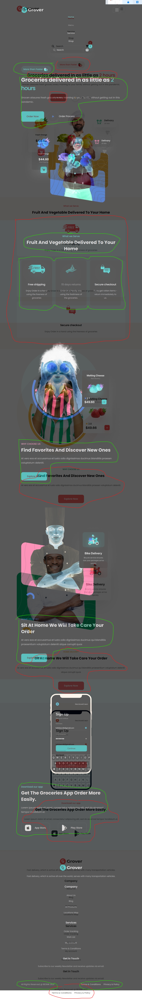
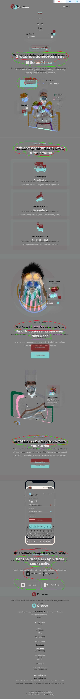
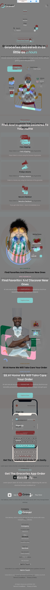
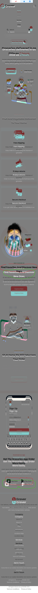
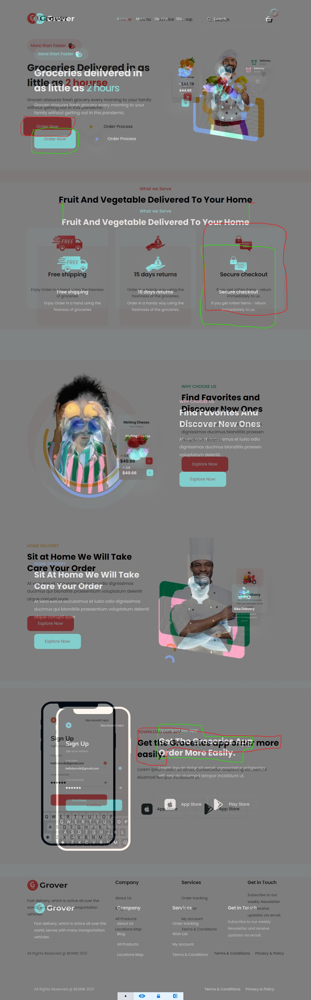
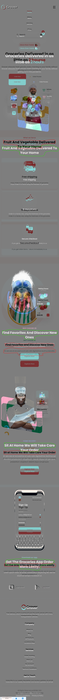

# Dương đánh giá bài học viên

**Note:**

- Màn hình:

  - max-width: 1500px

  - max-width: 1399px

  - max-width: 1199px

  - max-width: 991px

  - max-width: 767px

  - max-width: 575px

  - max-width: 420px

  - max-width: 375px

## [Dương Hiệp](https://github.com/duonghiep416/duonghiep_f8_fullstack.git)

- Sớm nhất \*

- [x] Màn hình: max-width: 1500px

Bài làm rất tốt \*

Chiều rộng phần hiển thị các phần tử đang bé hơn bản mẫu.

Phần bóng của `.hero-order img` quá đậm so với bản mẫu.

Chiều rộng các `.service-item` lớn hơn bản mẫu một chút.

Chưa xử lý action hover cho `.service-item`.

Màu chữ ở `section-title` sai so với bản mẫu.

Hình ảnh ở `.delivery .hero-img, .favorite .hero-img, .download .hero-img` lớn hơn so với bản mẫu.

Phần `.footer .section-desc` sai hoàn toàn so với bản mẫu.

---

- [x] Màn hình: max-width: 1399px

Bài làm chưa tốt

Chưa xử lý action hover cho `.service-item`.

Chưa có responsive ở màn hình này.

---

- [x] Màn hình: max-width: 1199px

Bài làm chưa tốt

Chưa xử lý action hover cho `.service-item`.

Chưa có responsive ở màn hình này.

---

- [x] Màn hình: max-width: 991px

Bài làm tốt

Các item trong `.hero-content` ở bản mẫu là căn trái chứ không phải căn giữa.

Các `.service-item` chưa đúng với bản mẫu, ở bản mẫu cả 3 item cùng trên một hàng.

Các item ở `.delivery-content, .favorite-content, .download-links` ở bản mẫu là căn trái chứ không phải căn giữa.

Các item ở `.copyright, .copyright-links` trong bản mẫu là cùng một hàng, không phải là 2 hàng.

---

- [x] Màn hình: max-width: 767px

Bài làm rất tốt \*

Các phần `.hero-title, .section-title` có font-size nhỏ hơn bản mẫu.

Các phần `.download-btn, .order-link` có kích thước nhỏ hơn bản mẫu.

---

- [x] Màn hình: max-width: 575px

Bài làm rất tốt \*

Các lỗi sai giống ở màn hình max-width: 767px.

---

- [x] Màn hình: max-width: 420px

Bài làm rất tốt \*

---

- [x] Màn hình: max-width: 375px

Bài làm rất tốt \*

---

- [x] Đánh giá chung bài tập về nhà: Bài làm rất tốt, cần chú ý thêm một số màn hình ở mức giữa, chú ý thêm về size các ảnh và các phần tử.

## [Nguyen Xuan Tuan Anh](https://github.com/xuananh2212/full_stack_01/tree/main/day_11)

- [x] Màn hình: max-width: 1500px

Bài làm tốt \*

Chú ý chữ hoa, chữ thường

Phần `.heading.lv2.cta--lv2.feature-cta--lv2` chưa có max-width.

Hình ảnh ở `.cta__img` to hơn bản mẫu.

Phần `.service__items__inner` có chiều rộng lớn hơn bản mẫu.

Sai chính tả **hourse** -> **hours**.

---

- [x] Màn hình: max-width: 1399px

Bài làm tốt \*

Một số lỗi sai giống như ở màn hình max-width: 1500px.

---

- [x] Màn hình: max-width: 1199px

Bài làm rất tốt \*

Chiều rộng phần hiển thị các phần tử đang to hơn bản mẫu.

---

- [x] Màn hình: max-width: 991px

Bài làm rất tốt \*

Animation hiển thị menu chưa giống bản mẫu.

Một số chiều rộng của các phần tử chưa giống bản mẫu.

---

- [x] Màn hình: max-width: 767px

Bài làm tốt \*

Một số lỗi sai vẫn giống như ở màn hình max-width: 991px.

---

- [x] Màn hình: max-width: 575px

Bài làm rất tốt \*

---

- [x] Màn hình: max-width: 420px

Bài làm tốt \*

Phần `.heading.lv2.service--lv2` chưa thu nhỏ font-size.

Các `.service__items__inner` chưa thu nhỏ chiều cao.

---

- [x] Màn hình: max-width: 375px

Bài làm tốt \*

Các lỗi sai tương tự như ở màn hình max-width: 420px.

- [x] Đánh giá chung bài tập về nhà: Bài làm tốt, cần chú ý thêm một số màn hình ở mức giữa, chú ý thêm về size các ảnh và các phần tử.
