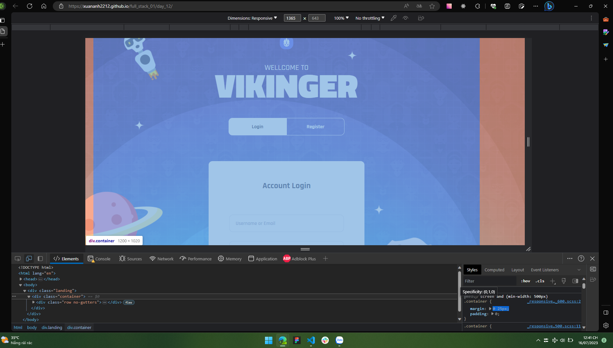
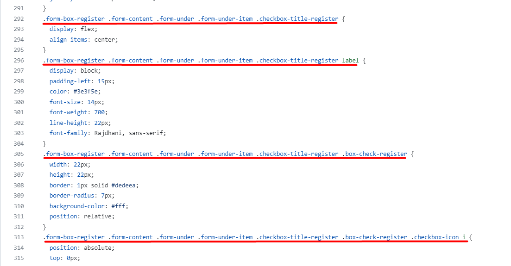
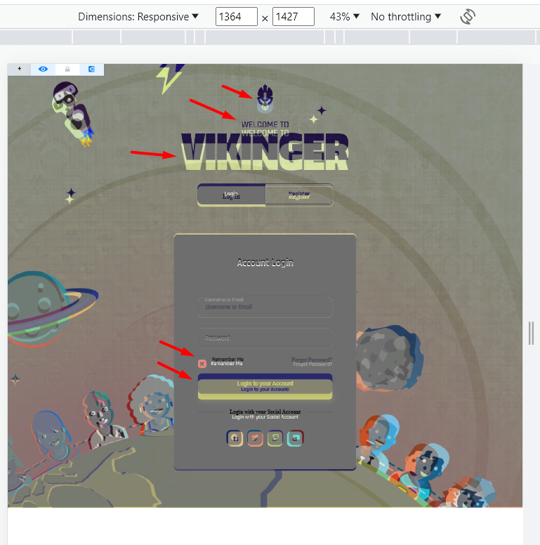

# Dương đánh giá bài học viên

**Note:**

- Màn hình:

  - max-width: 1500px

  - max-width: 1365px

  - max-width: 960px

  - max-width: 480px

- Đường dẫn:

  - Root: `https://reviewf8.vercel.app/Review`

  - HTML: `/Fullstack_nodeJs_K1/Day12/index.html`

  - Hình ảnh: `/images/Fullstack_nodeJs_K1/Day12/images`

## [Nguyen Xuan Tuan Anh](https://github.com/xuananh2212/full_stack_01/tree/main/day_12)

    Sớm nhất *

- [x] Bài 1: Màn hình: max-width: 1500px

  Bài làm rất tốt \*

  Chưa đổi màu của selection.

  Sai logo tại `.landing-content .logo-icon`

  Hiệu ứng transition hơi nhanh so với mẫu.

  Màu button ở register khác với bản mẫu.

  Hiệu ứng transition tại `.form-group input` sai so với bản mẫu.

  Chưa đổi màu khi hover vào `.forgot__link`

  Thiếu box-shadow tại 2 button.

  **[Xem ảnh-Login](https://reviewf8.vercel.app/Review/Fullstack_nodeJs_K1/Day12/images/tuananh2212-login-1500.png)**
  **[Xem ảnh-Register](https://reviewf8.vercel.app/Review/Fullstack_nodeJs_K1/Day12/images/tuananh2212-register-1500.png)**

---

- [x] Bài 2: Màn hình: max-width: 1365px

  Bài làm chưa tốt

  Các lỗi trước tương tự như màn hình 1500px.

  Phần `.container` chưa căn giữa. Vì `.container` sử dụng `margin: 0 25px`

  

  **[Xem ảnh-Login](https://reviewf8.vercel.app/Review/Fullstack_nodeJs_K1/Day12/images/tuananh2212-login-1365.png)**
  **[Xem ảnh-Register](https://reviewf8.vercel.app/Review/Fullstack_nodeJs_K1/Day12/images/tuananh2212-register-1365.png)**

---

- [x] Bài 3: Màn hình: max-width: 960px

  Bài làm rất tốt \*

  Các lỗi trước tương tự như màn hình 1365px.

  Cực kỳ chuẩn giao diện

  **[Xem ảnh-Login](https://reviewf8.vercel.app/Review/Fullstack_nodeJs_K1/Day12/images/tuananh2212-login-960.png)**
  **[Xem ảnh-Register](https://reviewf8.vercel.app/Review/Fullstack_nodeJs_K1/Day12/images/tuananh2212-register-960.png)**

---

- [x] Bài 4: Màn hình: max-width: 480px

  Bài làm rất tốt \*

  Các lỗi trước tương tự như màn hình 960px.

  Cực kỳ chuẩn giao diện, tuy có hơi lệch một vài px.

  **[Xem ảnh-Login](https://reviewf8.vercel.app/Review/Fullstack_nodeJs_K1/Day12/images/tuananh2212-login-480.png)**
  **[Xem ảnh-Register](https://reviewf8.vercel.app/Review/Fullstack_nodeJs_K1/Day12/images/tuananh2212-register-480.png)**

---

- [x] Đánh giá chung bài tập về nhà: Bài làm rất tốt, cần chú ý thêm một số màn hình ở mức giữa, chú ý thêm về size các ảnh và các phần tử.

---

## [Dương Hiệp](https://duonghiep416.github.io/duonghiep_f8_fullstack/Day12/)

- [x] Bài 1: Màn hình: max-width: 1500px

  Bài làm rất tốt \*

  Thiếu phần hình tròn ở bên phải màn hình.

  Sai icon ở `.page-info .logo i`.

  Có thể rút gọn 2 input radio bằng một input checkbox.

  Chưa làm phần selection.

  Chưa đổi màu khi hover vào `.forgot-password-link`

  Chưa làm action translate khi hover vào các `.page-form .social-link`

  Khi unfocus, chưa đổi lại màu viền các input.

  Sai hiệu ứng khi hover vào nút.

  **[Xem ảnh-Login](https://reviewf8.vercel.app/Review/Fullstack_nodeJs_K1/Day12/images/duonghiep-login-1500.png)**
  **[Xem ảnh-Register](https://reviewf8.vercel.app/Review/Fullstack_nodeJs_K1/Day12/images/duonghiep-register-1500.png)**

---

- [x] Bài 2: Màn hình: max-width: 1365px

  Bài làm tốt

  Lệch nhiều so với bản mẫu.

  Các lỗi trước tương tự như màn hình 1500px.

  **[Xem ảnh-Login](https://reviewf8.vercel.app/Review/Fullstack_nodeJs_K1/Day12/images/duonghiep-login-1365.png)**
  **[Xem ảnh-Register](https://reviewf8.vercel.app/Review/Fullstack_nodeJs_K1/Day12/images/duonghiep-register-1365.png)**

---

- [x] Bài 3: Màn hình: max-width: 960px

  Bài làm tốt

  Lệch nhiều so với bản mẫu.

  Các lỗi trước tương tự như màn hình 1365px.

  **[Xem ảnh-Login](https://reviewf8.vercel.app/Review/Fullstack_nodeJs_K1/Day12/images/duonghiep-login-960.png)**
  **[Xem ảnh-Register](https://reviewf8.vercel.app/Review/Fullstack_nodeJs_K1/Day12/images/duonghiep-register-960.png)**

---

- [x] Bài 4: Màn hình: max-width: 480px

  Bài làm tốt

  Hơi lệch một chút so với bản mẫu.

  Các lỗi trước tương tự như màn hình 960px.

  **[Xem ảnh-Login](https://reviewf8.vercel.app/Review/Fullstack_nodeJs_K1/Day12/images/duonghiep-login-480.png)**
  **[Xem ảnh-Register](https://reviewf8.vercel.app/Review/Fullstack_nodeJs_K1/Day12/images/duonghiep-register-480.png)**

---

- [x] Đánh giá chung bài tập về nhà: Bài làm tốt, cần chú ý thêm về size các ảnh và các phần tử, chú ý kiểm tra lại các hiệu ứng.

---

## [Mai Việt Hoàng](https://viethoang-mai.github.io/MVH-fullstack-nodejs-F8-01/Bai_tap/Bai_tap_buoi_12/Exercise12.html)

- [x] Bài 1: Màn hình: max-width: 1500px

  Bài làm rất tốt \*

  Sai icon ở `.landing .landing-content__info .logo .logo-img`.

  Có thể rút gọn 2 input radio bằng một input checkbox.

  Chưa làm phần selection.

  Đổi màu sai khi hover vào `.landing .landing-form .form .form__row a`

  Thời gian hiệu ứng quá nhanh tại các label của `.tab-switch`

  Font chữ quá mảnh tại `.landing .landing-content__info .desc`

  Sai hiệu ứng khi hover vào nút.

  Phần `.sub-heading` thực tế không phải là một heading riêng, nó không mang một ý nghĩa nào khi đứng một mình.

  - Nó cần đi cùng với `.heading` vì vậy nên gộp cả 2 lại.

  - Phần `.form__heading` mới là một `h2`

  Thiếu đổ bóng ở các button.

  **[Xem ảnh-Login](https://reviewf8.vercel.app/Review/Fullstack_nodeJs_K1/Day12/images/viethoang-login-1500.png)**
  **[Xem ảnh-Register](https://reviewf8.vercel.app/Review/Fullstack_nodeJs_K1/Day12/images/viethoang-register-1500.png)**

---

- [x] Bài 2: Màn hình: max-width: 1365px

  Bài làm tốt

  Lệch nhiều so với bản mẫu.

  Các lỗi trước tương tự như màn hình 1500px.

  **[Xem ảnh-Login](https://reviewf8.vercel.app/Review/Fullstack_nodeJs_K1/Day12/images/viethoang-login-1365.png)**
  **[Xem ảnh-Register](https://reviewf8.vercel.app/Review/Fullstack_nodeJs_K1/Day12/images/viethoang-register-1365.png)**

---

- [x] Bài 3: Màn hình: max-width: 960px

  Bài làm tốt

  Lệch nhiều so với bản mẫu.

  Các lỗi trước tương tự như màn hình 1365px.

  **[Xem ảnh-Login](https://reviewf8.vercel.app/Review/Fullstack_nodeJs_K1/Day12/images/viethoang-login-960.png)**
  **[Xem ảnh-Register](https://reviewf8.vercel.app/Review/Fullstack_nodeJs_K1/Day12/images/viethoang-register-960.png)**

---

- [x] Bài 4: Màn hình: max-width: 480px

  Bài làm tốt

  Hơi lệch một chút so với bản mẫu.

  Các lỗi trước tương tự như màn hình 960px.

  **[Xem ảnh-Login](https://reviewf8.vercel.app/Review/Fullstack_nodeJs_K1/Day12/images/viethoang-login-480.png)**
  **[Xem ảnh-Register](https://reviewf8.vercel.app/Review/Fullstack_nodeJs_K1/Day12/images/viethoang-register-480.png)**

---

- [x] Đánh giá chung bài tập về nhà: Bài làm tốt, cần chú ý thêm về size các ảnh và các phần tử, chú ý kiểm tra lại các hiệu ứng.

---

## [Luu Anh Quan](https://anhquan2211.github.io/F8-OFFLINE/)

- [x] Bài 1: Màn hình: max-width: 1500px

  Bài làm rất tốt \*

  Sai icon ở `.section-landing .landing-content .logo img`.

  Phần `.title-small` thực tế không phải là một heading riêng, nó không mang một ý nghĩa nào khi đứng một mình.

  - Nó cần đi cùng với `.title-main` vì vậy nên gộp cả 2 lại.

  Có thể rút gọn 2 input radio bằng một input checkbox.

  Chưa làm phần selection.

  Bài làm rất khớp bản mẫu

  **[Xem ảnh-Login](https://reviewf8.vercel.app/Review/Fullstack_nodeJs_K1/Day12/images/anhquan-login-1500.png)**
  **[Xem ảnh-Register](https://reviewf8.vercel.app/Review/Fullstack_nodeJs_K1/Day12/images/anhquan-register-1500.png)**

---

- [x] Bài 2: Màn hình: max-width: 1365px

  Bài làm rất tốt \*

  Các lỗi trước tương tự như màn hình 1500px.

  Rất khớp với bản mẫu.

  **[Xem ảnh-Login](https://reviewf8.vercel.app/Review/Fullstack_nodeJs_K1/Day12/images/anhquan-login-1365.png)**
  **[Xem ảnh-Register](https://reviewf8.vercel.app/Review/Fullstack_nodeJs_K1/Day12/images/anhquan-register-1365.png)**

---

- [x] Bài 3: Màn hình: max-width: 960px

  Bài làm rất tốt \*

  Các lỗi trước tương tự như màn hình 1365px.

  Rất khớp với bản mẫu.

  **[Xem ảnh-Login](https://reviewf8.vercel.app/Review/Fullstack_nodeJs_K1/Day12/images/anhquan-login-960.png)**
  **[Xem ảnh-Register](https://reviewf8.vercel.app/Review/Fullstack_nodeJs_K1/Day12/images/anhquan-register-960.png)**

---

- [x] Bài 4: Màn hình: max-width: 480px

  Bài làm rất tốt \*

  Các lỗi trước tương tự như màn hình 960px.

  Rất khớp với bản mẫu.

  Phần `Forgot password?` chưa xử lý tốt, khiến giao diện bị vỡ, tuy nhiên vẫn perfectly responsive.

  - Có thể thêm overflow: hidden vào `.form` để giải quyết vấn đề này.

  - Có thể do không có cha nào của nó là relative nên nó nhận body làm cha, sau đó vì sử dụng `right: -100%` nên nó sẽ bị tràn ra ngoài body.

  - Lý do không nhận thấy có vẻ là do sử dụng thêm width 100% nên phần text vẫn nằm trong phần `.form` nên không bị tràn ra ngoài.

  **[Xem ảnh-Login](https://reviewf8.vercel.app/Review/Fullstack_nodeJs_K1/Day12/images/anhquan-login-480.png)**
  **[Xem ảnh-Register](https://reviewf8.vercel.app/Review/Fullstack_nodeJs_K1/Day12/images/anhquan-register-480.png)**

---

- [x] Đánh giá chung bài tập về nhà: Bài làm rất tốt. Cần chú ý test lại màn hình nhỏ để tự tìm ra lỗi và sửa lại.

---

## [Dương Quốc Anh](https://quocanh-bit.github.io/F8_fullstack_006/buoi_12/bai1.html)

- [x] Bài 1: Màn hình: max-width: 1500px

  Bài làm tốt

  Có thể rút gọn 2 input radio bằng một input checkbox.

  Chưa làm phần selection.

  Chưa đổi màu khi hover vào `.landing .landing-form .form .form__row a`

  Sai hiệu ứng khi hover vào nút.

  Đổ bóng sai ở button phần đăng ký.

  Sai hoàn toàn title tại `.form-box-title` ở phần đăng ký.

  Sai chính tả `.lading` => `.landing`

  Phần `.lading-form .form-box a` sai màu.

  Việc sử dụng font-size bằng `em` sẽ rất khó để tính toán nếu không có một trường hợp cụ thể.

  Đặt font-weight quá bừa bãi, không có một quy tắc cụ thể.

  ```css
  /*Font title*/
  @font-face {
    font-family: "Titillium";
    src: url(../fonts/Titillium-Light.otf);
    font-weight: 300;
  }
  @font-face {
    font-family: "Titillium";
    src: url(../fonts/Titillium-Black.otf);
    font-weight: 600;
  }
  /*Font content*/
  @font-face {
    font-family: "Rajdhani";
    src: url(../fonts/Rajdhani-Light.ttf);
    font-weight: 100;
  }
  @font-face {
    font-family: "Rajdhani";
    src: url(../fonts/Rajdhani-SemiBold.ttf);
    font-weight: 300;
  }
  @font-face {
    font-family: "Rajdhani";
    src: url(../fonts/Rajdhani-Bold.ttf);
    font-weight: 600;
  }
  ```

  Đề xuất sửa thành:

  - Font-weight Light: 300
  - Font-weight SemiBold: 500
  - Font-weight Bold: 700
  - Font-weight Black: 900

  Bài làm quá lệch so với bản mẫu

  **[Xem ảnh-Login](https://reviewf8.vercel.app/Review/Fullstack_nodeJs_K1/Day12/images/quocanh-login-1500.png)**
  **[Xem ảnh-Register](https://reviewf8.vercel.app/Review/Fullstack_nodeJs_K1/Day12/images/quocanh-register-1500.png)**

---

- [x] Bài 2: Màn hình: max-width: 1365px

  Bài làm không tốt

  Các lỗi trước tương tự như màn hình 1500px.

  Bài làm quá lệch so với bản mẫu

  Background bản mẫu không sử dụng fixed.

  **[Xem ảnh-Login](https://reviewf8.vercel.app/Review/Fullstack_nodeJs_K1/Day12/images/quocanh-login-1365.png)**
  **[Xem ảnh-Register](https://reviewf8.vercel.app/Review/Fullstack_nodeJs_K1/Day12/images/quocanh-register-1365.png)**

- [x] Bài 3: Màn hình: max-width: 960px

  Bài làm không tốt tốt

  Tất cả màn hình đều sai hoàn toàn về giao diện. Do sai background.

## [Minh Quang](https://github.com/taminhquang13/F8_Fullstack/tree/main/BT12)

Bài làm tốt

NHỮNG LƯU Ý, LỖI CHUNG TOÀN BÀI:

- Với màn desktop: Phần nội dung đang căn chỉnh top không căn linh hoạt luôn ở giữa màn hình theo chiều dọc.

- Các `button` và thẻ `a` sai font-family. Với những màn desktop, button đang active ở `switch-btn` chưa chỉnh về `cursor:auto`.

- Phần các input:

  - Ô `input` đầu tiên của form chưa auto focus ngay từ đầu.

  - Khi input:focus,input:valid thì `label` chưa có khoảng cách 2 bên với border của input.

  - Các ô input trừ kiểu checkbox, đang đều có name giống nhau là `name="text"`. Có thể viết thuộc tính `required` thay vì `required=""`

  - Ô input email ở register form đang có `type=text` là chưa phù hợp. Nên để `type=email`

- Với những màn Desktop, phần Checkbox `Remember Me` chưa được active ngay từ đầu, và chưa có `cursor:pointer`.

- Với những màn Desktop: Button submit chưa xử lý hover đổi màu background.

- Chữ `line-txt` chưa đúng mã màu.

- Phần `social-link > i` (16px) đang lớn hơn bài mẫu (12px). Với những màn Desktop, chưa xử lý hover cho từng icon link.

- Ở phần `head` của file HTML, nên để phần link file css của bài xuống dưới phần nhúng link css của thư viện. Để có thể ghi đè css của thư viện nếu cần.

  

CHÚ Ý VÀ LỖI Ở NHỮNG PHẦN RIÊNG:

- [x] Bài 1: Màn hình: [max-width: 1500px]:

  Bài làm chưa tốt.

  Vì chưa căn chỉnh nội dung luôn linh hoạt ở giữa màn hình nên nội dung toàn trang dài quá 100vh, nhưng không có thanh cuộn dọc nên bị khuất mất phần nội dung dài quá 100vh đó.

  Vị trí form register chưa đúng, đang bị lệch hẳn xuống dưới.

---

- [x] Bài 2: Các màn hình: [max-width: 1364px], [max-width: 600px], [ max-width: 480px]:

  Bài làm chưa tốt.

  Từ [max-width: 724px] trở xuống đang bị lỗi không width full màn hình, do phần form register ẩn nhưng vẫn đang chiếm kích thước thực trên trang.

  

  Ngoài những lỗi trên thì, giao diện Login tương đối trùng khớp với bài mẫu, chỉ lệch một chút ở một số chỗ:

  

---

- [x] Đánh giá chung bài tập về nhà: Bài làm tốt, cần chú ý thêm các tiểu tiết style, check vị trí các phần tử khi ở các màn hình kích thước khác nhau để bài làm tốt hơn.

---

## [Tuấn Phạm](https://github.com/phamtuan162/phamtuan-nodejs-01/tree/main/Buoi12)

Bài làm rất tốt \*

NHỮNG LƯU Ý, LỖI CHUNG TOÀN BÀI:

Phần khoảng cách giữa `landing__desc` và `landing__tab-switch` đang nhỏ hơn bài mẫu.

- Phần `landing__tab-switch`: kiểu chữ uppercase là không giống bài mẫu, ở bài mẫu là kiểu viết lowercase. Với những màn desktop, button đang active khi hover vào vẫn hiện hình bàn tay, ở chưa chỉnh về `cursor:auto`.

- Form: Ô input đầu tiên của form register chưa autofocus ngay từ đầu. ô input email ở register form đang có `type=text` là chưa phù hợp, nên để `type=email`. Chữ label của checkbox chưa đúng mã màu.

- Màu chữ của link `forgot password` chưa đúng.

CHÚ Ý VÀ LỖI Ở NHỮNG PHẦN RIÊNG:

- [x] Bài 1: Màn hình: max-width: 1500px.

  Bài làm rất tốt \*

  Chỉ có một chút về xác định breakpoint, bạn đang làm là 1499px, chưa đúng như bài mẫu là 1500px.

- [x] Bài 2: Màn hình: max-width: 1364px

  Bài làm rất tốt \*

  Giao diện và mọi thứ đều đã rất tốt, chỉ có một chút về việc bạn đang xác định breakpoint chưa đúng theo bài mẫu: Bạn đang làm là 1367px, chưa đúng như bài mẫu là 1364px.

- [x] Bài 3: Màn hình: max-width: 600px:

  Bài làm rất tốt

  Chỉ chưa xử lý: Ở màn hình này width của form được set lại giá trị khác (full width theo `container`), padding của form cũng đang nhỏ hơn bài mẫu.

- [x] Bài 4: Màn hình: max-width: 500px:

  Bài làm rất tốt

  Chỉ chưa xử lý: Ở màn hình này width của `landing__tab-switch` được set lại giá trị khác (full width theo `container`). Padding của form cũng đang nhỏ hơn bài mẫu.

---

- [x] Đánh giá chung bài tập về nhà: Bài làm rất tốt, cần chú ý thêm xác định breakpoint theo bài mẫu, để ý style các phần tử theo các kích thước màn hình để bài sẽ hoàn thiện hơn.
