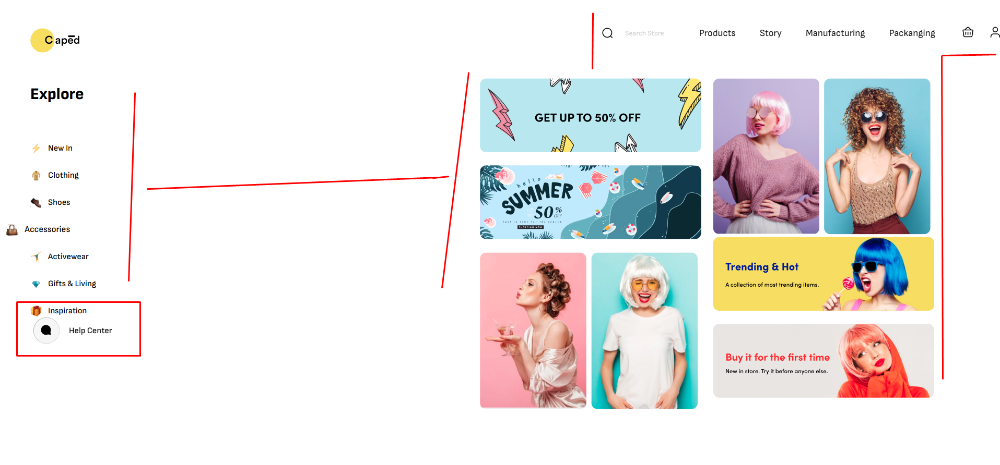
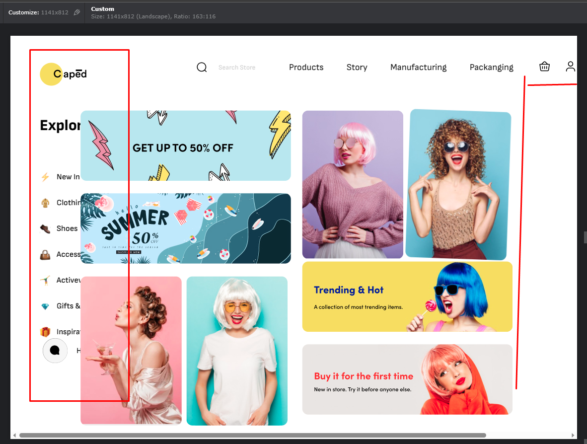
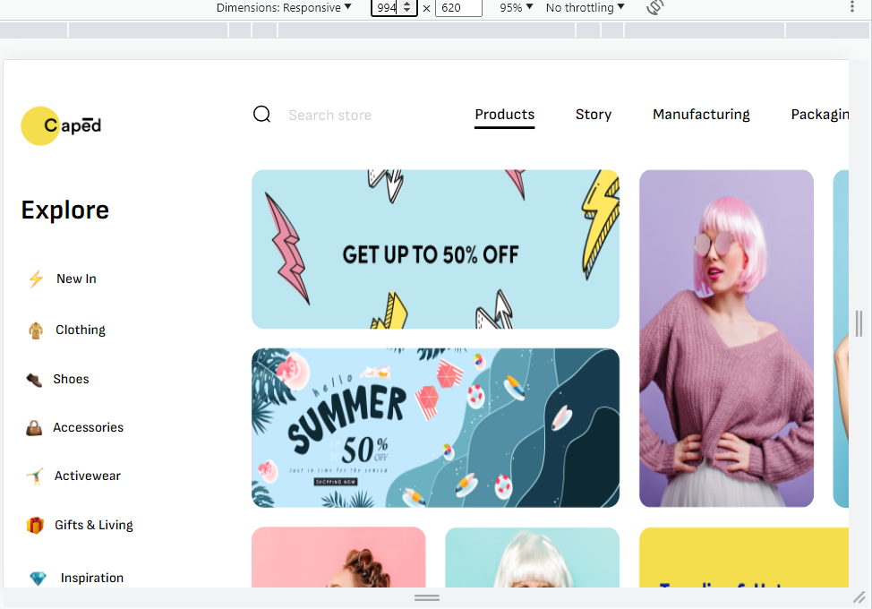
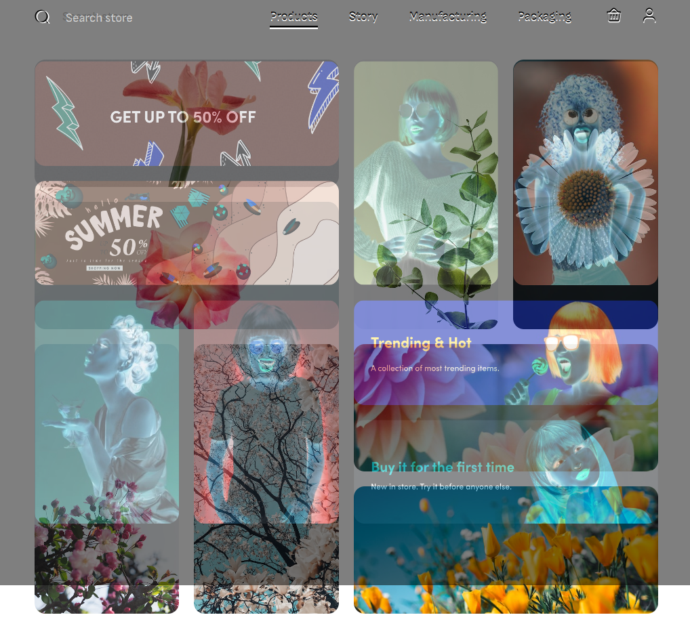
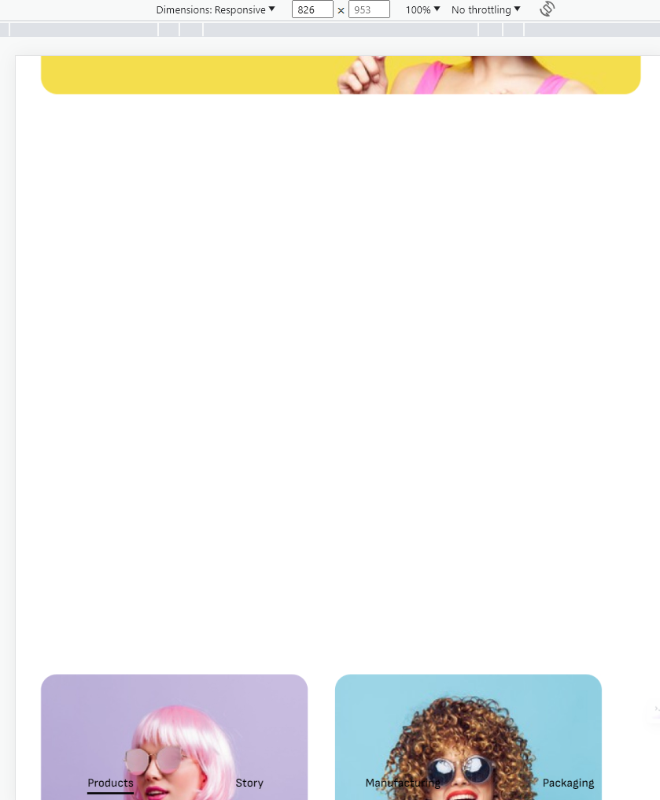
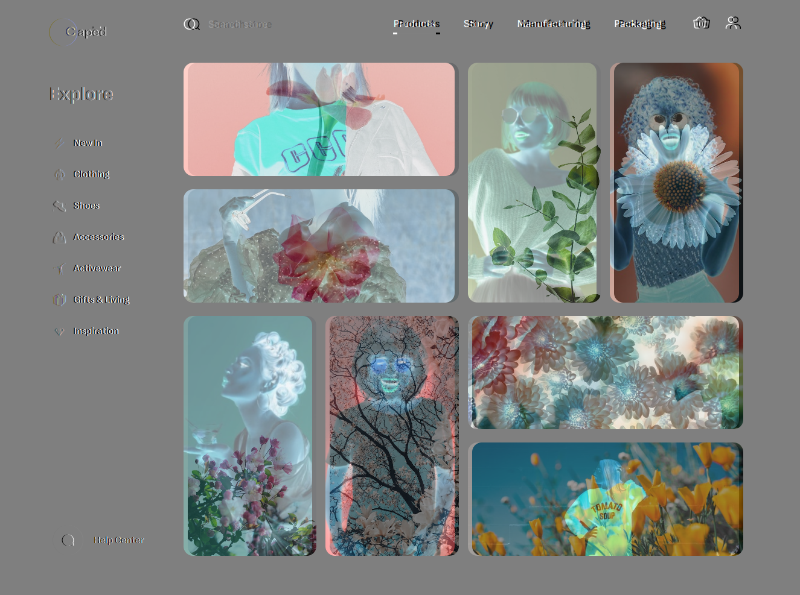
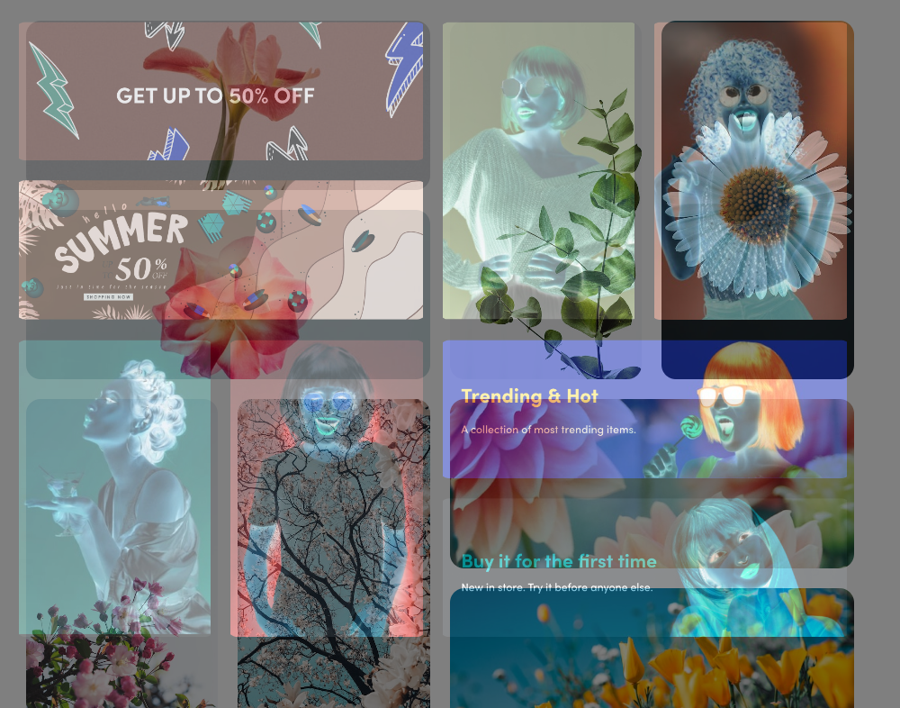
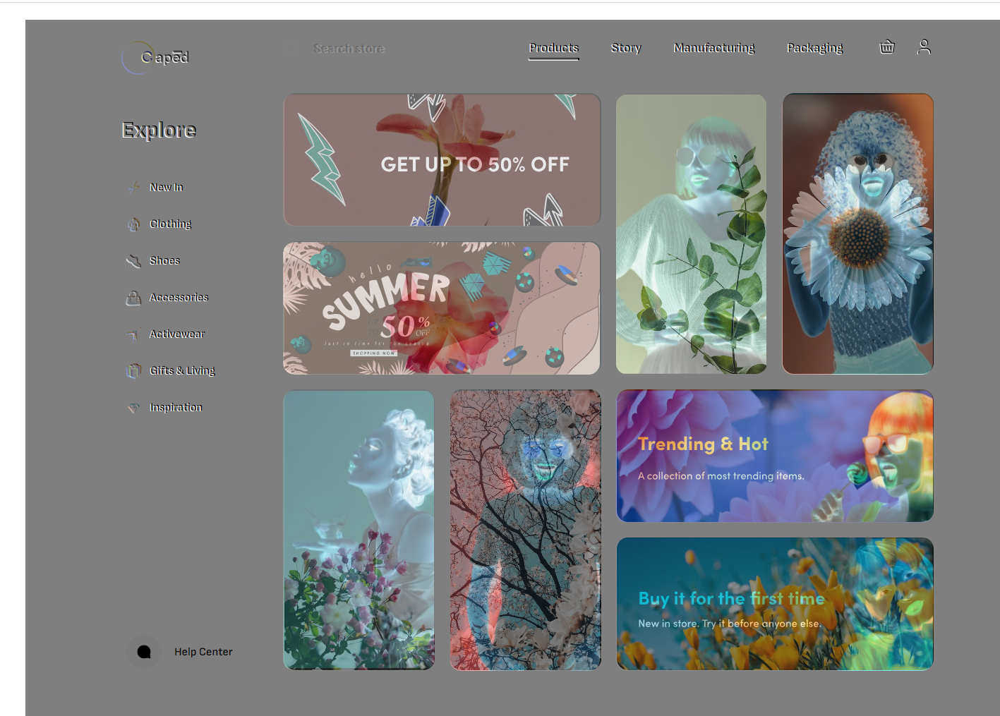

# Dương đánh giá bài học viên

## [Nguyen Xuan Tuan Anh](https://github.com/xuananh2212/full_stack_01/tree/main/day_12)

    Sớm nhất *

- [x] Bài 1:

  Bài làm rất tốt \*

  Nên đo đúng tỷ lệ hình ảnh để làm bài tốt hơn.

  Tất cả kích thước ảnh đang sai so với bản mẫu.

  Nên thêm một chút padding hoặc margin vào bottom để khi cuộn xuống cuối, hình ảnh không bị dính vào lề dưới.

  Ở màn hình từ 576px => 768px, hình ảnh dọc đang quá hẹp.

  Từ màn hình 575 trở xuống, việc làm menu cuộn ở trong một trang web mobile khá là khó sử dụng, chỉ cần cuộn quá tay thì sẽ bị lăn vào toàn trang. Nên sử dụng tab ngang để hiển thị menu thì hợp lý hơn.

  - Phần **Help Center** không mang vai trò quá quan trọng hơn hoặc bằng menu, logo. Không nên đặt chung hàng. Có thể đổi chỗ **Help Center** cho menu.

  Đã có reset css ở trên, không cần thiết phải viết lại selector `*` ở dưới.

  ```css
  * {
    padding: 0;
    margin: 0;
    box-sizing: border-box;
    outline: 0;
  }
  ```

  Nếu đặt tên class và selector theo BEM thì nên tuân thủ đúng BEM (Block, Element, Modifier).

  Không cần thiết phải link nhiều ảnh trong `rel="icon"` và `rel="apple-touch-icon"` vì sử dụng ảnh này để hiển thị icon trên tab, bookmark, màn hình chính điện thoại. Nên chỉ cần link ảnh 32x32 là đủ.

---

## [Mai Việt Hoàng](https://viethoang-mai.github.io/MVH-fullstack-nodejs-F8-01/Hoc_SCSS/Thuc_hanh_b13)

- [x] Bài 1:

  Bài làm rất tốt \*

  Nên đo đúng tỷ lệ hình ảnh để làm bài tốt hơn.

  Tất cả kích thước ảnh đang sai so với bản mẫu.

  Phần `.wrapper .search-form .search-input` hơi xấu, đang bị nổi khối với màu đền.

  Phần hình ảnh chính `.wrapper-inner .item.column > * img` nên có alt miêu tả hình ảnh thay vì để trống.

  Từ màn hình `909px` đến `769px` đang bị lỗi giao diện.

  Từ màn `375px` trở xuống, việc xếp 2 hình ảnh vào chung 1 cột khiến cho hình ảnh bị thu nhỏ quá nhiều, không đẹp.

  - Chữ **Gifts & Living** đang bị nhảy chữ xuống. Nên sử dụng `white-space: nowrap` để chữ không bị xuống dòng.

---

## [Dương Quốc Anh](https://github.com/QuocAnh-bit/F8_fullstack_006.git)

- [x] [Bài 1](https://github.com/QuocAnh-bit/F8_fullstack_006.git)

  Phần `help` chưa được `fixed`

  Nút `menu-mobile` không hoạt động trên mobile

  Chưa responsive cho màn hình tablet

  Trên màn hình `mobile` nội dung bị tràn ra ngoài và chỉ hiện một phần của trang web

  Màn hình có kích thước từ `769px` -> `1550px` bị tràn nội dung ra ngoài và xuất hiện thanh cuộn ngang

  Thiếu phần `search`, `navbar danh mục sản phẩm`, `help` trên màn mobile

---

- [x] Đánh giá chung bài tập về nhà: Bài làm chưa tốt, vẫn bị lỗi giao diện trên màn hình tablet, mobile (xuất hiện thanh cuộn ngang, chỉ hiện một phần của trang web)

## [Trung Le](https://github.com/Trungdeptraii/16-07-2023-Le-Van_Trung-Day13.git)

- [x] [Bài 1](https://github.com/Trungdeptraii/16-07-2023-Le-Van_Trung-Day13.git)

  `Navbar` của header đang ở phía bên trái (Theo thiết kế nằm bên phải)

  Chữ và icon của phần `help center` bị sát vào nhau quá

  Chưa responsive cho màn tablet

  Chưa responsive cho màn mobile

  Responsive cho màn từ `575px -> 767px`: Bố trí phần `navbar` của `header` chưa hợp lý, nên ẩn đi và tạo thêm một nút để khi bấm vào thì `navbar` sẽ trượt ra. Thiếu `logo`, logo là phần chính của trang web không nên thiếu. Phần `navbar danh mục sản phẩm` dàn thành 1 hàng bị sát vào nhau quá và chữ cũng bị rơi xuống hàng khác. Thiếu phần `help center`

  Từ màn `1210px` trở xuống là bị xuất hiện thanh cuộn ngang và khuất nội dung

---

- [x] Đánh giá chung bài tập về nhà: Bài làm chưa tốt, chưa responsive cho màn hình tablet, mobile, giao diện trên desktop chưa sát với thiết kế

## [Minh Quang](https://github.com/taminhquang13/F8_Fullstack.git)

- [x] [Bài 1](https://github.com/taminhquang13/F8_Fullstack.git)

  Nên thêm `cursor:pointer` khi hover vào các ảnh để người dùng có cảm giác có thể ấn vào được

  Phần chữ `explore` bị lệch với `nav-sidebar`, các icon trong `nav-sidebar` bị trồi ra ngoài

  Không có `object-fit: cover` cho các ảnh khi set width, height khiến cho ảnh bị méo

  Không set cùng width cho các icon trong phần `sidebar` khiến cho phần chữ bên cạnh không được thẳng nhau do kích thước các icon khác nhau

  Chưa có responsive

---

- [x] Đánh giá chung bài tập về nhà: Bài làm chưa tốt, chưa có responsive

## [Nguyễn Duy An](https://github.com/nguyenduyan9/BTVN.git)

- [x] [Bài 1](https://github.com/nguyenduyan9/BTVN.git)

  Chưa có `transition` cho thẻ img khiến cho hiệu ứng zoom ảnh bị giật

  Khi hover ảnh bị mất `border-radius`

  Thừa icon menu trên màn desktop

  Từ `1121px -> 1180px` icon `help center` bị méo, nên set `min-width` cho `message-icon`

  Từ màn hình dưới `1180px` nội dung bị sát vào lề, không có phần đệm lề khiến cho trang web bị xấu

  Hiệu ứng trượt từ phải sang trái của menu còn giật và gây rối mắt cho người dùng. Nên trượt từ 1 bên sang (menu ở bên trái thì trượt từ bên trái, hoặc ngược lại)

  Ấn vào `overlay` chưa tắt được menu, không tìm được cách tắt menu

  Phần `explore` là một phần của trang web, không thuộc `header`. Không nên để `explore` nằm trong header. Đối với màn hình nhỏ, phần `explore` bị mất nội dung.

  Phần `help center` đặt chưa được hợp lý, có thể tham khảo cách bố trí phần `explore`, `help center` trong hình sau:
  

---

- [x] Đánh giá chung bài tập về nhà: Bài làm chưa tốt, cần chú ý vào cách sắp xếp bố cục trên tablet, mobile sao cho hợp lý

## [Hoài Nam Đỗ](https://github.com/oaiHmaN25/btvn.git)

- [x] [Bài 1](https://github.com/oaiHmaN25/btvn.git)

  Vỡ giao diện trên màn hình desktop, nội dung tràn ra ngoài khiến cho màn hình xuất hiện thanh cuộn ngang. Nút `help center` chưa giống với thiết kế (Xem video hướng dẫn code trong **chương 8** để hiểu rõ hơn)

  

  Đối màn hình mobile, tablet: Sắp xếp bố cục chưa hợp lý, thiếu phần `navbar chính của header`, các icon phần `sidebar` để lên phần header không có mô tả khiến cho các icon không có ý nghĩa, không có nút `help center`

  Phần `explore` là một phần của trang web, không thuộc `header`. Không nên để `explore` nằm trong header.

  Vỡ giao diện từ màn `1257px -> 1050px`

  

---

- [x] Đánh giá chung bài tập về nhà: Bài làm chưa tốt, cần cải thiện nhiều, cần chú ý vào cách sắp xếp bố cục trên tablet, mobile sao cho hợp lý (Code lại)

## [Tuấn Phạm](https://phamtuan162.github.io/phamtuan-nodejs-01/Buoi13.)

- [x] [Bài 1](https://phamtuan162.github.io/phamtuan-nodejs-01/Buoi13.)

  Màn hình trên > 1200px phần **header** vị trí sô lật nhiều so với bản mẫu.

  .

  Từ Màn 992px => 1200px lỗi giao diện do để `.wrapper__inner` có `width: 1200px`.

  .

  Giao diện mobile làm tốt.

---

- [x] Đánh giá chung bài tập về nhà: Bài làm tốt. chỉ cần điều chỉnh một số lỗi nhỏ để hoàn thiện hơn.

## [Bi11-043 Đỗ Hà Chi](https://serenaha12.github.io/ecommerce_ui/.)

- [x] [Bài 1](https://serenaha12.github.io/ecommerce_ui/.)

  Màn hình trên > 1200px tất cả kích thước ảnh đang sai so với bản mẫu.
  
  Từ Màn 992px => 1200px lỗi giao diện do để `.wrapper__inner` có `width: 1200px`.
  Màn Tablet cũng bị lỗi giao diện .
  Khoảng cách giữa các hình ảnh khá xa từ màn hình < 992px.
  .
  Không Có giao diện mobile(bổ sung thêm giao diện mobile).

---

- [x] Đánh giá chung bài tập về nhà: bài làm chưa tốt xem lại phần màn tablet và mobile.

## [DuongHiep](https://duonghiep416.github.io/duonghiep_f8_fullstack/)

- [x] [Bài 1](https://duonghiep416.github.io/duonghiep_f8_fullstack/)

  Màn hình trên > 1200px làm tốt.
  ;

  Màn Tablet nên chỉnh phần **slide bar** đối xứng giao diện sẽ đẹp hơn.

  Giao diện mobile làm tốt.

---

- [x] Đánh giá chung bài tập về nhà: Bài làm rất tốt. chỉ cần điều chỉnh một số lỗi nhỏ để hoàn thiện hơn.

## [Nam Nguyễn](https://github.com/namnguyen2603/nguyentrungnam_bai13.git)

- [x] [Bài 1](https://github.com/namnguyen2603/nguyentrungnam_bai13.git)

  Màn hình trên > 1200px tất cả kích thước các ảnh đang sai so với mẫu thiết kế.
  .
  Nút `help center` chưa giống với thiết kế (Xem video hướng dẫn code trong **chương 8** để hiểu rõ hơn).
  Từ Màn hình < 1200px bị lỗi giao diện.
  Chưa có giao diện **mobile**.

---

- [x] Đánh giá chung bài tập về nhà: Bài làm chưa tốt cần xem lại các màn hình tablet và mobile.

## [Luu Anh Quan](https://github.com/anhquan2211/F8-OFFLINE)

- [x] [Bài 1](https://github.com/anhquan2211/F8-OFFLINE)

  Màn hình trên > 1200px làm tốt.
  .
  Màn hình tablet làm tốt.
  Màn hình mobile làm tốt.

---

- [x] Đánh giá chung bài tập về nhà: Bài làm rất tốt.
