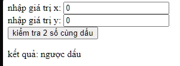
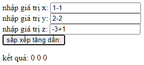

# Dương review bài Fullstack K1 Day16 (JS Day1)

## [Nguyen Xuan Tuan Anh](https://github.com/xuananh2212/js_fullstack_k1.git)

- [x] [Bài 1]

  Bài làm rất tốt \*

  Nên xóa các `console.log` không cần thiết trong bài

  Nên gộp chung bước Ép kiểu dữ liệu và gán giá trị cho biến để code ngắn gọn hơn, dễ đọc hơn.

  Biến var có thể khai báo và gán lại, nên không cần thiết phải tạo biến mới để gán giá trị mới.

  Thay vì gọi nhiều lần việc lấy giá trị và ép kiểu về số, nên gộp chung thành 1 hàm để tái sử dụng

---

- [x] [Bài 2]

  Bài làm rất tốt \*

  Nên format code theo chuẩn để dễ đọc hơn

  Đặt tên biến quá bừa bãi (x, y, z, ...)

  Các label cần có thêm giá trị `for` để liên kết với input

  Thay vì gọi nhiều lần việc lấy giá trị và ép kiểu về số, nên gộp chung thành 1 hàm để tái sử dụng

---

- [x] [Bài 3]

  Bài làm rất tốt \*

  Nên format code theo chuẩn để dễ đọc hơn

  Đặt tên biến quá bừa bãi (x, y, z)

  Các label cần có thêm giá trị `for` để liên kết với input

  Thay vì gọi nhiều lần việc lấy giá trị và ép kiểu về số, nên gộp chung thành 1 hàm để tái sử dụng

---

- [x] [Bài 4]

  Bài làm tốt

  Nên format code theo chuẩn để dễ đọc hơn

  Đặt tên biến quá bừa bãi (x, y, span)

  Các label cần có thêm giá trị `for` để liên kết với input

  Thay vì gọi nhiều lần việc lấy giá trị và ép kiểu về số, nên gộp chung thành 1 hàm để tái sử dụng

  Nếu 2 số không được truyền vào hoặc cả 2 là 0 thì bài làm sai.

  

---

- [x] [Bài 5]

  Bài làm tốt \*

  Nên format code theo chuẩn để dễ đọc hơn

  Đặt tên biến quá bừa bãi (x, y, z, mySpan)

  Các label cần có thêm giá trị `for` để liên kết với input

  Thay vì gọi nhiều lần việc lấy giá trị và ép kiểu về số, nên gộp chung thành 1 hàm để tái sử dụng

  Nếu một trong số các field là phép toán thì bài làm sai.

  

  ***

  - [x] Đánh giá chung bài tập về nhà: bài làm rất tốt, tuy nhiên cần cải thiện về việc đặt tên biến, format code và tái sử dụng code.

## [Luu Anh Quan](https://github.com/anhquan2211/F8-OFFLINE/blob/main/f8-offline-day16/main.js)

- [x] [Bài 1]

  Bài làm tốt \*

  Nên kiểm tra có phải một số hợp lệ không trước khi so sánh và đổi chỗ.

  ***

- [x] [Bài 2]

  Bài làm rất tốt \*

  ***

- [x] [Bài 3]

  Bài làm rất tốt \*

  ***

- [x] [Bài 4]

  Bài làm rất tốt \*

  ***

- [x] [Bài 5]

  Bài làm tốt \*

  Nên kiểm tra có phải một số hợp lệ không trước khi so sánh và đổi chỗ.

  ***

- [x] Đánh giá chung bài tập về nhà: bài làm rất tốt, tuy nhiên cần tính đến các trường hợp đặc biệt như đầu vào không phải là số.

## [Dương Quốc Anh](https://github.com/QuocAnh-bit/F8_fullstack_006.git)

- [x] [Bài 1]

  Bài làm tốt \*

  Nên kiểm tra có phải một số hợp lệ không trước khi so sánh và đổi chỗ.

  ***

- [x] [Bài 2]

  Bài làm rất tốt \*

  ***

- [x] [Bài 3]

  Bài làm rất tốt \*

  Nên gán số lớn ra một biến và console.log 1 lần để dễ sửa và nâng cấp code hơn.

  Cần format code theo chuẩn để dễ đọc hơn

  ***

- [x] [Bài 4]

  Bài làm tốt

  ```js
  a = 0;
  b = -1;
  if (a * b < 0) {
    console.log("Khac dau");
  } else {
    console.log("Cung dau"); // Cung dau
  }
  // ---
  a = 0;
  b = 1;
  if (a * b < 0) {
    console.log("Khac dau");
  } else {
    console.log("Cung dau"); // Cung dau
  }
  ```

  Với trường hợp có 1 số là 0, bài làm sai.

  Format lại code.

  ***

- [x] [Bài 5]

  Sai yêu cầu đề bài: Sắp xếp tăng dần nhưng lại in ra giảm dần.

  ***

- [x] Đánh giá chung bài tập về nhà: bài làm tốt, tuy nhiên cần format code theo chuẩn để dễ đọc hơn, chú ý hơn vào các trường hợp đặc biệt, yêu cầu đề bài.

## [Dương Hiệp](https://github.com/duonghiep416/duonghiep_f8_fullstack/tree/main/Day16)

- [x] [Bài 1]

  Bài làm tốt \*

  Nên kiểm tra có phải một số hợp lệ không trước khi so sánh và đổi chỗ.

  ***

- [x] [Bài 2]

  Bài làm rất tốt \*

  ***

- [x] [Bài 3]

  Bài làm rất tốt \*

  ***

- [x] [Bài 4]

  Bài làm rất tốt \*

  ***

- [x] [Bài 5]

  Bài làm tốt \*

  Nên kiểm tra có phải một số hợp lệ không trước khi so sánh và đổi chỗ.

  ***

- [x] Đánh giá chung bài tập về nhà: bài làm rất tốt, tuy nhiên cần chú ý đến các trường hợp đặc biệt như đầu vào không phải là số.

## [Mai Việt Hoàng](https://github.com/Viethoang-Mai/MVH-fullstack-nodejs-F8-01.git)

- [x] [Bài 1]

  Bài làm tốt \*

  Nên kiểm tra có phải một số hợp lệ không trước khi so sánh và đổi chỗ.

  ***

- [x] [Bài 2]

  Bài làm rất tốt \*

  ***

- [x] [Bài 3]

  Bài làm rất tốt \*

  ***

- [x] [Bài 4]

  Bài làm tốt

  ```js
  var a = 0,
    b = -3;
  if (a * b >= 0) console.log(`a va b cùng dấu`); // a va b cùng dấu
  else console.log(`a va b trái dấu`);

  // ---

  var a = 0,
    b = 3;
  if (a * b >= 0) console.log(`a va b cùng dấu`); // a va b cùng dấu
  else console.log(`a va b trái dấu`);
  ```

  Với trường hợp có 1 số là 0, bài làm sai.

  ***

- [x] [Bài 5]

  Bài làm tốt \*

  Nên kiểm tra có phải một số hợp lệ không trước khi so sánh và đổi chỗ.

  ***

- [x] Đánh giá chung bài tập về nhà: bài làm rất tốt, tuy nhiên cần chú ý đến các trường hợp đặc biệt như đầu vào không phải là số hoặc số 0... Sử dụng tên biến có ý nghĩa hơn.

## [nguyen hung anh](https://github.com/realguy010895/hunganh-f8-k1-buoi16/blob/main/script.js)

- [x] [Bài 1]

  Bài làm tốt \*

  Nên kiểm tra có phải một số hợp lệ không trước khi so sánh và đổi chỗ.

  ***

- [x] [Bài 2]

  Bài làm rất tốt \*

  ***

- [x] [Bài 3]

  Bài làm rất tốt \*

  ***

- [x] [Bài 4]

  Bài làm tốt

  ```js
  var a = 0;
  var b = 1;

  if ((a >= 0 && b >= 0) || (a < 0 && b < 0) || (a === 0 && b === 0)) {
    console.log("Hai số cùng dấu.");
  } else {
    console.log("Hai số có dấu khác nhau.");
  }
  ```

  Với trường hợp có 1 số là 0 và một số là dương, bài làm chưa xử lý đúng.

  Với trường hợp này, nên thay dấu `>=` thành `>` để kiểm tra 3 trường hợp: cùng dấu âm, cùng dấu dương, 2 số là 0.

  Tuy nhiên có cách giải đơn giản hơn là kiểm tra tích của 2 số, nếu tích >= 0 thì 2 số cùng dấu, ngược lại thì 2 số trái dấu.

  - Với trường hợp một trong 2 số là 0 thì tích sẽ luôn bằng 0.

    Lúc này cần kiểm tra thêm 2 số có cùng là 0 hay không.

  ```js
  var a = 1;
  var b = -1;

  if (a * b >= 0) {
    if (a === 0 || b === 0) {
      console.log("Một trong hai số bằng 0.");
    } else {
      console.log("Hai số cùng dấu.");
    }
  } else {
    console.log("Hai số trái dấu.");
  }
  ```

  ***

- [x] [Bài 5]

  Bài làm tốt \*

  Nên kiểm tra có phải một số hợp lệ không trước khi so sánh và đổi chỗ.

  ***

- [x] Đánh giá chung bài tập về nhà: bài làm tốt, tuy nhiên cần chú ý làm một cách tối ưu hơn, đặt tên biến có ý nghĩa hơn.

## [Phan Trung Hiếu](https://github.com/pth2003/FullStack_Nodejs_K1/tree/main/BTVN/btvn_buoi_16)

- [x] [Bài 1]

  Bài làm tốt \*

  Nên kiểm tra có phải một số hợp lệ không trước khi so sánh và đổi chỗ.

  ***

- [x] [Bài 2]

  Bài làm sai yêu cầu, trong đề bài không nói về sự ưu tiên trong phép tính. Vì vậy phải tính theo thứ tự từ trái qua phải và nhân chia trước cộng trừ sau.

  ***

- [x] [Bài 3]

  Bài làm rất tốt \*

  ***

- [x] [Bài 4]

  Bài làm tốt

  ```js
  var f = 0,
    g = -1;
  if (f * g < 0) {
    console.log("Khac dau");
  } else {
    console.log("Cung dau");
  }

  // ---

  var f = 0,
    g = 1;
  if (f * g < 0) {
    console.log("Khac dau");
  } else {
    console.log("Cung dau");
  }
  ```

  Với trường hợp có 1 số là 0, bài làm sai.

  ***

- [x] [Bài 5]

  Bài làm rất tốt \*

  Cần kiểm tra tính hợp lệ của 2 số trước khi so sánh.

  ***

- [x] Đánh giá chung bài tập về nhà: bài làm tốt, tuy nhiên cần chú ý đến các trường hợp đặc biệt như đầu vào không phải là số.

## [Minh Quang](https://github.com/taminhquang13/F8_Fullstack/tree/main/BT15)

- [x] [Bài 1]

  Bài làm tốt \*

  Nên kiểm tra có phải một số hợp lệ không trước khi so sánh và đổi chỗ.

  Format lại code.

  ***

- [x] [Bài 2]

  Bài làm rất tốt \*

  ***

- [x] [Bài 3]

  Bài làm rất tốt \*

  ***

- [x] [Bài 4]

  Bài làm tốt

  Thực tế không cần bọc `if ((f * g) > 0) {}` vì `f * g` đã trả về 1 giá trị boolean.

  ```js
  var f = 0,
    g = -1;
  if (f * g < 0) {
    console.log("Khac dau");
  } else {
    console.log("Cung dau");
  }

  // ---

  var f = 0,
    g = 1;
  if (f * g < 0) {
    console.log("Khac dau");
  } else {
    console.log("Cung dau");
  }
  ```

  Với trường hợp có 1 số là 0, bài làm sai.

  ***

- [x] [Bài 5]

  Bài làm rất tốt \*

  Cần kiểm tra tính hợp lệ của 2 số trước khi so sánh.

  Nên tách ra để console.log 1 lần. Để tối ưu cho việc sửa đổi code sau này.

  ***

- [x] Đánh giá chung bài tập về nhà: bài làm tốt, tuy nhiên cần chú ý đến các trường hợp đặc biệt như đầu vào không phải là số. Chú ý đến việc format code và tối ưu code.
