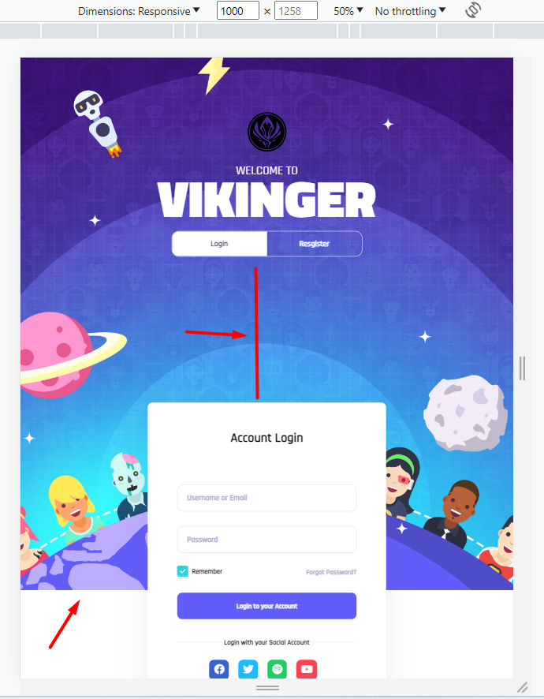

# Tuyết đánh giá bài học viên Fullstack-K2-Day11

**Note:**

- Màn hình:
- [x] Bài 1: min-width:1501px
- [x] Bài 2: min-width:1365px
- [x] Bài 3: min-width:601px
- [x] Bài 4: min-width:501px
- [x] Bài 5: max-width:500px

## [Bùi Quang Trưởng](https://okazakitruong.github.io/BQTruong-F8-K2-Offline/Day12/index.html)

    Sớm nhất *

Bài làm rất tốt\*

**Những lưu ý và lỗi chung trong toàn bài**

- Tất cả các `button` đang có `font-family` chưa đúng. Bài tập buổi 11 trước cũng đã chỉ ra lỗi này, bạn cần chú ý set css thêm font-family cho những phần tử có font mặc định như `"button", "input", "select", "textarea"`. Chưa xử lý hover vào` button submit form` đổi màu background.

- Cả 2 form: còn đang thiếu `box-shadow` và cần thêm giá trị `name` cho các input. Ở Form Register, ô input `"Your Email"` nên để `type="email"`.

- Các chữ `label` ở trong cả 2 form chưa đúng `font-weight`, cần đậm hơn.

- Phần `input:checkbox` ở 2 form cần được `checked` ngay từ đầu.

**Ở từng màn hình**

- [x] Bài 1: min-width: 1501px

  Bài làm rất tốt \*

- [x] Bài 2: min-width: 1365px

  Bài làm rất tốt

  Khoảng cách giữa các nội dung ở trong `div.content` chưa đúng. Ở màn hình này những khoảng cách nhỏ hơn màn min-width:1501px.

- [x] Bài 3: min-width: 601px

  Bài làm rất tốt \*

  Khoảng cách giữa phần `heading` và `btn` đang nhỏ hơn bài mẫu.

- [x] Bài 4: min-width: 501px

  Bài làm rất tốt \*

  Lỗi tương tự Bài 4.

- [x] Bài 5: max-width: 500px

  Bài làm rất tốt

  Lỗi tương tự Bài 4.

  Khoảng cách giữa `btn` và `form` chưa đúng. Ở màn hình này, khoảng cách giữa 2 phần này nhỏ hơn màn min-width:501px

  Khoảng padding của form đang nhỏ hơn bài mẫu. Ở màn hình này padding của form không đổi so với màn min-width:501px

- [x] Đánh giá chung bài tập về nhà: Bài làm rất tốt \*

  Cần chú ý kỹ hơn các thay đổi style của từng phần tử khi ở mỗi màn hình để bài responsive hoàn thiện hơn.

---

## [Hồng Hà Nguyễn Thị](https://ha752002.github.io/f8-fullstack-k2/Exercise/Ex_12/index.html)

Bài làm tốt

**Những lưu ý và lỗi chung trong toàn bài**

- Phần `tab-switch` đang có kích thước chưa giống như bài mẫu.

- Cả 2 form: còn đang thiếu `box-shadow` và cần thêm giá trị `name` cho các input. Phần Form `Login`, ô input `"Username or Email"` nên để `type="text"` thay vì `type="email"`, vì ô input này có thể nhập vào username là dạng text.

- Phần `input:checkbox` ở 2 form cần được `checked` ngay từ đầu giống bài mẫu.

- Chưa xử lý css khi hover vào: `forgot-password-link` và ở mỗi `social-link`.

- Ở các ô input, màu border chưa đúng khi đã có giá trị và đang không focus.

**Ở từng màn hình**

- [x] Bài 1: min-width: 1501px

  Bài làm tốt

  Thiếu phần `background` màu trắng, hình một phần hình tròn, nằm bên phải của trang.

  Cả 2 Form đang căn không đúng như bài mẫu. Ở bài mẫu là 2 form luôn nằm ở giữa theo chiều dọc.

- [x] Bài 2: min-width: 1366px (bài mẫu là min-width: 1365px)

  Bài làm tốt

  Cả 2 Form đang căn không đúng như bài mẫu. Ở bài mẫu là 2 form luôn nằm giữa theo chiều dọc.

  Khoảng cách giữa `h1` và `landing-info__desc` chưa đúng. Ở màn hình này, khoảng cách giữa 2 phần này nhỏ hơn màn min-width: 1501px.

- [x] Bài 3: min-width: 601px

  Bài làm chưa tốt

  Khoảng cách giữa `tab-switch` và phần form đang nhỏ hơn bài mẫu.

  Kích thước 2 form đang full màn hình là chưa đúng. Ở bài mẫu width không full màn hình.

- [x] Bài 4: min-width: 501px

  Bài làm chưa tốt

  Lỗi tương tự như Bài 3

- [x] Bài 5: max-width: 500px

  Bài làm chưa tốt

  Lỗi tương tự như Bài 3. Và Kích thước của `tab-switch` đang full màn hình là chưa đúng. Ở bài mẫu width không full màn hình.

- [x] Đánh giá chung bài tập về nhà: Bài làm chưa tốt, cần quan sát kỹ hơn bài mẫu về các vị trí, style của các phần tử ở từng màn hình để làm responsive hoàn thiện hơn.

---

## [Thế Nguyễn Đại](https://daithehh04.github.io/fullstack/day12/exercise-1.html)

Bài làm rất tốt \*

**Những lưu ý và lỗi chung trong toàn bài**

- Thiếu phần hình ảnh logo.

- Trừ `h1`, toàn bộ phần chữ trong bài đang có `font-family` chưa đúng. Trừ màn hình max-width: 500px, chữ ở `info__text` ở các màn hình khác đều đang có kiểu chưa đúng, ở bài mẫu là kiểu chữ in hoa.

- Cả 2 form: còn đang thiếu `box-shadow` và cần thêm giá trị `name` cho các input. Chú ý cần để `type` cho các ô input đúng với giá trị nhập vào. Ở form Register, chưa xử lý hover đổi màu background cho `button:submit`.

- Phần `input:checkbox` ở 2 form cần được `checked` ngay từ đầu giống bài mẫu. Cần thêm giá trị `name`, và đang có lỗi khi click vào hình ô checkbox thì không được `checked`.

- Chưa xử lý css khi hover vào: `forgot-password-link` và ở mỗi `social-link`.

**Ở từng màn hình**

- [x] Bài 1 min-width: 1501px

  Bài làm rất tốt \*

- [x] Bài 2 min-width: 1365px

  Bài làm rất tốt \*

  Khoảng cách giữa các nội dung ở trong `div.info` chưa đúng. Ở màn hình này những khoảng cách nhỏ hơn màn min-width:1501px.

- [x] Bài 3 min-width: 601px

  Bài làm rất tốt \*

- [x] Bài 4 min-width: 501px

  Bài làm rất tốt \*

- [x] Bài 5 max-width: 500px

  Bài làm rất tốt \*

- [x] Đánh giá chung bài tập về nhà: Bài làm rất tốt \*, cần quan sát kỹ hơn bài mẫu về style của các phần tử, để bài hoàn thiện hơn.

---

## [Nguyễn Văn Đức](https://poyken.github.io/f8-fullstack-k2/html-css-responsive/ex/day12/)

Bài làm chưa tốt

**Những lưu ý và lỗi chung trong toàn bài**

- Nên dùng thẻ HTML heading cho các phần chữ mang ý nghĩa là head title như phần chữ `"Vikinger, Account Login, Create your Account!"`

- Những phần chữ có `font-weight:700` chưa đúng, do chưa import font-weight:700 vào. font-weight thực tế đang ăn trên bài là font "Rajdhani Medium" là 500.

- Những phần chữ màu đen đậm trong form có mã màu chưa đúng với bài mẫu.

- Phần `button submit` ở 2 form cần thêm css bỏ outline để đúng với bài mẫu.

- Phần `input:checkbox` ở cả 2 form, kích thước của ô checkbox khi checked và uncheck chưa khớp với nhau, đang bị dư border khi `checked`.

- Phần `icon` social: Kích thước chưa đúng, ở bài mẫu là hình vuông. Chưa xử lý hover vào các `icon`.

- Phần `infor` không nên set margin là giá trị tương đối bằng %. Nên set giá trị tuyệt đối để giống bài mẫu hơn. Chỉ nên set margin-bottom ở `para` hoặc ở margin-top ở `btn`, không nên để cả 2 vì set cả 2 như trong bài thì nó chỉ ăn margin nào có giá trị lớn hơn.

**Ở từng màn hình**

- [x] Bài 1 min-width: 1501px

  Bài làm rất tốt

- [x] Bài 2 min-width: 1365px

  Bài làm tốt

  Khoảng cách giữa `infor` và `form` đang quá xa nhau.

  Khoảng cách giữa các phần tử của `infor` đang lớn hơn bài mẫu.

- [x] Bài 3 min-width: 601px

  Bài làm chưa tốt

  Ảnh background không full nội dung bên trong.

  Khoảng cách lệch quá nhiều.

  

- [x] Bài 4 min-width: 501px

  Chưa làm responsive ở màn này.

- [x] Bài 5 max-width: 500px

  Chưa làm responsive ở màn này.

- [x] Đánh giá chung bài tập về nhà: Bài làm chưa tốt, chưa hoàn thiện. Cần chú ý kỹ hơn bài mẫu để xác định hết các breakpoint, các style thay đổi của mỗi phần tử khi ở từng màn hình để làm responsive tốt hơn.

---

## [Duy Hiếu Nguyễn](https://hieuboss.github.io/F8-fullstack-k2/html/lesson12/ex1.html)

Bài làm chưa tốt

**Những lưu ý và lỗi chung trong toàn bài**

- Phần chữ `h1` chưa đúng font-size.

- Phần `page-infor__click` chưa active label `login` ngay từ đầu, khoảng click được ở các nút đang quá hẹp, phải lick trúng chữ thì mới `checked`. Icon hình bàn tay không xuất hiện khi hover vào chữ. Nên css phần click được, và hình icon bàn tay khi hover cho cả cái nút. Cần thêm transition để nhìn hiệu ứng được mượt hơn khi click vào nút.

- Phần `page-form` và các nút ở trong `page-infor__click` set width có giá trị % là chưa đúng, vì chỉ trừ màn hình "max-width:600px" ra thì ở những màn lớn hơn width của những phần này được cố định.

- Trừ màn `max-width: 500px` ra, thì ở các màn hình còn lại padding của 2 form đang nhỏ hơn nhiều so với bài mẫu.

- Những phần `form-head` trong form có mã màu chưa đúng như bài mẫu.

- Cả 2 form: còn đang thiếu `box-shadow` và cần thêm giá trị `name` cho các input.

- Phần `input:checkbox` ở 2 form có `font-family` chưa đúng. Khi checked, hình icon checked đang bị lệch, ô checkbox dư border và chưa có transition. Form Login phần `input:checkbox` chưa được checked ngay từ đầu như bài mẫu.

- Phần `.login-links > a` có `font-family` chưa đúng. Chưa xử lý hover.

- Phần `button submit` ở 2 form có `font-family` chưa đúng.

- Chưa xử lý css khi hover vào các link trong `social-icon`.

- Chưa có hiệu ứng show/hide cho form.

**Ở từng màn hình**

- [x] Bài 1 min-width: 1501px

  Bài làm tốt

  Thiếu phần `background` màu trắng, hình một phần hình tròn, nằm bên phải của trang.

- [x] Bài 2 min-width: 1365px

  Bài làm chưa tốt

  Chưa làm responsive màn này

  Dư phần ảnh `rocket` từ màn hình này trở xuống.

- [x] Bài 3 min-width: 601px (bài bạn sẽ là max-width:1200px)

  Bài làm chưa tốt

  Chưa chưa được responsive giống như bài mẫu do kích thước đang để width có giá trị % như đã nhận xét trên.

- [x] Bài 4 min-width: 501px

  Bài làm tốt

- [x] Bài 5 max-width: 500px

  Bài làm chưa tốt

  Chưa làm responsive màn này

- [x] Đánh giá chung bài tập về nhà: Bài làm chưa tốt, chưa hoàn thiện. Cần chú ý kỹ hơn bài mẫu để xác định hết các breakpoint, các style thay đổi của mỗi phần tử khi ở từng màn hình để làm responsive tốt hơn.

---

## [Tiến Đạt - K2](https://phamtiendat18.github.io/Fullstack-K2/Day_12/index.html)

Bài làm chưa tốt

**Những lưu ý và lỗi chung trong toàn bài**

- Xuất hiện thanh cuộn ngang do đang set `landing` có width:100vw. Nên set là 100%.

- Ở các màn hình lớn, phần background đang không auto chiếm hết chiều dọc màn hình mà phụ thuộc theo height của phần `.landing .wapper`. Phần `.wapper` đang được set kích thước và, vị trí chưa đúng, ở bài mẫu kích thước của form là auto, vị trí là luôn nằm giữa theo chiều dọc, và Chưa có khoảng cách dưới giữa `wapper` và cha. Tương tự thì phần `decor-landing` đang set `height:65vw` cũng không đảm bảo sẽ có chiều cao chiếm full màn hình.

- Cần thêm transition cho các nút trong `switch` để nhìn được mượt hơn khi lick.

- Form Register chưa có `border-radius`. Phần `input:checkbox` ở cả 2 from chưa được `checked` ngay từ đầu, ô checkbox thừa border khi được checked.

- Cần thêm giá trị `name` cho các input.

**Ở từng màn hình**

- [x] Bài 1 min-width: 1501px

  Bài làm chưa tốt

  Có những lưu ý và lỗi chung ở trên.

- [x] Bài 2 min-width: 1365px

  Bài làm chưa tốt

  Có những lưu ý và lỗi chung ở trên. Và khoảng cách trên dưới giữa các nội dung trong `company-info` ở màn hình này đang lớn hơn bài mẫu.

- [x] Bài 3 min-width: 601px

  Bài làm rất tốt \*

  Khoảng cách giữa `switch` và `form` đang lớn hơn bài mẫu.

- [x] Bài 4 min-width: 501px

  Bài làm chưa tốt

  width của form chưa đúng, ở màn hình này form có width sẽ thay đổi linh hoạt tỉ lệ theo màn hình. Ở bài mẫu được set là width:90%.

  Khoảng cách giữa `switch` và `form` đang lớn hơn bài mẫu.

- [x] Bài 5 max-width: 500px

  Khoảng cách giữa `switch` và `form` đang lớn hơn bài mẫu.

  width của form chưa đúng, ở màn hình này form có width sẽ thay đổi linh hoạt tỉ lệ theo màn hình. Ở bài mẫu được set là width:90%.

- [x] Đánh giá chung bài tập về nhà: ài làm chưa tốt, cần quan sát kỹ hơn bài mẫu về các vị trí, style của các phần tử ở từng màn hình để làm responsive tốt hơn.

---

## [Đoàn Duy Chinh](https://duychinh.github.io/f8-fullstack-KS2/Project-2/index.html)

Bài làm chưa tốt.

**Những lưu ý và lỗi chung trong toàn bài**

- Cần thêm `background-size` cho ảnh background body, vì ở màn hình có kích thước lớn hơn ảnh thì ảnh không full màn hình.

- Khoảng cách trên dưới của các phần tử trong `landing__info` chưa giống với bài mẫu.

- Phần chữ `h1` có `font-size` chưa giống với bài mẫu. Phần `landing__info__desc__lap` có line-height chưa giống với bài mẫu.

- Phần `tab-switch`: Lỗi click vào nút nào cũng có thể show/hide cả 2 form. Chữ của nút `Login` lúc không active, có màu chưa đúng.

- Các thay đổi style: nút `tab-switch`, form khi show/hide, `input:checkbox` chưa có transition.

- Ở màn hình lớn, thiếu icon hình tên lửa ở góc trên trái của form.

- Chỉ trừ màn hình "max-width:600px" ra thì ở những màn lớn hơn set width có giá trị % là chưa đúng, vì width các thành phần ở những màn lớn này được cố định.

- Form chưa style giống bài mẫu:

  - Set height cứng nên chiều cao của form không giống bài mẫu, khoảng cách đệm trên dưới của form chưa đúng. Chiều cao của input đang nhỏ hơn, Khoảng cách giữa các input đang lớn hơn, lúc nhập giá trị vào input, và không focus thì chữ label đang đè lên chữ ô input.

  - Phần `input:checkbox` lúc được checked, đang lệch và thừa border. Khi click vào chữ thì không check được.

  - Chưa xử lý hover vào: button submit ở 2 form, và link `Forgot Password?`.

**Ở từng màn hình**

- [x] Bài 1 min-width: 1501px

  Bài làm chưa tốt. Có những lỗi chung trên và thiếu phần `background` màu trắng, hình một phần hình tròn, nằm bên phải của trang.

- [x] Bài 2 min-width: 1365px

  Bài làm chưa tốt. Có những lỗi chung trên.

- [x] Bài 3, 4, 5: Các màn hình min-width: 601px, min-width: 501px, max-width: 500px

  Bài làm chưa tốt. Xác định sai breakpoint. ở bài mẫu là từ các màn "bé hơn 1365px" sẽ chuyển đổi bố cục các phần, bạn đang làm các màn "bé hơn 1100px". Lỗi phần ảnh background, kích thước của form do width set % như đã nói ở trên phần lỗi chung.

- [x] Đánh giá chung bài tập về nhà: Bài làm chưa tốt, chưa hoàn thiện. Cần chú ý kỹ hơn bài mẫu để xác định hết các breakpoint, các style thay đổi của mỗi phần tử khi ở từng màn hình để làm responsive tốt hơn.

---
