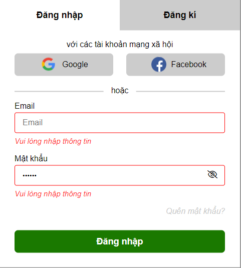

## [Tiến Đạt - K2](https://github.com/anhquan2211/F8-OFFLINE/tree/main/f8-offline-day23)

- [x] [Bài 1]

  Để tiện hơn trong việc sử dụng lặp lại nhiều lần `document.querySelector` có thể sử dụng một function riêng thay vì phải viết lại nhiều lần, ví dụ:

  ```html
  <script>
    var $ = function (tag) {
      return document.querySelector(tag);
    };
    var $$ = function (allTag) {
      return document.querySelectorAll(allTag);
    };
  </script>
  <script src="..."></script>
  ```

  Cách xử lý chức năng ẩn hiện password ở cả 2 trang Đăng ký, đăng nhập giống nhau nên có thể viết một hàm `toggleEye` để thực hiện chức năng đó để:

  - Code ngắn gọn hơn, không cần phải copy nhiều lần.

  - Code dễ hiểu và dễ dàng tối ưu và phát triển sau này.

  Với các input ở 2 trang, đều có một điểm chung là **email**, **password**. Và hiện đang thực hiện thao tác với DOM và việc xác thực chung trong một function.

  - Nên sử dụng một hàm chung để viết validate và xử lý các action.

  Để sử dụng ở nhiều nơi, nhiều file mà chỉ sửa một chỗ.

  Việc maintain, fix bug cũng dễ dàng hơn.

  - Nên viết một hàm `getError` để lấy được các message lỗi cần thiết ở một chỗ.

  Để có thể dễ dàng sửa đổi message.

  Để dễ dàng thêm message cho từng case.

  - Nên viết một hàm `resetForm` thực hiện các action reset và kết hợp với hàm validate, getError.

  Để code ngắn gọn hơn.

  Để có thể xử lý các case ở một nơi mà không cần phải copy nhiều lần.

  Ở trang đăng ký chưa làm case khi nhập mật khẩu đăng ký thì cần bắt được sự kiện nhập của người dùng và hiển thị ra thông báo `Mật khẩu tối thiểu 6 - 20 ký tự `

  Cần chỉnh chu hơn về giao diện.

---

- [x] Đánh giá chung bài tập về nhà:

  Bài làm tốt. Tuy nhiên chưa xử lý hết case.

  Cần chú ý thêm về vấn đề tối ưu cho việc sửa chữa, nâng cấp.

---

## [Bùi Quang Trưởng](https://github.com/OkazakiTruong/BQTruong-F8-K2-Offline/tree/main/Day23)

- [x] [Bài 1]

  Bài làm rất tốt. \*

  Icon ẩn hiện mật khẩu đang bị ngược so với chức năng và cách hiển thị của icon.

  Với các input ở 2 trang, đều có một điểm chung là **email**, **password**.

  - Nên sử dụng một hàm chung để viết validate và xử lý các action.

  Để sử dụng ở nhiều nơi, nhiều file mà chỉ sửa một chỗ.

  Việc maintain, fix bug cũng dễ dàng hơn.

  - Nên viết một hàm `getError` để lấy được các message lỗi cần thiết ở một chỗ.

  Để có thể dễ dàng sửa đổi message.

  Để dễ dàng thêm message cho từng case.

  - Nên viết một hàm `resetForm` thực hiện các action reset và kết hợp với hàm validate, getError.

  Để code ngắn gọn hơn.

  Để có thể xử lý các case ở một nơi mà không cần phải copy nhiều lần.

  Để tiện hơn trong việc sử dụng lặp lại nhiều lần `document.querySelector` có thể sử dụng một function riêng thay vì phải viết lại nhiều lần, ví dụ:

  ```html
  <script>
    var $ = function (tag) {
      return document.querySelector(tag);
    };
    var $$ = function (allTag) {
      return document.querySelectorAll(allTag);
    };
  </script>
  <script src="..."></script>
  ```

  Cách xử lý chức năng ẩn hiện password ở cả 2 trang Đăng ký, đăng nhập giống nhau nên có thể viết một hàm `toggleEye` để thực hiện chức năng đó để:

  - Code ngắn gọn hơn, không cần phải copy nhiều lần.

  - Code dễ hiểu và dễ dàng tối ưu và phát triển sau này.

  ***

- [x] Đánh giá chung bài tập về nhà

  Bài làm rất tốt. Đúng yêu cầu đề bài

  Tuy nhiên cần chú ý thêm về vấn đề tối ưu cho việc sửa chữa, nâng cấp.

---

## [Đoàn Duy Chinh](https://github.com/DuyChinh/f8-fullstack-KS2/tree/main/Day-23)

- [x] [Bài 1]

  Bài làm tốt

  Chưa hiện thông báo của tất cả input sau khi blur 1 input bất kỳ lần đầu tiên.

  - Có thể sử dụng một vòng lặp để hiển thị tất cả lỗi.

  Khi chuyển tab thì cả 2 form đều chưa reset trạng thái của icon thực hiện chức năng ẩn hiển password.

  Giao diện Login:

  - Chưa xử lý case để nếu dữ liệu ở Email không hợp lệ và có dữ liệu ở Password.

  

  Giao diện Register:

  - Khi gõ ký tự đầu tiên của input Họ và tên thì cần thông báo lỗi của 2 input còn lại.

  - Chưa xử lý case để nếu dữ liệu ở Email không hợp lệ và có dữ liệu ở Password.

    Với các input ở 2 trang, đều có một điểm chung là **email**, **password**.

  - Nên sử dụng một hàm chung để viết validate và xử lý các action.

  Để sử dụng ở nhiều nơi, nhiều file mà chỉ sửa một chỗ.

  Việc maintain, fix bug cũng dễ dàng hơn.

  - Nên viết một hàm `getError` để lấy được các message lỗi cần thiết ở một chỗ.

  Để có thể dễ dàng sửa đổi message.

  Để dễ dàng thêm message cho từng case.

  - Nên viết một hàm `resetForm` thực hiện các action reset và kết hợp với hàm validate, getError.

  Để code ngắn gọn hơn.

  Để có thể xử lý các case ở một nơi mà không cần phải copy nhiều lần.

  Để tiện hơn trong việc sử dụng lặp lại nhiều lần `document.querySelector` có thể sử dụng một function riêng thay vì phải viết lại nhiều lần, ví dụ:

  ```html
  <script>
    var $ = function (tag) {
      return document.querySelector(tag);
    };
    var $$ = function (allTag) {
      return document.querySelectorAll(allTag);
    };
  </script>
  <script src="..."></script>
  ```

---

- [x] Đánh giá chung bài tập về nhà

Bài làm tốt. Tuy nhiên chưa xử lý hết tất cả các case.

Cần chú ý thêm về vấn đề tối ưu cho việc sửa chữa, nâng cấp.

---

## [Nguyễn Văn Đức](https://github.com/Poyken/Js/tree/main/day22/ex)

- [x] [Bài 1]

Bài làm rất tốt\*

Thay vì check `=== null || === ""` có thể sử dụng falsy.

Có thể sử dụng một function riêng thay vì phải viết lại nhiều lần, ví dụ:

```html
<script>
  var $ = function (tag) {
    return document.querySelector(tag);
  };
  var $$ = function (allTag) {
    return document.querySelectorAll(allTag);
  };
</script>
<script src="..."></script>
```

---

- [x] Đánh giá chung bài tập về nhà

  Bài làm rất tốt\*

---

## [Nguyễn Đại Thế](https://github.com/daithehh04/fullstack/tree/main/day23)

- [x] [Bài 1]

  Bài làm rất tốt \*

  Icon thực hiện chức năng ẩn, hiện mật khẩu đang không được reset về đúng trạng thái ban đầu.

  ***

- [x] Đánh giá chung bài tập về nhà

  Bài làm rất tốt.

  Chỉ cần lưu ý lỗi nhỏ ở trên để hoàn thiện hơn.

---
