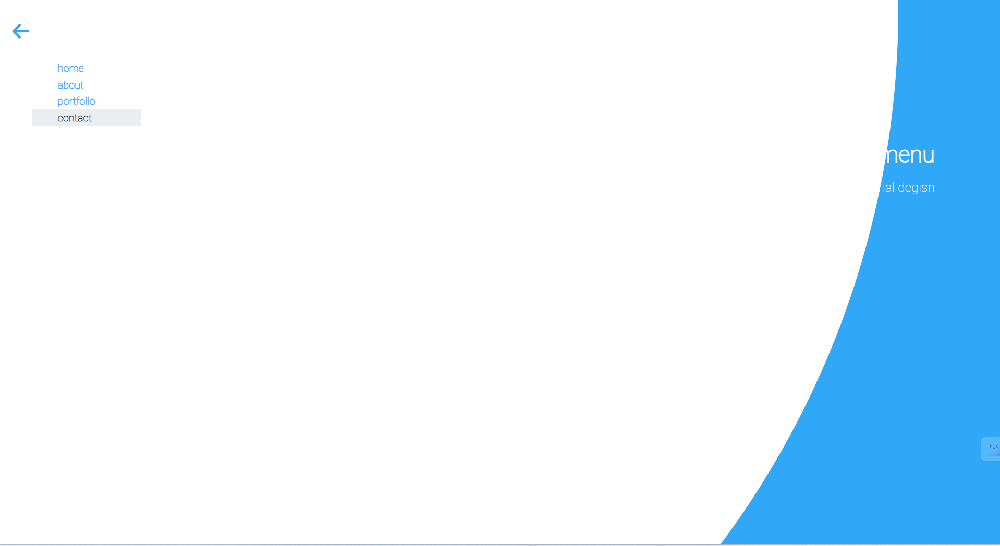
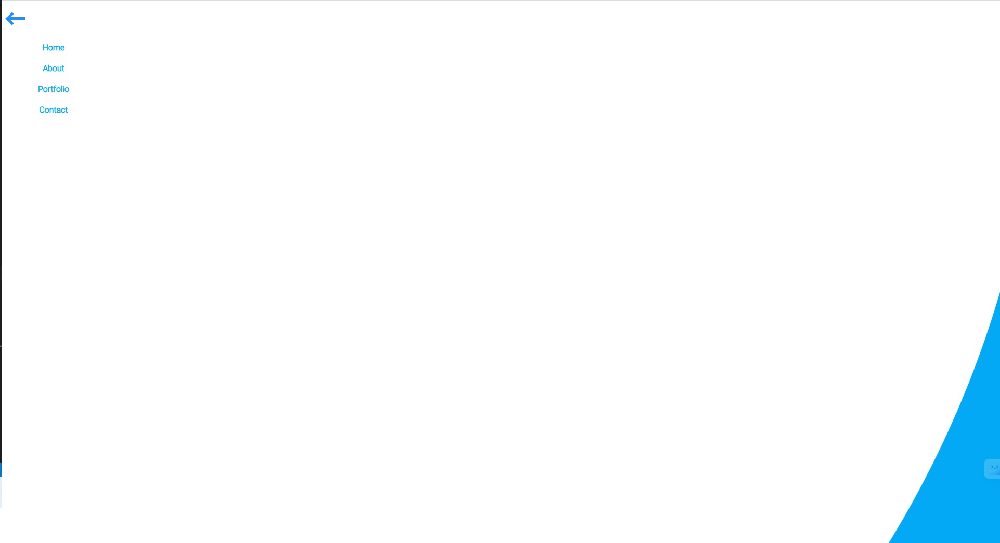

## [Mạnh Huy](https://github.com/HuyNguyen3107/F8_Fullstack_Offline_K4/tree/main/Day_10)

**Sớm nhất**

- [x] Bài 1:

  Bài làm rất tốt. \*

---

- [x] Bài 2:

  Bài làm rất tốt. \*

---

- [x] Bài3:

  Bài làm rất tốt. \*

  Hiệu ứng mở thư giống bản mẫu khoảng 90% vì ở bản mẫu khi hover vào thư thì cảm giác như lật ra lật vào nhưng hiện tại bài làm chỉ đang cho một khối tam giác lên xuống nên cảm giác không mượt như bản mẫu.

---

- [x] Đánh giá: Bài làm rất tốt, cố gắng phát huy ở các buổi sau.

---

## [Vinh Nguyễn](https://vinhh03.github.io/vinh_f8_fullstack_k4/)

- [x] Bài 1:

  Bài làm rất tốt. \*

  Các tiêu đề ở menu nên tuân thủ bản mẫu là không viết hoa chữ cái đầu tiên, có thể sử dụng thuộc tính `text-transform: lowercase;`

---

- [x] Bài 2:

  Bài làm rất tốt. \*

---

- [x] Bài3:

  Bài làm rất tốt. \*

---

- [x] Đánh giá: Bài làm rất tốt, cố gắng phát huy ở các buổi sau.

---

## [Nguyễn Hưng Tuân](https://github.com/hungtuan/f8-fullstack-k4/tree/main/Day-10)

- [x] Bài 1:

  Bài làm rất tốt. \*

---

- [x] Bài 2:

  Bài làm rất tốt. \*

---

- [x] Bài3:

  Bài làm rất tốt. \*

  Tuy nhiên hiệu ứng mở thư vẫn hơi giật.

---

- [x] Đánh giá: Bài làm rất tốt, cố gắng phát huy ở các buổi sau.

---

## [Hoang Van Thanh](https://yanshu92.github.io/F8-Fullstack-K4/)

- [x] [Bài 1]: Bài làm rất tốt \*

  Không lên để thẻ `<ul>` có kích thước bằng view port vì nếu người dùng muốn tạo ra overlay để nhấn ra ngoài.

---

- [x] [Bài 2]: Bài làm rất tốt \*

---

- [x] [Bài 3]: Bài làm rất tốt \*

  Khi **:hover** vào cạnh trên của lá thư có hiện tượng giật.

  Đề Xuất.

  Tạo Thêm thẻ `<div class= "container">` bọc thẻ `<div class= "envelope">` và cho **:hover** vào **container**.

  ```css
  .container {
    width: 300px;
    height: 250px;
  }
  ```

---

- [x] Đánh giá chung bài tập về nhà: Bài làm rất tốt, Tuy nhiên còn một số lỗi nhỏ về mặt tiểu tiết.

## [Huy Bui](https://github.com/Huy-Bui4869/f8_fullstack_k4/tree/main/Day_10)

- [x] [Bài 1]: Bài làm rất tốt \*

---

- [x] [Bài 2]: Bài làm rất tốt \*

  Lên để Thời gian chạy Hiệu ứng nhanh hơn tầm 0.25s để tăng trải nghiệm người dùng.

---

- [x] [Bài 3]: Bài làm rất tốt \*

---

- [x] Đánh giá chung bài tập về nhà: Bài làm rất tốt, tuy nhiên còn một số lỗi nhỏ về mặt tiểu tiết.

## [Tuan Kiet Hoang](https://suspiciously36.github.io/f8_fullstack_k4/)

- [x] [Bài 1]: Bài làm tốt \*

  Khi thẻ `<input id = "burger">`được **:checked** thì Hiệu ứng `.burger-container` không giống với bản mẫu.

---

- [x] [Bài 2]: Bài làm rất tốt \*

  Lên để Thời gian chạy Hiệu ứng nhanh hơn tầm 0.25s để tăng trải nghiệm người dùng.

  Thẻ `<p>`và Thẻ `<h2>` màu Hơi Mờ hơn so với bản mẫu.

---

- [x] [Bài 3]: Bài làm rất tốt \*

---

- [x] Đánh giá chung bài tập về nhà: Bài làm rất tốt, Tuy nhiên còn một số lỗi nhỏ về mặt tiểu tiết.

## [Thái Duy Tiến](https://thaiduytien1611cunbeo.github.io/NopbaitapF8/)

- [x] [Bài 1]: Bài làm tốt.

  Khi thẻ `<input >`được **:checked** thì Hiệu ứng `.backgorund` chưa full view port.

  

---

- [x] [Bài 2]: Bài làm tốt \*.

  Hiệu ứng gần giống với bản mẫu.

---

- [x] [Bài 3]: Bài làm rất tốt \*

  Lên để Thời gian chạy Hiệu ứng nhanh hơn khoảng 0.25s để tăng trải nghiệm người dùng.

---

- [x] Đánh giá chung bài tập về nhà: Bài làm tốt, có sự cải thiện.

## [Nguyễn Chi Nam](https://chinam197.github.io/baitapbuoi10/)

- [x] [Bài 1]: Bài làm tốt.

  Phần **nav-bar** khi **active** vào thẻ `<li>` thì **background-color** chuyển màu cứ không là **:hover**.

  Khi phóng to màn hình navbar, phần background trắng chưa phải hình tròn.

---

- [x] [Bài 2]: Bài làm tốt \*.

  Thêm `trasition-delay: 0.25s` khi input được **:check** để hiệu ứng giống bản mẫu.

---

- [x] [Bài 3]: Bài làm tốt

  Phần Hiệu ứng gần giống với bản mẫu.

  Nên Để `.letter` có `trasition-delay: 0.5s` vì khi mở hộp thư thì lá thư mới được đẩy ra.

---

- [x] Đánh giá chung bài tập về nhà: Bài làm tốt, tuy nhiên còn một số lỗi nhỏ về mặt tiểu tiết.

## [Dong Nguyen](https://github.com/Dongnguyen318/Quydong)

- [x] [Bài 1]:

  Khi phóng to màn hình navbar, phần background trắng chưa phải hình tròn.

  Chưa Có hiệu ứng khi **active** vào thẻ `<li>`đổi `background-color`.

---

- [x] [Bài 2]: Bài làm tốt .

  Phần Hiệu ứng gần giống với bản mẫu.

---

- [x] [Bài 3]:

  Chưa Có Hiệu ứng hộp thư được mở ra.

  Khi chưa **:hover** `.letter-container` 1 phần lá thư vẫn được hiển thị.

---

- [x] Đánh giá chung bài tập về nhà: Bài làm tốt, cần cẩn thận hơn khi nộp bài.

## [Đặng Khải](https://albertkhai.github.io/f8-fullstack-offline/)

- [x] [Bài 1]: bài làm rất tốt \*

---

- [x] [Bài 2]: Bài làm rất tốt \*.

  Thẻ `.blog__article` cho `transform: rotate(-90deg)` để giống với bản mẫu.

---

- [x] [Bài 3]: Bài làm rất tốt \*

---

- [x] Đánh giá chung bài tập về nhà: Bài làm rất tốt, tuy nhiên còn một số lỗi nhỏ về mặt tiểu tiết.

## [Nguyễn Ngọc Hùng](https://oladayne.github.io/f8-fullstack-k98/)

- [x] [Bài 1]: bài làm tốt

  Khi thẻ `<input >`được **:checked** thì Hiệu ứng `.hambuger2` chưa full view port.

  

---

- [x] [Bài 2]: Bài làm rất tốt \*.

  Phần Hiệu ứng gần giống với bản mẫu.

---

- [x] [Bài 3]: Bài làm rất tốt \*

---

- [x] Đánh giá chung bài tập về nhà: Bài làm rất tốt, tuy nhiên còn một số lỗi nhỏ về mặt tiểu tiết.

## [Lê Đình Hùng](https://le-hung-020903.github.io/f8-fullstack-k4/)

- [x] [Bài 1]: bài làm tốt

  Chưa Có hiệu ứng khi **active** vào thẻ `<li>`đổi `background-color`.

---

- [x] [Bài 2]: Bài làm rất tốt \*.

---

- [x] [Bài 3]: Bài làm tốt

  Sai Hiệu ứng của lá thư.

---

- [x] Đánh giá chung bài tập về nhà: Bài làm tốt, tuy nhiên còn một số lỗi nhỏ về mặt tiểu tiết.
