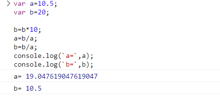

## [Thái Duy Tiến](https://github.com/thaiduytien1611cunbeo/NopbaitapF8/tree/main/Day14)

**Sớm nhất**

- [x] Bài 1:

  Bài làm rất tốt. \*

---

- [x] Bài 2:

  Bài làm rất tốt. \*

  Tuy nhiên, cần chú ý việc `console.log()` ra một cách rõ ràng và chuẩn hơn code sẽ chặt chẽ hơn. Hiện tại đang làm như sau:

  ```js
  console.log(`s : ${s}`); //s : 4882842.5
  ```

  Góp ý nên sửa dấu `:` thành dấu `=`:

  ```js
  console.log(`s = ${s}`); //s : 4882842.5
  ```

---

- [x] Bài 3:

  Bài làm rất tốt. \*

  Tuy nhiên việc xét nhiều trường hợp như vậy, làm cho code không tối ưu, rắc rối và khó cải thiện code sau này.

  Nên tham khảo phương pháp sau đây:

  ```js
  var a = 60,
    b = 30,
    c = 90;

  var max = a;
  if (b > max) {
    max = b;
  }
  if (c > max) {
    max = c;
  }
  console.log("Số lớn nhất là:", max);
  ```

---

- [x] Bài 4:

  Bài làm tốt. \*

  Tuy nhiên bài làm chưa xét đến trường hợp một trong hai số là 0 hoặc cả 2 số là 0. Hai trường hợp này cần tách riêng vì số 0 là một số đặc biệt, không âm cũng không dương.

---

- [x] Bài 5:

  Bài làm rất tốt. \*

---

- [x] Đánh giá: Bài làm rất tốt, chỉ cần lưu ý một số trường hợp đặc biệt có thể xảy ra và nên tối ưu code để hoàn thiện hơn.

---

## [Nguyễn Hưng Tuân](https://github.com/hungtuan/f8-fullstack-k4/tree/main/Day-16)

- [x] Bài 1:

  Bài làm rất tốt. \*

---

- [x] Bài 2:

  Bài làm rất tốt. \*

---

- [x] Bài 3:

  Bài làm rất tốt. \*

---

- [x] Bài 4:

  Bài làm tốt. \*

  Góp ý: Nên tách trường hợp số `0` thành một trường hợp riêng để thông báo tồn tại số 0 trong 2 số thì bài làm sẽ chặt chẽ hơn. Vì số `0` là một số đặc biệt.

---

- [x] Bài 5:

  Bài làm rất tốt. \*

---

- [x] Đánh giá: Bài làm rất tốt, chỉ cần lưu ý một số trường hợp đặc biệt để bài làm thêm chặt chẽ hơn.

---

## [Hoàng Văn Thanh](https://github.com/YanShu92/F8-Fullstack-K4/tree/main/Day_15)

- [x] Bài 1:

  Bài làm rất tốt. \*

---

- [x] Bài 2:

  Bài làm rất tốt. \*

---

- [x] Bài 3:

  Bài làm rất tốt. \*

---

- [x] Bài 4:

  Bài làm rất tốt. \*

  Góp ý: Trường hợp `c = 0` sẽ thông báo là `Không xác định cùng/trái dấu`, điều này là đúng nếu như tích của 2 số bằng 0. Tuy nhiên nên thông báo `tồn tại số 0 trong 2 số a và b` sẽ chặt chẽ hơn.

---

- [x] Bài 5:

  Bài làm rất tốt. \*

---

- [x] Đánh giá: Bài làm rất tốt, chỉ cần lưu ý thông báo rõ ràng hơn các trường hợp đặc biệt để bài làm thêm chặt chẽ hơn.

---

## [Mạnh Huy](https://github.com/HuyNguyen3107/F8_Fullstack_Offline_K4/tree/main/Day_14)

- [x] Bài 1:

  Bài làm rất tốt. \*

---

- [x] Bài 2:

  Bài làm rất tốt. \*

---

- [x] Bài 3:

  Bài làm rất tốt. \*

  Tuy nhiên việc xét từng trường hợp như vậy nếu như bài toán yêu cầu tìm số lớn nhất trong 5 số hoặc nhiều hơn sẽ phải xét rất nhiều trường hợp.

  Vì vậy, có thể tham khảo cách làm sau đây:

  ```js
  var a = 60,
    b = 30,
    c = 90;

  var max = a;
  if (b > max) {
    max = b;
  }
  if (c > max) {
    max = c;
  }
  console.log("Số lớn nhất là:", max);
  ```

---

- [x] Bài 4:

  Bài làm tốt. \*

  Góp ý: Trường hợp tồn tại số 0 trong 2 số a và b nên đưa ra thông báo là `tồn tại số 0 trong hai số a và b` thì bài làm chặt chẽ hơn.

---

- [x] Bài 5:

  Bài làm rất tốt. \*

---

- [x] Đánh giá: Bài làm khá tốt, chú ý cần tối ưu code ngắn gọn để hoàn thiện hơn.

---

## [Nguyễn Chi Nam](https://github.com/chinam197/baitapb16.git)

- [x] Bài 1:

  Bài làm rất tốt. \*

---

- [x] Bài 2:

  Bài làm rất tốt. \*

---

- [x] Bài 3:

  Bài làm rất tốt. \*

  Tuy nhiên việc xét từng trường hợp như vậy nếu như bài toán yêu cầu tìm số lớn nhất trong 5 số hoặc nhiều hơn sẽ phải xét rất nhiều trường hợp.

  Vì vậy, có thể tham khảo cách làm sau đây:

  ```js
  var a = 60,
    b = 30,
    c = 90;

  var max = a;
  if (b > max) {
    max = b;
  }
  if (c > max) {
    max = c;
  }
  console.log("Số lớn nhất là:", max);
  ```

---

- [x] Bài 4:

  Bài làm tốt. \*

  Tuy nhiên, cần xét đến trường hợp một trong 2 số là `0` để đưa ra kết luận `tồn tại số 0 trong 2 số a và b` thì bài làm sẽ chặt chẽ hơn vì số `0` là số không âm cũng không dương.

---

- [x] Bài 5:

  Bài làm chưa tốt.

  Khi thử `a = -4, b = 0, c = 0` thì không sắp xếp được theo giá trị tăng dần vì hiện bài làm đang xét cụ thể các trường hợp nhưng chỉ xét các trường hợp lớn hơn và nhỏ hơn. Nếu như có 2 hoặc 3 giá trị bằng nhau thì không thể đưa ra kết luận.

  Vì vậy, cần làm theo cách khác tối ưu hơn, có thể tham khảo cách sau đây:

  ```js
  var a = 40,
    b = 60,
    c = 20,
    temp;

  if (a > b) {
    temp = a;
    a = b;
    b = temp;
  }
  if (a > c) {
    temp = a;
    a = c;
    c = temp;
  }
  if (b > c) {
    temp = b;
    b = c;
    c = temp;
  }

  console.log("Sắp xếp theo thứ tự tăng dần:", a, b, c);
  ```

---

- [x] Đánh giá: Bài làm tốt, tuy nhiên các cách làm còn chưa thực sự tối ưu, cần chú ý một số lỗi nhỏ để hoàn thiện hơn.

---

## [Vinh Nguyễn](https://github.com/vinhh03/vinh_f8_fullstack_k4/tree/main/bai_tap/day16)

- [x] Bài 1:

  Bài làm rất tốt. \*

---

- [x] Bài 2:

  Bài làm rất tốt. \*

---

- [x] Bài 3:

  Bài làm rất tốt. \*

---

- [x] Bài 4:

  Bài làm rất tốt. \*

---

- [x] Bài 5:

  Bài làm rất tốt. \*

  Tuy nhiên, hiện tại đang `log` ra từng số nhưng yêu cầu bài toán là sắp xếp thành dãy số có thứ tự tăng dần, nên `log` ra dãy số để bài làm chặt chẽ hơn.

---

- [x] Đánh giá: Bài làm rất tốt, cố gắng duy trì trong các buổi sau.

---

## [Đặng Khải](https://albertkhai.github.io/f8-fullstack-offline/Day-16/index.html)

- [x] Bài 1: Bài làm tốt \*

  Hàm `areNaN(...args)` chưa kiểm tra hết trường hợp đầu vào có thể là 1 chuỗi dạng số ví dụ: `"123"`.

---

- [x] Bài 2: Bài làm rất tốt \*

---

- [x] Bài 3: Bài làm tốt \*

  Chưa tốt ưu **condition** trong câu rẽ nhánh **if**.

  Đề xuất.

  ```javascript
  result = a;
  if (result < b) {
    result = b;
  }
  if (result < c) {
    result = c;
  }
  ```

---

- [x] Bài 4: Bài làm rất tốt \*

---

- [x] Bài 5: Bài làm rất tốt \*

---

- [x] Đánh giá chung bài tập về nhà: Bài làm rất tốt, tuy nhiên vẫn còn 1 số lỗi nhỏ.

## [Tuan Kiet Hoang](https://github.com/suspiciously36/f8_fullstack_k4/tree/main/day-16)

- [x] Bài 1: Bài làm tốt \*.

  Nên kiểm tra có phải một số hợp lệ không trước khi so sánh và đổi chỗ.

---

- [x] Bài 2: Bài làm rất tốt \*.

---

- [x] Bài 3: Bài làm tốt.

  chưa tốt ưu **condition** trong câu rẽ nhánh **if**.

  Đề Xuất.

  ```javascript
  maxValue = a;
  if (maxValue < b) {
    maxValue = b;
  }
  if (maxValue < c) {
    maxValue = c;
  }
  ```

---

- [x] Bài 4: Bài làm rất tốt \*

---

- [x] Bài 5: Bài làm rất tốt \*

---

- [x] Đánh giá chung bài tập về nhà: Bài làm rất tốt,tuy nhiên cần tính đến các trường hợp đầu vào không phải số.

## [Trần Đức Công](https://github.com/OkazakiTruong/BQTruong-F8-K2-Offline/tree/main/Day16)

- [x] Bài 1: Bài làm chưa tốt .

  Nên kiểm tra có phải một số hợp lệ không trước khi so sánh và đổi chỗ.

  Sai trường hợp **a** là số thập phân.

  Lỗi.

  .

  Đề Xuất.

  ```javascript
  var a = 10;
  var b = 20;
  b = b + a;
  a = b - a;
  b = b - a;
  console.log(`a=`, a);
  console.log(`b=`, b);
  ```

---

- [x] Bài 2: Bài làm rất tốt \*.

---

- [x] Bài 3: Bài làm tốt \*

  Chưa tối ưu câu lệnh rẽ nhánh **if**.

  Đề Xuất.

  ```javascript
  maxValue = a;
  if (maxValue < b) {
    maxValue = b;
  }
  if (maxValue < c) {
    maxValue = c;
  }
  ```

---

- [x] Bài 4: Bài làm tốt

  Chưa xét trường hợp `a === 0 || b === 0`.

  Số `0` không phải số dương cũng không phải số âm.

  Đề Xuất.

  ```javascript
  var a = -10;
  var b = 20;
  var c =
    a * b === 0
      ? `không thể xét dấu vì a hoặc b bằng 0`
      : a * b > 0
      ? `2 số cùng dấu`
      : `2 số trái dấu`;
  console.log(c);
  ```

---

- [x] Bài 5: Bài làm chưa tốt.

  Sai trường hợp `c < a < b ` ví dụ: `a = 16,  b = 18,  c = 2`.

  Đề xuất sửa thành:

  ```javascript
  if (a > b) {
    if (a > c) {
      if (b > c) {
        console.log(c, b, a);
      } else {
        console.log(b, c, a);
      }
    } else {
      console.log(b, a, c);
    }
  } else {
    if (b < c) {
      console.log(a, b, c);
    } else {
      if (c > a) {
        console.log(a, c, b);
      } else {
        console.log(c, a, b);
      }
    }
  }
  ```

  Chưa tối ưu **condition** trong câu rẽ nhánh.

  Đề Xuất lại.

  ```javascript
  let a = 120;
  let b = 121;
  let c = 99;
  if (a > b) {
    a += b;
    b = a - b;
    a -= b;
  }
  if (b > c) {
    b += c;
    c = b - c;
    b -= c;
  }
  if (a > b) {
    a += b;
    b = a - b;
    a -= b;
  }
  console.log(
    "ba số a,b,c sau khi được sắp xếp tăng dần lần lượt là:",
    a,
    b,
    c
  );
  ```

---

- [x] Đánh giá chung bài tập về nhà: Bài làm tốt, cần cẩn thận hơi khi làm bài.

## [Lê Đình Hùng](https://github.com/Le-Hung-020903/f8-fullstack-k4/tree/main/Day_16/javascript)

- [x] Bài 1: Bài làm chưa tốt .

  Nên kiểm tra có phải một số hợp lệ không trước khi so sánh và đổi chỗ.

  Sai trường hợp `a || b là số thập phân`.

  Bài làm chỉ đúng với số nguyên.

  Đề Xuất.

  ```javascript
  var a = 10;
  var b = 20;
  b = b + a;
  a = b - a;
  b = b - a;
  console.log(`a=`, a);
  console.log(`b=`, b);
  ```

---

- [x] Bài 2: Bài làm rất tốt \*.

---

- [x] Bài 3: Bài làm tốt \*.

  Chưa tối ưu **condition** trong câu rẽ nhánh **if**.

  Đề Xuất.

  ```javascript
  maxNumber = a;
  if (maxNumber < b) {
    maxNumber = b;
  }
  if (maxNumber < c) {
    maxNumber = c;
  }
  ```

---

- [x] Bài 4: Bài làm tốt .

  Chưa có trường hợp `a === 0 || b === 0`.

  Số **0** là số không âm cũng không dương.

  ```javascript
  var a = -10;
  var b = 20;
  var c =
    a * b === 0
      ? `không thể xét dấu vì a hoặc b bằng 0`
      : a * b > 0
      ? `2 số cùng dấu`
      : `2 số trái dấu`;
  console.log(c);
  ```

---

- [x] Bài 5: Bài làm rất tốt \*

---

- [x] Đánh giá chung bài tập về nhà: Bài làm tốt, tuy nhiên cần tính đến các trường hợp đầu vào không phải số và cần học đề bài kĩ hơn.

## [Huy Bui](https://github.com/Huy-Bui4869/f8_fullstack_k4/tree/main/Day_14)

- [x] Bài 1: Bài làm tốt \* .

  Nên kiểm tra có phải một số hợp lệ không trước khi so sánh và đổi chỗ.

---

- [x] Bài 2: Bài làm rất tốt \*.

---

- [x] Bài 3: Bài làm tốt \*.

  Chưa tối ưu **condition** trong câu rẽ nhánh **if**.

  Đề Xuất.

  ```javascript
  biggestNumber = a;
  if (biggestNumber < b) {
    biggestNumber = b;
  }
  if (biggestNumber < c) {
    biggestNumber = c;
  }
  ```

---

- [x] Bài 4: Bài làm rất tốt \* .

---

- [x] Bài 5: Bài làm chưa tốt.

  Sai trường hợp Nếu ` z > x` biến `biggest` sẽ sai phải cập nhật lại biến `biggest`.

  Đề xuất sửa thành:

  ```javascript
  var z = 11,
    x = 8,
    c = 0,
    biggest = z;

  if (z > x) {
    z = x;
    x = biggest;
    biggest = z;
  }

  if (z > c) {
    z = c;
    c = biggest;
  }

  if (x > c) {
    biggest = x;
    x = c;
    c = biggest;
  }
  console.log(`Sắp xếp 3 số tăng dần ${z}, ${x}, ${c}`);
  ```

---

- [x] Đánh giá chung bài tập về nhà: Bài làm tốt, tuy nhiên cần tính đến các trường hợp đầu vào không phải số và cần học đề bài kĩ hơn.

## [Hà Long Việt](https://github.com/Vietha22/f8_fullstack_k4/blob/main/Day_15/js/ex01.js)

- [x] Bài 1: Bài làm tốt \* .

  Nên kiểm tra có phải một số hợp lệ không trước khi so sánh và đổi chỗ.

---

- [x] Bài 2: Bài làm rất tốt \*.

---

- [x] Bài 3: Bài làm rất tốt \*.

---

- [x] Bài 4: Bài làm tốt \* .

  Chưa có trường hợp `a === 0 || b === 0`.

  Số **0** là số không âm cũng không dương.

  ```javascript
  var a = -10;
  var b = 20;
  var c =
    a * b === 0
      ? `không thể xét dấu vì a hoặc b bằng 0`
      : a * b > 0
      ? `2 số cùng dấu`
      : `2 số trái dấu`;
  console.log(c);
  ```

---

- [x] Bài 5: Bài làm rất tốt \*.

---

- [x] Đánh giá chung bài tập về nhà: Bài làm rất tốt, tuy nhiên cần tính đến các trường hợp đầu vào không phải số.
