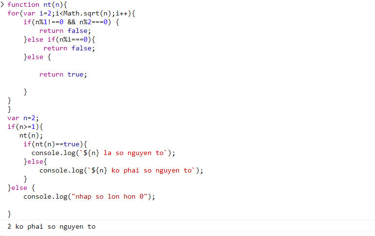

## [Hoàng Văn Thanh](https://github.com/YanShu92/F8-Fullstack-K4/tree/main/Day_16)

**Sớm nhất**

- [x] Bài 1:

  Bài làm rất tốt. \*

  Tuy nhiên số km là một đại lượng không đổi, nên khai báo bằng từ khóa `const`.

---

- [x] Bài 2:

  Bài làm rất tốt. \*

  Tuy nhiên số điện là một đại lượng không đổi, nên khai báo bằng từ khóa `const`.

---

- [x] Bài 3:

  Bài làm rất tốt. \*

---

- [x] Bài 4:

  Bài làm rất tốt. \*

  Tuy nhiên ở trong hàm kiểm tra số nguyên tố `isPrimeNumber` nếu như sử dụng phương pháp đặt cờ hiệu thì nên sử dụng ở tất cả các chỗ cần sử dụng phương pháp đó. Cụ thể ở chỗ xét điều kiện `number % m === 0` thì ở trong khối đó nên gán `key = false` sẽ hợp lý và thống nhất về cách làm hơn.

---

- [x] Bài 5:

  Bài làm rất tốt. \*

---

- [x] Bài 6:

  Bài làm rất tốt. \*

---

- [x] Bài 7:

  Bài làm rất tốt. \*

---

- [x] Bài 8:

  Bài làm rất tốt. \*

---

- [x] Đánh giá: Bài làm rất tốt, chỉ cần lưu ý một số lỗi nhỏ để hoàn thiện hơn.

---

## [Mạnh Huy](https://github.com/HuyNguyen3107/F8_Fullstack_Offline_K4/tree/main/Day_15)

- [x] Bài 1:

  Bài làm rất tốt. \*

  Góp ý về HTML:

  - Ở trong thẻ input có thuộc tính `placeholder` và đang có giá trị là `Mileage`. Có nghĩa là dặm, đây là một đơn vị cũng để đo độ dài quãng đường nhưng khác với đơn vị km. 1 dặm = 1,61km. Việc để placeholder như vậy có thể làm cho người dùng hiểu nhầm về đơn vị đo đang tính hiện tại là dặm chứ không phải km.

  Góp ý về JS:

  - Số km là đại lượng không đổi nên khai báo `distance` bằng từ khóa `const`.

  - Trong trường hợp số km đi được lớn hơn 120km thì cách tính tổng tiền trước khi giảm 10% giống với cách tính tổng tiền từ 5km đến 120km. Nên gộp 2 trường hợp này vào để tránh việc lặp code, giúp cho tối ưu code.

  - Chú ý cần `log` ra thông báo cụ thể và rõ ràng sẽ giúp ích cho người dùng sẽ hiểu hơn về vấn đề đang giải quyết. Cụ thể hiện tại khi nhập số km thì chỉ in ra đúng số tiền phải trả, cần đưa ra lời dẫn cụ thể ví dụ như: ` Số tiền phải trả cho ${distance}km là ${totalPrice} VNĐ`.

---

- [x] Bài 2:

  Bài làm rất tốt. \*

  Góp ý về JS:

  - Số kWh là đại lượng không đổi nên khai báo bằng từ khóa `const`.

  - Nhận xét về việc thông báo cụ thể rõ ràng như bài 1.

---

- [x] Bài 3:

  Bài làm rất tốt. \*

---

- [x] Bài 4:

  Bài làm chưa tốt.

  Hiện tại đang viết điều kiện của hàm if để trả về `false` như sau:

  ```js
  if ((n % 1 !== 0) & (n <= 1)) {
    return false;
  }
  ```

  Vì trong JS không có toán tử `&` nên nó sẽ không hiểu được điều kiện trên và khi nhập số 1 hoặc số không nguyên thì đều trả ra kết quả các số đó là số nguyên tố. Điều đó làm cho kết quả của bài làm hiện tại sai.

  Có thể sửa lại điều kiện trong hàm if cho đúng hoặc có thể tham khảo đoạn code kiểm tra số nguyên tố sau đây:

  ```js
  function isPrime(number) {
    if (
      number % 1 !== 0 ||
      number < 2 ||
      (number % 2 === 0 && number !== 2) ||
      (number % 3 === 0 && number !== 3)
    )
      return false;
    for (let i = 5; i <= Math.sqrt(number); i += 2)
      if (number % i === 0) return false;
    return true;
  }
  console.log(
    `${!isPrime(3) ? "Không t" : "T"}hỏa mãn điều kiện là số nguyên tố`
  );
  ```

---

- [x] Bài 5:

  Bài làm tốt. \*

  Tuy nhiên chưa có thông báo nếu như người dùng nhập vào một giá trị âm hoặc một giá trị không phải là số nguyên. Điều đó làm cho nếu như người dùng ban đầu nhập vào một giá trị hợp lệ thì sẽ in ra dãy số hình tam giác đúng yêu cầu nhưng sau đó nếu như nhập một giá trị không hợp lệ thì giao diện vẫn hiển thị kết quả trước đó.

---

- [x] Bài 6:

  Bài làm rất tốt. \*

---

- [x] Bài 7:

  Bài làm rất tốt. \*

---

- [x] Bài 8:

  Bài làm rất tốt. \*

---

- [x] Đánh giá: Bài làm rất tốt, cần lưu ý về điều kiện ở bài 4 và một số lỗi nhỏ để hoàn thiện hơn.

---

## [Hà Long Việt](https://github.com/Vietha22/f8_fullstack_k4/tree/main/Day_16)

- [x] Bài 1:

  Bài làm chưa tốt.

  Bài làm đang hiểu sai yêu cầu bài toán, hiện bài làm đang lấy số km đi được nhân với giá tiền của km được quy định trong khoảng đó với tất cả số km đi được. Nhưng đúng phải là cộng dồn số tiền ứng với số km trong từng khoảng.

  Ví dụ cụ thể: Giả sử tổng quãng đường đi được là 10km thì sẽ chia ra làm 3 khoảng:

  - 1km đầu tiên vẫn sẽ tính là 15 000đ. Vì vậy số tiền phải trả cho 1km đầu là: 15 000 \* 1 = 15 000đ.

  - 4km tiếp theo sẽ tính là 13 500đ / 1km. Vì vậy số tiền phải trả cho 4km tiếp theo là: 13 500 \* 4 = 54 000đ

  - 5km cuối cùng sẽ tính là 11 000đ / 1km. Vì vậy số tiền phải trả cho 4km cuối là 11 000 \* 5 = 55 000đ.

  - Như vậy tổng số tiền phải trả cho 10km là 15 000 + 54 000 + 55 000 = 124 000đ.

  Số km là đại lượng không đổi nên khai báo `km` bằng từ khóa `const`.

---

- [x] Bài 2:

  Bài làm rất tốt. \*

  Số kWh là đại lượng không đổi nên khai báo bằng từ khóa `const`.

---

- [x] Bài 3:

  Bài làm tốt. \*

  Bài làm hiện nếu nhập `n = -3` thì sẽ trả về kết quả là `S = 0` do nó sẽ lấy giá trị của S khi khai báo là 0, điều này không đúng và nên kiểm tra điều kiện đầu vào của n (số âm, không phải là số nguyên) để đưa ra thông báo hợp lý.

---

- [x] Bài 4:

  Bài làm rất tốt. \*

  Góp ý: Nên tối ưu vòng lặp để giảm bớt các vòng lặp kiểm tra không cần thiết.

  Có thể tham khảo đoạn code tối ưu sau đây:

  ```js
  function isPrime(number) {
    if (
      number % 1 !== 0 ||
      number < 2 ||
      (number % 2 === 0 && number !== 2) ||
      (number % 3 === 0 && number !== 3)
    )
      return false;
    for (let i = 5; i <= Math.sqrt(number); i += 2)
      if (number % i === 0) return false;
    return true;
  }
  console.log(
    `${!isPrime(3) ? "Không t" : "T"}hỏa mãn điều kiện là số nguyên tố`
  );
  ```

---

- [x] Bài 5:

  Bài làm chưa tốt.

  Hiện chưa có khoảng trắng giữa các số nên khi in ra các số sẽ dính vào nhau không đúng với bài mẫu mà đề bài đưa ra.

  Nên kiểm tra điều kiện nếu `n` là số âm hoặc một số không nguyên sẽ đưa ra thông báo hợp lý.

---

- [x] Bài 6:

  Bài làm rất tốt. \*

---

- [x] Bài 7:

  Bài làm rất tốt. \*

---

- [x] Bài 8:

  Bài làm tốt. \*

  Bài làm chưa kiểm tra nếu n là số âm và số không nguyên.

  Ngoài ra khi so sánh nên sử dụng `===` sẽ chặt chẽ hơn là sử dụng `==`.

---

- [x] Đánh giá: Bài làm khá tốt, cần lưu ý đọc kỹ yêu cầu đề bài và một số lỗi nhỏ để hoàn thiện và chỉnh chu hơn.

---

## [Nguyễn Ngọc Hùng](https://github.com/Oladayne/f8-fullstack-k98.git)

- [x] Bài 1:

  Bài làm chưa tốt.

  Bài làm đang hiểu sai yêu cầu bài toán, hiện bài làm đang lấy số km đi được nhân với giá tiền của km được quy định trong khoảng đó với tất cả số km đi được. Nhưng đúng phải là cộng dồn số tiền ứng với số km trong từng khoảng.

  Ví dụ cụ thể: Giả sử tổng quãng đường đi được là 10km thì sẽ chia ra làm 3 khoảng:

  - 1km đầu tiên vẫn sẽ tính là 15 000đ. Vì vậy số tiền phải trả cho 1km đầu là: 15 000 \* 1 = 15 000đ.

  - 4km tiếp theo sẽ tính là 13 500đ / 1km. Vì vậy số tiền phải trả cho 4km tiếp theo là: 13 500 \* 4 = 54 000đ

  - 5km cuối cùng sẽ tính là 11 000đ / 1km. Vì vậy số tiền phải trả cho 4km cuối là 11 000 \* 5 = 55 000đ.

  - Như vậy tổng số tiền phải trả cho 10km là 15 000 + 54 000 + 55 000 = 124 000đ.

  Số km là đại lượng không đổi nên khai báo `km` bằng từ khóa `const`.

  Bài làm hiện còn chưa kiểm tra đầy đủ các điều kiện ở đầu vào nếu như nó là số âm.

  Ngoài ra, việc đặt biến `a` để chỉ số km đi được và biến `temp` để tính tổng số tiền phải trả là không hợp lý về mặt ngữ nghĩa, cần lưu ý việc đặt biến đúng ý nghĩa, rõ ràng.

---

- [x] Bài 2:

  Bài làm rất tốt. \*

  Số kWh là đại lượng không đổi nên khai báo bằng từ khóa `const`.

---

- [x] Bài 3:

  Bài làm tốt. \*

  Bài làm hiện nếu nhập `n = -3` thì sẽ trả về kết quả là `temp = 0` do nó sẽ lấy giá trị của temp khi khai báo là 0, điều này không đúng và nên kiểm tra điều kiện đầu vào của n (số âm, không phải là số nguyên) để đưa ra thông báo hợp lý.

---

- [x] Bài 4:

  Bài làm chưa tốt.

  Chú ý về việc format code.

  Hiện tại khi `log` ra đang là `ko phải là số nt` và `là số nt`. Chú ý cần thông báo một cách rõ ràng, rành mạch, không viết tắt để bài làm chặt chẽ và chỉnh chu hơn.

  Đoạn code sau đây đang sai khi thông báo ra `là nt` nếu nhập m = 1 thì thông báo như vậy là không đúng:

  ```js
  if (m < 3) {
    console.log("là nt");
  }
  ```

  Có thể tham khảo đoạn code tối ưu dưới đây để hoàn thiện bài làm hơn:

  ```js
  function isPrime(number) {
    if (
      number % 1 !== 0 ||
      number < 2 ||
      (number % 2 === 0 && number !== 2) ||
      (number % 3 === 0 && number !== 3)
    )
      return false;
    for (let i = 5; i <= Math.sqrt(number); i += 2)
      if (number % i === 0) return false;
    return true;
  }
  console.log(
    `${!isPrime(3) ? "Không t" : "T"}hỏa mãn điều kiện là số nguyên tố`
  );
  ```

---

- [x] Bài 5:

  Bài làm tốt. \*

  Chú ý về việc format code.

  Nên kiểm tra điều kiện nếu `n` là số âm hoặc một số không nguyên sẽ đưa ra thông báo hợp lý.

---

- [x] Bài 6:

  Bài làm rất tốt. \*

---

- [x] Bài 7:

  Bài làm rất tốt. \*

---

- [x] Bài 8:

  **Chưa làm.**

---

- [x] Đánh giá: Bài làm cần chú ý về việc format code, hiển thị rõ ràng khi thông báo ra kết quả hoặc một lỗi nào đó, cần đọc kỹ yêu cầu đề bài và một số lỗi nhỏ để hoàn thiện và chỉnh chu hơn.

---

## [Hoàng Tuấn Kiệt](https://github.com/suspiciously36/f8_fullstack_k4/tree/main/day-17)

- [x] Bài 1:

  Bài làm chưa tốt.

  Bài làm đang hiểu sai yêu cầu bài toán, hiện bài làm đang lấy số km đi được nhân với giá tiền của km được quy định trong khoảng đó với tất cả số km đi được. Nhưng đúng phải là cộng dồn số tiền ứng với số km trong từng khoảng.

  Ví dụ cụ thể: Giả sử tổng quãng đường đi được là 10km thì sẽ chia ra làm 3 khoảng:

  - 1km đầu tiên vẫn sẽ tính là 15 000đ. Vì vậy số tiền phải trả cho 1km đầu là: 15 000 \* 1 = 15 000đ.

  - 4km tiếp theo sẽ tính là 13 500đ / 1km. Vì vậy số tiền phải trả cho 4km tiếp theo là: 13 500 \* 4 = 54 000đ

  - 5km cuối cùng sẽ tính là 11 000đ / 1km. Vì vậy số tiền phải trả cho 4km cuối là 11 000 \* 5 = 55 000đ.

  - Như vậy tổng số tiền phải trả cho 10km là 15 000 + 54 000 + 55 000 = 124 000đ.

  Số km là đại lượng không đổi nên khai báo `km` bằng từ khóa `const`.

  Bài làm hiện còn chưa kiểm tra đầy đủ các điều kiện ở đầu vào nếu như nó là số âm.

  Đề bài đang để `discount` là 10% nhưng hiện tại bài làm đang để là `15%`.

  Chia khoảng số km đi được chưa hợp lý, điều kiện đầu tiên là `km <= 1` rồi thì điều kiện tiếp theo nên là `1 < km && km <= 5` chứ không nên là `1 <= km && km <= 5`.

  Tên biến nên đặt theo quy tắc camelCase. Ví dụ như: `unitPrice1`, `unitPrice2`, `unitPrice3`.

  Ngoài ra, cần thông báo `log` ra rõ ràng hơn để bài làm chặt chẽ hơn.

---

- [x] Bài 2:

  Bài làm chưa tốt.

  Bài làm vẫn hiểu sai yêu cầu như bài 1. Ở đây đúng vẫn cần phải cộng dồn số tiền của từng kWh với từng khoảng đã quy định.

  Tên biến nên đặt theo quy tắc camelCase. Ví dụ như: `unitPrice1`, `unitPrice2`, `unitPrice3`.

  Ngoài ra, cần thông báo `log` ra rõ ràng hơn để bài làm chặt chẽ hơn.

---

- [x] Bài 3:

  Bài làm rất tốt. \*

---

- [x] Bài 4:

  Bài làm rất tốt. \*

---

- [x] Bài 5:

  Bài làm chưa tốt.

  Hiện bài làm đang in ra đúng dạng tam giác vuông nhưng mỗi hàng đều bắt đầu từ 1 mà đề bài yêu cầu số bắt đầu mỗi hàng sẽ liên tiếp với số cuối cùng của hàng trước.

  Tham khảo đoạn code dưới đây để sửa lại:

  ```js
  function triangle(N) {
    let result = "";
    let currentNumber = 1;

    for (let i = 1; i <= N; i++) {
      for (let j = 1; j <= i; j++) {
        result += currentNumber + " ";
        currentNumber++;
      }
      result += "\n";
    }
    return result;
  }

  console.log(triangle(5));
  ```

---

- [x] Bài 6:

  Bài làm rất tốt. \*

---

- [x] Bài 7:

  Bài làm rất tốt. \*

  Tuy nhiên cần chỉnh chu hơn trong việc hiển thị bảng cửu chương trên giao diện một cách rõ ràng và đẹp hơn.

---

- [x] Bài 8:

  Bài làm rất tốt. \*

---

- [x] Đánh giá: Bài làm khá tốt, tuy nhiên cần đọc kỹ yêu cầu đề bài ở bài 1, bài 2 và một số lỗi nhỏ để hoàn thiện và chỉnh chu hơn.

---

## [Nguyễn Chi Nam](https://github.com/chinam197/bai17.git)

- [x] Bài 1: Bài làm chưa tốt \*

  Sai cách tính tiền của quãng đường `1 < số km ≤ 5 và km > 5`.

  Ví dụ : đi được 10km, 1 km đầu tiền sẽ tính là 15000đ / 1km, sau đó 4 km tiếp theo tính 13500đ/1km , 5km cuối cùng tính 11000đ /1km.

  Đề Xuất.

  ```javascript
  var numberKm = 10;
  var sumTaxi;
  const FROM_1_LESS = 15000;
  const FROM_5_LESS = 13500;
  const TO_5_MORE = 11000;

  if (!isNaN(numberKm) && numberKm > 0) {
    if (numberKm <= 1) sumTaxi = numberKm * FROM_1_LESS;
    else if (numberKm > 1 && numberKm <= 5)
      sumTaxi = (numberKm - 1) * FROM_5_LESS + FROM_1_LESS;
    else if (numberKm > 5) {
      sumTaxi = (numberKm - 5) * TO_5_MORE + 4 * FROM_5_LESS + FROM_1_LESS;
      let discount = 0;
      if (numberKm > 120) {
        discount = 0.1 * sumTaxi;
      }
      sumTaxi -= discount;
    }

    console.log(`tiền cước taxi phải trả là: ${sumTaxi} vnd`);
  } else {
    console.log("vui lòng nhập giá trị số hoặc nhập giá trị > 0");
  }
  ```

---

- [x] Bài 2: Bài làm chưa tốt.

  Sai hầu hết tất cả các trường hợp , đúng được trường hợp số kwh từ `0- 50`.

  Ví dụ cách tính: tháng này dùng hết 500 kwh số điện, cách tính tổng số tiền như sau: (500 - 400 = 100)kwh tính 2.927 đồng/kwh +
  (400-300 = 100)kwh tính 2.834 đồng/kwh + (300-200 = 100)kwh tính 2.536 đồng/kwh + (200-100 = 100) kwh tính 2.014 đồng/kwh + (100-50 = 50)kwh tính 1.734 đồng/kwh + còn lại 50kwh tính 1.678 đồng/kwh.

  Đề Xuất.

  ```javascript
  let numberKwh = 500;
  var sumElectricity;
  const kwh401 = 2.927;
  const kwh301 = 2.834;
  const kwh201 = 2.536;
  const kwh101 = 2.014;
  const kwh51 = 1.734;
  const kwh0 = 1.678;

  function electricityBill(numberKwh) {
    if (!isNaN(numberKwh) && numberKwh >= 0) {
      if (numberKwh >= 401)
        return (sumElectricity =
          (numberKwh - 400) * kwh401 +
          100 * kwh301 +
          100 * kwh201 +
          100 * kwh101 +
          50 * kwh51 +
          50 * kwh0);
      else if (numberKwh >= 301)
        return (sumElectricity =
          (numberKwh - 300) * kwh301 +
          100 * kwh201 +
          100 * kwh101 +
          50 * kwh51 +
          50 * kwh0);
      else if (numberKwh >= 201)
        return (sumElectricity =
          (numberKwh - 200) * kwh201 + 100 * kwh101 + 50 * kwh51 + 50 * kwh0);
      else if (numberKwh >= 101)
        return (sumElectricity =
          (numberKwh - 100) * kwh101 + 50 * kwh51 + 50 * kwh0);
      else if (numberKwh >= 51)
        return (sumElectricity = (numberKwh - 50) * kwh51 + 50 * kwh0);
      else return (sumElectricity = kwh0 * numberKwh);
    } else {
      return null;
    }
  }

  sumElectricity = electricityBill(numberKwh);
  if (sumElectricity !== null) {
    console.log(`số tiền phải đóng ${sumElectricity} vnd`);
  } else {
    console.log("vui lòng nhập giá trị số hoặc nhập giá trị >= 0");
  }
  ```

  Đề Xuất cách tối ưu.

  ```javascript
  function TotalBill(kWh) {
    if (kWh <= 0) {
      console.log(`Số kWh nhập vào phải lớn hơn 0!`);
      return;
    }
    let totalBill = 0;

    function calculate(upperLimit, price) {
      const used_kWh = Math.min(kWh, upperLimit);
      totalBill += used_kWh * price;
      kWh -= used_kWh;
    }
    calculate(50, 1.678); // 50kWh đầu tiên
    calculate(50, 1.734); // Từ kWh 51 - 100
    calculate(100, 2.014); // Từ kWh 101 - 200
    calculate(100, 2.536); // Từ kWh 201 - 300
    calculate(100, 2.834); // Từ kWh 301 - 400
    calculate(Infinity, 2.927); // Từ kWh 401 trở đi
    return totalBill;
  }
  console.log(`số tiền phải đóng ${TotalBill(500)} vnd`);
  ```

---

- [x] Bài 3: Bài làm chưa tốt.

  Sai điều kiện dừng `n*(n+1)`.

  Biến `s` cộng dồn chứ không phải gắn lại biến `s` sau mỗi lần lặp.

  .

  Đề Xuất.

  ```javascript
  var s = 0;
  n = 3;
  for (var i = 1; i <= n; i++) {
    s += i * (i + 1);
  }
  console.log(`tong S khi n =${n} la :${s}`);
  ```

---

- [x] Bài 4: Bài làm chưa tốt.

  Sai trường hợp `n=2` số 2 là số nguyên tố.

  .

  Đề Xuất.

  ```javascript
  function isPrime(n) {
    if (n <= 1) return false;
    if (n <= 3) return true;
    if (n % 2 === 0 || n % 3 === 0) return false;
    for (let i = 5; i * i <= n; i += 6) {
      if (n % i === 0 || n % (i + 2) === 0) return false;
    }
    return true;
  }
  console.log("isPrime(number)", isPrime(9007199254740881));
  ```

---

- [x] Bài 5: Bài làm rất tốt \*

---

- [x] Bài 6: Bài làm rất tốt \*

---

- [x] Bài 7: Bài làm rất tốt \*

---

- [x] Bài 8: Bài làm chưa tốt.

  Sai thuật toán.

  Đề Xuất.

  ```javascript
  let stopPoint = 5;
  function sumNotLoop(n) {
    if (n === 1) {
      return n;
    }
    return 1 / n + sumNotLoop(n - 1);
  }

  if (stopPoint % 1 == 0 && stopPoint > 0) {
    console.log(`gía trị S = ${sumNotLoop(stopPoint)}`);
  } else {
    console.log("vui lòng nhập giá trị là số nguyên và > 0");
  }
  ```

---

- [x] Đánh giá chung bài tập về nhà: Bài làm chưa tốt, cần xem lại từ 1 -> 4 và bài 8. không hiểu bài nào yêu cầu đặt câu hỏi.

## [Huy Bui](https://github.com/Huy-Bui4869/f8_fullstack_k4/tree/main/Day_15)

- [x] Bài 1: Bài làm tốt \*

  Quãng đường đi là một giá trị không thay đổi, nên sử dụng từ khóa const để khai báo biến.

---

- [x] Bài 2: Bài làm tốt \*.

  Các phép tính đang lặp lại nhiều lần, nên tách thành một hàm riêng để tái sử dụng và truyền vào là số điện.

  Đề Xuất .

  ```javascript
  function TotalBill(kWh) {
    if (kWh <= 0) {
      console.log(`Số kWh nhập vào phải lớn hơn 0!`);
      return;
    }
    let totalBill = 0;

    function calculate(upperLimit, price) {
      const used_kWh = Math.min(kWh, upperLimit);
      totalBill += used_kWh * price;
      kWh -= used_kWh;
    }
    calculate(50, 1.678); // 50kWh đầu tiên
    calculate(50, 1.734); // Từ kWh 51 - 100
    calculate(100, 2.014); // Từ kWh 101 - 200
    calculate(100, 2.536); // Từ kWh 201 - 300
    calculate(100, 2.834); // Từ kWh 301 - 400
    calculate(Infinity, 2.927); // Từ kWh 401 trở đi
    return totalBill;
  }
  console.log(`số tiền phải đóng ${TotalBill(500)} vnd`);
  ```

---

- [x] Bài 3: Bài làm rất tốt \*.

---

- [x] Bài 4: Bài làm tốt \*.

  Đề Xuất tối ưu.

  ```javascript
  function isPrime(n) {
    if (n <= 1) return false;
    if (n <= 3) return true;
    if (n % 2 === 0 || n % 3 === 0) return false;
    for (let i = 5; i * i <= n; i += 6) {
      if (n % i === 0 || n % (i + 2) === 0) return false;
    }
    return true;
  }
  console.log("isPrime(number)", isPrime(9007199254740881));
  ```

---

- [x] Bài 5: Bài làm rất tốt \*

---

- [x] Bài 6: Bài làm rất tốt \*

---

- [x] Bài 7: Bài làm rất tốt \*

---

- [x] Bài 8: Bài làm rất tốt \*.

---

- [x] Đánh giá chung bài tập về nhà: Bài làm rất tốt. cần phát huy , tuy nhiên vẫn còn 1 số lỗi nhỏ.

## [Nguyễn Hưng Tuân](https://github.com/hungtuan/f8-fullstack-k4/blob/main/Day-17/js/main.js)

- [x] Bài 1: Bài làm chưa tốt.

  Sai cách tính tiền của quãng đường `1 < số km ≤ 5 và km > 5`.

  Ví dụ : đi được 10km, 1 km đầu tiền sẽ tính là 15000đ / 1km, sau đó 4 km tiếp theo tính 13500đ/1km , 5km cuối cùng tính 11000đ /1km.

  Đề Xuất.

  ```javascript
  var numberKm = 10;
  var sumTaxi;
  const FROM_1_LESS = 15000;
  const FROM_5_LESS = 13500;
  const TO_5_MORE = 11000;

  if (!isNaN(numberKm) && numberKm > 0) {
    if (numberKm <= 1) sumTaxi = numberKm * FROM_1_LESS;
    else if (numberKm > 1 && numberKm <= 5)
      sumTaxi = (numberKm - 1) * FROM_5_LESS + FROM_1_LESS;
    else if (numberKm > 5) {
      sumTaxi = (numberKm - 5) * TO_5_MORE + 4 * FROM_5_LESS + FROM_1_LESS;
      let discount = 0;
      if (numberKm > 120) {
        discount = 0.1 * sumTaxi;
      }
      sumTaxi -= discount;
    }

    console.log(`tiền cước taxi phải trả là: ${sumTaxi} vnd`);
  } else {
    console.log("vui lòng nhập giá trị số hoặc nhập giá trị > 0");
  }
  ```

---

- [x] Bài 2: Bài làm chưa tốt.

  Sai hầu hết tất cả các trường hợp , đúng được trường hợp số kwh từ `0- 50`.

  Ví dụ cách tính: tháng này dùng hết 500 kwh số điện, cách tính tổng số tiền như sau: (500 - 400 = 100)kwh tính 2.927 đồng/kwh +
  (400-300 = 100)kwh tính 2.834 đồng/kwh + (300-200 = 100)kwh tính 2.536 đồng/kwh + (200-100 = 100) kwh tính 2.014 đồng/kwh + (100-50 = 50)kwh tính 1.734 đồng/kwh + còn lại 50kwh tính 1.678 đồng/kwh.

  Đề Xuất.

  ```javascript
  let numberKwh = 500;
  var sumElectricity;
  const kwh401 = 2.927;
  const kwh301 = 2.834;
  const kwh201 = 2.536;
  const kwh101 = 2.014;
  const kwh51 = 1.734;
  const kwh0 = 1.678;

  function electricityBill(numberKwh) {
    if (!isNaN(numberKwh) && numberKwh >= 0) {
      if (numberKwh >= 401)
        return (sumElectricity =
          (numberKwh - 400) * kwh401 +
          100 * kwh301 +
          100 * kwh201 +
          100 * kwh101 +
          50 * kwh51 +
          50 * kwh0);
      else if (numberKwh >= 301)
        return (sumElectricity =
          (numberKwh - 300) * kwh301 +
          100 * kwh201 +
          100 * kwh101 +
          50 * kwh51 +
          50 * kwh0);
      else if (numberKwh >= 201)
        return (sumElectricity =
          (numberKwh - 200) * kwh201 + 100 * kwh101 + 50 * kwh51 + 50 * kwh0);
      else if (numberKwh >= 101)
        return (sumElectricity =
          (numberKwh - 100) * kwh101 + 50 * kwh51 + 50 * kwh0);
      else if (numberKwh >= 51)
        return (sumElectricity = (numberKwh - 50) * kwh51 + 50 * kwh0);
      else return (sumElectricity = kwh0 * numberKwh);
    } else {
      return null;
    }
  }

  sumElectricity = electricityBill(numberKwh);
  if (sumElectricity !== null) {
    console.log(`số tiền phải đóng ${sumElectricity} vnd`);
  } else {
    console.log("vui lòng nhập giá trị số hoặc nhập giá trị >= 0");
  }
  ```

  Đề Xuất cách tối ưu.

  ```javascript
  function TotalBill(kWh) {
    if (kWh <= 0) {
      console.log(`Số kWh nhập vào phải lớn hơn 0!`);
      return;
    }
    let totalBill = 0;

    function calculate(upperLimit, price) {
      const used_kWh = Math.min(kWh, upperLimit);
      totalBill += used_kWh * price;
      kWh -= used_kWh;
    }
    calculate(50, 1.678); // 50kWh đầu tiên
    calculate(50, 1.734); // Từ kWh 51 - 100
    calculate(100, 2.014); // Từ kWh 101 - 200
    calculate(100, 2.536); // Từ kWh 201 - 300
    calculate(100, 2.834); // Từ kWh 301 - 400
    calculate(Infinity, 2.927); // Từ kWh 401 trở đi
    return totalBill;
  }
  console.log(`số tiền phải đóng ${TotalBill(500)} vnd`);
  ```

---

- [x] Bài 3: Bài làm tốt .

  Chưa tốt ưu không cần phải tạo ra 1 biến `count`.

  Đề Xuất.

  ```javascript
  var n = 5;
  var total = 0;
  for (var i = 1; i <= n; i++) {
    total += i * (i + 1);
  }
  console.log(`Tổng S là: ${total}`);
  ```

---

- [x] Bài 4: Bài làm tốt.

  Đề Xuất tối ưu.

  ```javascript
  function isPrime(n) {
    if (n <= 1) return false;
    if (n <= 3) return true;
    if (n % 2 === 0 || n % 3 === 0) return false;
    for (let i = 5; i * i <= n; i += 6) {
      if (n % i === 0 || n % (i + 2) === 0) return false;
    }
    return true;
  }
  console.log("isPrime(number)", isPrime(9007199254740881));
  ```

---

- [x] Bài 5: Bài làm tốt.

  Điều kiện trong **for** `i <=5` cho vào 1 biến vì nếu muốn thêm dòng thì chỉ cần sửa giá trị của biến.

  Đề xuất.

  ```javascript
  var n = 5;
  var string = "";
  var count = 1;
  for (var i = 1; i <= n; i++) {
    for (var j = 1; j <= i; j++) {
      string += count + " ";
      count++;
    }
    string += "\n\n";
  }
  console.log(string);
  ```

---

- [x] Bài 6: Bài làm chưa tốt.

  Yêu cầu làm bài 6.

---

- [x] Bài 7: Bài làm chưa tốt.

  Yêu cầu làm bài 7.

---

- [x] Bài 8: Bài làm tốt \*.

  Chưa tối ưu hàm `calculateHarmonicSeriesSum` không cần chuyển 2 tham số , chỉ cần chuyển 1 tham số.

  Đề Xuất.

  ```javascript
  function calculateHarmonicSeriesSum(n) {
    if (n === 1) {
      return 1;
    }
    // Tính tổng và tiếp tục đệ quy
    return 1 / n + calculateHarmonicSeriesSum(n - 1);
  }
  ```

---

- [x] Đánh giá chung bài tập về nhà: Bài làm tạm ổn. Cần tiếp tục làm lại bài 1,2,6,7. cần cẩn thận hơn khi làm bài, không hiểu bài làm yêu cầu đặt câu hỏi.

## [Vinh Nguyễn](https://github.com/vinhh03/vinh_f8_fullstack_k4/tree/main/bai_tap/day17)

- [x] Bài 1: Bài làm chưa tốt.

  Yêu cầu làm bài 1.

---

- [x] Bài 2: Bài làm chưa tốt.

  Yêu cầu làm bài 2.

---

- [x] Bài 3: Bài làm tốt \* .

  Cần xét xem đầu vào có phải **số** hay không.

---

- [x] Bài 4: Bài làm tốt.

  Đề Xuất tối ưu.

  ```javascript
  function isPrime(n) {
    if (n <= 1) return false;
    if (n <= 3) return true;
    if (n % 2 === 0 || n % 3 === 0) return false;
    for (let i = 5; i * i <= n; i += 6) {
      if (n % i === 0 || n % (i + 2) === 0) return false;
    }
    return true;
  }
  console.log("isPrime(number)", isPrime(9007199254740881));
  ```

---

- [x] Bài 5: Bài làm chưa tốt.

  Yêu cầu làm bài 5.

---

- [x] Bài 6: Bài làm chưa tốt.

  Yêu cầu làm bài 6.

---

- [x] Bài 7: Bài làm rất tốt \*.

---

- [x] Bài 8: Bài làm chưa tốt.

  Yêu cầu làm bài 8.

---

- [x] Đánh giá chung bài tập về nhà: Hoàn thiện nốt các phần chưa hoàn thành.

## [Đặng Khải](https://github.com/AlbertKhai/f8-fullstack-offline/tree/main/Day-17)

- [x] Bài 1: Bài làm tốt \*.

  Quãng đường đi là một giá trị không thay đổi, nên sử dụng từ khóa const để khai báo biến.

---

- [x] Bài 2: Bài làm tốt \*.

  Đề Xuất tối ưu lại.

  ```javascript
  function TotalBill(kWh) {
    if (kWh <= 0) {
      console.log(`Số kWh nhập vào phải lớn hơn 0!`);
      return;
    }
    let totalBill = 0;

    function calculate(upperLimit, price) {
      const used_kWh = Math.min(kWh, upperLimit);
      totalBill += used_kWh * price;
      kWh -= used_kWh;
    }
    calculate(50, 1.678); // 50kWh đầu tiên
    calculate(50, 1.734); // Từ kWh 51 - 100
    calculate(100, 2.014); // Từ kWh 101 - 200
    calculate(100, 2.536); // Từ kWh 201 - 300
    calculate(100, 2.834); // Từ kWh 301 - 400
    calculate(Infinity, 2.927); // Từ kWh 401 trở đi
    return totalBill;
  }
  console.log(`số tiền phải đóng ${TotalBill(500)} vnd`);
  ```

---

- [x] Bài 3: Bài làm rất tốt \* .

---

- [x] Bài 4: Bài làm tốt \*.

  Đề Xuất tối ưu.

  ```javascript
  function isPrime(n) {
    if (n <= 1) return false;
    if (n <= 3) return true;
    if (n % 2 === 0 || n % 3 === 0) return false;
    for (let i = 5; i * i <= n; i += 6) {
      if (n % i === 0 || n % (i + 2) === 0) return false;
    }
    return true;
  }
  console.log("isPrime(number)", isPrime(9007199254740881));
  ```

---

- [x] Bài 5: Bài làm tốt \*.

  Trường hợp `n === 1` lỗi, Vẫn phải in ra 1 dòng với **count === 1**;

---

- [x] Bài 6: Bài làm rất tốt \*.

---

- [x] Bài 7: Bài làm rất tốt \*.

---

- [x] Bài 8: Bài làm rất tốt \*.

---

- [x] Đánh giá chung bài tập về nhà: Bài làm rất tốt. chỉ cần chỉnh sửa 1 số lỗi nhỏ.
