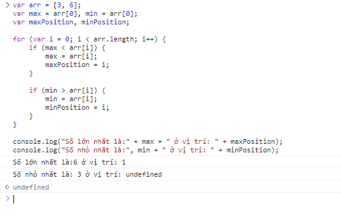
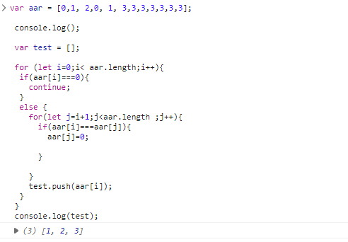

## [Hoàng Văn Thanh](https://github.com/YanShu92/F8-Fullstack-K4/tree/main/Day_19)

**Sớm nhất**

- [x] [Bài 1]

  Bài làm rất tốt\*

  ***

- [x] [Bài 2]

  Bài làm rất tốt \*

  Có thể tối ưu số lần lặp bằng cách sau:

  **Quy luật 6K+-1**:

  ```shell
  5 = 6 * 1 - 1    7 = 6 * 1 + 1    11 = 6 * 1 - 1
  13 = 6 * 1 + 1    17 = 6 * 3 - 1      19 = 6 * 3 + 1
  ```

  Đề xuất sửa thành:

  ```javascript
  function isPrime(n) {
    if (n <= 1 || n % 1 !== 0) return false;
    if (n <= 3) return true;
    if (n % 2 === 0 || n % 3 === 0) return false;
    for (let i = 5; i * i <= n; i += 6) {
      if (n % i === 0) return false;
    }
    return true;
  }

  var array = [1, 0, 2, 3, 6, 8, 5, 7, 11, 13, 99, 9007199254740881];

  console.log(array.filter(isPrime));
  ```

  ***

- [x] [Bài 3]

  Bài làm rất tốt. \*

  Tuy nhiên cần kiểm tra đầu vào phải là một mảng thì sẽ chặt chẽ hơn.

  Có thể tham khảo cách làm sau đây:

  ```js
  var arr = ["a", "b", "c", "a", "b", "c"];
  var finalArr = [];

  arr.forEach((val) => !finalArr.includes(val) && finalArr.push(val));

  console.log(finalArr);
  ```

  ***

- [x] [Bài 4]

  Bài làm rất tốt. \*

  ***

- [x] Đánh giá chung bài tập về nhà:

  Bài làm rất tốt, chỉ cần lưu ý một số lỗi nhỏ và tối ưu code để hoàn thiện hơn.

---

## [Mạnh Huy](https://github.com/HuyNguyen3107/F8_Fullstack_Offline_K4/tree/main/Day_18)

- [x] [Bài 1]

  Bài làm rất tốt\*

  Tuy nhiên bài làm chưa xét đến trường hợp đầu vào là một mảng rỗng. Hiện tại, nếu đầu vào là một mảng rỗng thì sẽ thu được kết quả là `Số lớn nhất trong mảng là 0 và là phần tử thứ 1 trong mảng` và `Số nhỏ nhất trong mảng là 0 và là phần tử thứ 1 trong mảng`. Điều này cần xử lý để bài làm chặt chẽ hơn.

  ***

- [x] [Bài 2]

  Bài làm rất tốt \*

  Có thể tối ưu số lần lặp bằng cách sau:

  **Quy luật 6K+-1**:

  ```shell
  5 = 6 * 1 - 1    7 = 6 * 1 + 1    11 = 6 * 1 - 1
  13 = 6 * 1 + 1    17 = 6 * 3 - 1      19 = 6 * 3 + 1
  ```

  Đề xuất sửa thành:

  ```javascript
  function isPrime(n) {
    if (n <= 1 || n % 1 !== 0) return false;
    if (n <= 3) return true;
    if (n % 2 === 0 || n % 3 === 0) return false;
    for (let i = 5; i * i <= n; i += 6) {
      if (n % i === 0) return false;
    }
    return true;
  }

  var array = [1, 0, 2, 3, 6, 8, 5, 7, 11, 13, 99, 9007199254740881];

  console.log(array.filter(isPrime));
  ```

  ***

- [x] [Bài 3]

  Bài làm rất tốt\*

  ***

- [x] [Bài 4]

  Bài làm tốt. \*

  Hiện tại khi chèn vào mảng sau khi sắp xếp thì hiển thị thông báo là `Mảng sau khi chèn giá trị 6 vào vị trí undefined là: [6, 2, 3, 4, 5, 9]`. Chưa xử lý tốt phần hiển thị vị trí được chèn vào nên đang hiện là `undefined`

- [x] Đánh giá chung bài tập về nhà:

  Bài làm rất tốt, tuy nhiên cần lưu ý một số trường hợp đặc biệt có thể xảy ra của đầu vào và một số lỗi nhỏ để hoàn thiện hơn.

---

## [Thái Duy Tiến](https://github.com/thaiduytien1611cunbeo/NopbaitapF8/tree/main/Day19/js)

- [x] [Bài 1]

  Bài làm tốt\*

  Bài làm chưa kiểm tra một số trường hợp đặc biệt sau:

  - Đề bài yêu cầu mảng này phải chứa các số nguyên, nên cần kiểm tra mỗi phần tử trong mảng phải là số nguyên.

  - Đầu vào là một mảng rỗng.

  - Đầu vào không phải là mảng.

  ***

- [x] [Bài 2]

  Bài làm tốt. \*

  Bài làm chưa kiểm tra một số trường hợp đặc biệt sau:

  - Đầu vào là một mảng rỗng.

  - Đầu vào không phải là mảng.

  - Các phần tử trong mảng không phải là số nguyên.

  Cần xử lý tốt hơn trong hàm thực hiện chức năng kiểm tra một số là số nguyên tố. Có thể tham khảo cách làm sau đây để hoàn thiện hơn:

  **Quy luật 6K+-1**:

  ```shell
  5 = 6 * 1 - 1    7 = 6 * 1 + 1    11 = 6 * 1 - 1
  13 = 6 * 1 + 1    17 = 6 * 3 - 1      19 = 6 * 3 + 1
  ```

  Đề xuất sửa thành:

  ```javascript
  function isPrime(n) {
    if (n <= 1 || n % 1 !== 0) return false;
    if (n <= 3) return true;
    if (n % 2 === 0 || n % 3 === 0) return false;
    for (let i = 5; i * i <= n; i += 6) {
      if (n % i === 0) return false;
    }
    return true;
  }

  var array = [1, 0, 2, 3, 6, 8, 5, 7, 11, 13, 99, 9007199254740881];

  console.log(array.filter(isPrime));
  ```

  ***

- [x] [Bài 3]

  Bài làm rất tốt\*.

  ***

- [x] [Bài 4]

  Bài làm rất tốt. \*

  Có thể tối ưu bằng cách làm sau đây:

  ```js
  function insertSorted(numbers, element) {
    numbers.sort((a, b) => a - b);
    for (let i = 0; i < numbers.length; i++) {
      if (element <= numbers[i]) {
        numbers.splice(i, 0, element);
        break;
      }
    }
    return numbers;
  }

  var numbers = [5, 1, 9, 8, 10];
  var element = 4;
  console.log(insertSorted(numbers, element));
  ```

- [x] Đánh giá chung bài tập về nhà:

  Bài làm tốt, tuy nhiên cần xét các trường hợp có thể xảy ra ở đầu vào để hoàn thiện hơn.

---

## [Hà Long Việt](https://github.com/Vietha22/f8_fullstack_k4/tree/main/Day_19)

- [x] [Bài 1]

  Bài làm chưa tốt.

  Bài làm chưa hiển thị được vị trí của số lớn nhất và số nhỏ nhất trong mảng như yêu cầu của đề bài.

  Bài làm chưa kiểm tra một số trường hợp đặc biệt sau:

  - Đề bài yêu cầu mảng này phải chứa các số nguyên, nên cần kiểm tra mỗi phần tử trong mảng phải là số nguyên.

  - Đầu vào là một mảng rỗng. (Hiện tại nếu đầu vào là một mảng rỗng thì kết quả thu được đang là: `Số nhỏ nhất: undefined, Số lớn nhất: undefined`)

  - Đầu vào không phải là mảng.

  Lưu ý về cách đặt tên biến nên đặt theo quy tắc camelCase, cụ thể là biến `Arr` đang được đặt tên không theo quy tắc camelCase.

  Có thể tham khảo cách làm sau đây:

  ```js
  function MaxAndMin(array) {
    var max;
    var min;
    var indexMax = 0;
    var indexMin = 0;
    if (array.length > 0) {
      max = array[0];
      min = array[0];
      for (let i = 0; i < array.length; i++) {
        if (max < array[i]) {
          max = array[i];
          indexMax = i;
        }
        if (min > array[i]) {
          min = array[i];
          indexMin = i;
        }
      }
      console.log(`giá trị max là : ${max} vị trí index ${indexMax}`);
      console.log(`giá trị min là : ${min} vị trí index ${indexMin}`);
    } else {
      console.log("danh sách rỗng");
    }
  }
  ```

  ***

- [x] [Bài 2]

  Bài làm rất tốt. \*

  Có thể tối ưu vòng lặp bằng cách sau đây:

  **Quy luật 6K+-1**:

  ```shell
  5 = 6 * 1 - 1    7 = 6 * 1 + 1    11 = 6 * 1 - 1
  13 = 6 * 1 + 1    17 = 6 * 3 - 1      19 = 6 * 3 + 1
  ```

  Đề xuất sửa thành:

  ```javascript
  function isPrime(n) {
    if (n <= 1 || n % 1 !== 0) return false;
    if (n <= 3) return true;
    if (n % 2 === 0 || n % 3 === 0) return false;
    for (let i = 5; i * i <= n; i += 6) {
      if (n % i === 0) return false;
    }
    return true;
  }

  var array = [1, 0, 2, 3, 6, 8, 5, 7, 11, 13, 99, 9007199254740881];

  console.log(array.filter(isPrime));
  ```

  ***

- [x] [Bài 3]

  Bài làm tốt\*.

  Tuy nhiên bài làm cần đảm bảo đầu ra thu được vẫn phải là một mảng sau khi loại bỏ các phần tử giống nhau. Hiện tại kết quả thu được đang là một chuỗi: `Mảng sau khi xử lý: 0,1,a,5,m,6`. Điều này là không đúng với Output của đề bài đưa ra.

  Có thể tham khảo cách làm sau đây:

  ```js
  var arr = ["a", "b", "c", "a", "b", "c"];
  var finalArr = [];

  arr.forEach((val) => !finalArr.includes(val) && finalArr.push(val));

  console.log(finalArr);
  ```

  ***

- [x] [Bài 4]

  Bài làm tốt. \*

  Tuy nhiên bài làm cần đảm bảo đầu ra thu được vẫn phải là một mảng sau khi đã sắp xếp và chèn phần tử mới vào mảng. Hiện tại kết quả thu được đang là một chuỗi: `Mảng sau khi sắp xếp và chèn: 1,4,5,8,9,10`. Điều này là không đúng với Output của đề bài đưa ra.

  Có thể tối ưu bằng cách làm sau đây:

  ```js
  function insertSorted(numbers, element) {
    numbers.sort((a, b) => a - b);
    for (let i = 0; i < numbers.length; i++) {
      if (element <= numbers[i]) {
        numbers.splice(i, 0, element);
        break;
      }
    }
    return numbers;
  }

  var numbers = [5, 1, 9, 8, 10];
  var element = 4;
  console.log(insertSorted(numbers, element));
  ```

- [x] Đánh giá chung bài tập về nhà:

  Bài làm tốt, tuy nhiên cần thực hiện đầy đủ các yêu cầu của đề bài (bài 1), cần xét các trường hợp có thể xảy ra ở đầu vào, cần lưu ý định dạng của Output theo yêu cầu của đề bài và một số lỗi nhỏ để hoàn thiện hơn.

---

## [Nguyễn Chi Nam](https://github.com/chinam197/nbai19.git)

- [x] [Bài 1]

  Bài làm tốt. \*

  Cần lưu ý cách đặt tên biến. Cụ thể `number` là một từ nên không cần phải đặt theo quy tắc camelCase là `numBer`.

  Hiện tại cách xử lý chưa tối ưu nếu như có nhiều số bằng nhau và các số này có giá trị lớn nhất so với các số còn lại thì đều sẽ in ra bấy nhiêu dòng thông báo giá trị lớn nhất (tương tự với giá trị nhỏ nhất).

  Ví dụ cụ thể: Đầu vào là: `let numBer = [11, 2, 2, 3, 12, 3, 44,44,88,88];` thì đầu ra thu được sẽ là 4 dòng thông báo như sau:

  - `giá trị min = 2 index :1`
  - `giá trị min = 2 index :2`
  - `giá trị max = 88 index :8`
  - `giá trị max = 88 index :9`

  Bài làm chưa kiểm tra một số trường hợp đặc biệt sau:

  - Đề bài yêu cầu mảng này phải chứa các số nguyên, nên cần kiểm tra mỗi phần tử trong mảng phải là số nguyên.

  - Đầu vào là một mảng rỗng.

  - Đầu vào không phải là mảng.

  Chú ý về việc format code.

  Có thể tham khảo cách làm sau đây:

  ```js
  function MaxAndMin(array) {
    var max;
    var min;
    var indexMax = 0;
    var indexMin = 0;
    if (array.length > 0) {
      max = array[0];
      min = array[0];
      for (let i = 0; i < array.length; i++) {
        if (max < array[i]) {
          max = array[i];
          indexMax = i;
        }
        if (min > array[i]) {
          min = array[i];
          indexMin = i;
        }
      }
      console.log(`giá trị max là : ${max} vị trí index ${indexMax}`);
      console.log(`giá trị min là : ${min} vị trí index ${indexMin}`);
    } else {
      console.log("danh sách rỗng");
    }
  }
  ```

  ***

- [x] [Bài 2]

  Bài làm tốt. \*

  Bài làm chưa kiểm tra một số trường hợp đặc biệt sau:

  - Đầu vào không phải là mảng.

  - Các phần tử trong mảng không phải là số nguyên. Hiện tại nếu nhập phần tử có giá trị là `2.2` thì vẫn nhận là số nguyên tố.

  ***

- [x] [Bài 3]

  Bài làm rất tốt\*.

  ***

- [x] [Bài 4]

  Bài làm chưa tốt.

  Đề bài yêu cầu sắp xếp mảng theo thứ tự tăng dần rồi thêm một phần tử vào mảng đã sắp xếp sao cho không làm thay đổi thứ tự tăng dần của mảng chứ không phải thêm phần tử vào cuối mảng rồi lại sắp xếp lại.

  Chú ý trong việc format code.

  Có thể tham khảo cách làm sau đây:

  ```js
  function insertSorted(numbers, element) {
    numbers.sort((a, b) => a - b);
    for (let i = 0; i < numbers.length; i++) {
      if (element <= numbers[i]) {
        numbers.splice(i, 0, element);
        break;
      }
    }
    return numbers;
  }

  var numbers = [5, 1, 9, 8, 10];
  var element = 4;
  console.log(insertSorted(numbers, element));
  ```

- [x] Đánh giá chung bài tập về nhà:

  Bài làm còn nhiều vấn đề cần lưu ý, cần xét các trường hợp có thể xảy ra ở đầu vào và lưu ý đọc kỹ yêu cầu đề bài để hoàn thiện hơn.

---

## [Trần Đức Công](https://github.com/TranCong312002/F8-fullstack-k4/tree/main/Bai_tap_buoi_19)

- [x] [Bài 1]

  Bài làm rất tốt. \*

  Bài làm chưa kiểm tra trường hợp đầu vào là mảng rỗng. Hiện tại sẽ thu được kết quả nếu đầu vào là mảng rỗng là: `Số lớn nhất trong dãy là: 0 Chỉ số trong mảng là: 0`.

  ***

- [x] [Bài 2]

  Bài làm rất tốt. \*

  Có thể tham khảo cách làm sau đây để tối ưu hơn số lượng vòng lặp xác định số nguyên tố:

  **Quy luật 6K+-1**:

  ```shell
  5 = 6 * 1 - 1    7 = 6 * 1 + 1    11 = 6 * 1 - 1
  13 = 6 * 1 + 1    17 = 6 * 3 - 1      19 = 6 * 3 + 1
  ```

  Đề xuất sửa thành:

  ```javascript
  function isPrime(n) {
    if (n <= 1 || n % 1 !== 0) return false;
    if (n <= 3) return true;
    if (n % 2 === 0 || n % 3 === 0) return false;
    for (let i = 5; i * i <= n; i += 6) {
      if (n % i === 0) return false;
    }
    return true;
  }

  var array = [1, 0, 2, 3, 6, 8, 5, 7, 11, 13, 99, 9007199254740881];

  console.log(array.filter(isPrime));
  ```

  ***

- [x] [Bài 3]

  Bài làm tốt\*.

  Tuy nhiên cần lưu ý về định dạng của đầu ra khi lọc các phần tử giống nhau phải giữ nguyên là mảng. Hiện tại kết quả đang là một chuỗi.

  Cần xử lý cả trường hợp trong mảng chứa các kiểu dữ liệu khác chứ không phải chỉ xử lý số nguyên.

  Có thể tham khảo cách làm sau đây để tối ưu hơn:

  ```js
  var arr = ["a", "b", "c", "a", "b", "c"];
  var finalArr = [];

  arr.forEach((val) => !finalArr.includes(val) && finalArr.push(val));

  console.log(finalArr);
  ```

  ***

- [x] [Bài 4]

  Bài làm rất tốt. \*

  Tuy nhiên cần lưu ý về định dạng của đầu ra sau khi sắp xếp và thêm phần tử phải giữ nguyên là mảng. Hiện tại kết quả đang là một chuỗi.

  Có thể tối ưu bằng cách làm sau đây:

  ```js
  function insertSorted(numbers, element) {
    numbers.sort((a, b) => a - b);
    for (let i = 0; i < numbers.length; i++) {
      if (element <= numbers[i]) {
        numbers.splice(i, 0, element);
        break;
      }
    }
    return numbers;
  }

  var numbers = [5, 1, 9, 8, 10];
  var element = 4;
  console.log(insertSorted(numbers, element));
  ```

- [x] Đánh giá chung bài tập về nhà:

  Bài làm tốt, tuy nhiên cần lưu ý về định dạng của đầu ra theo đúng yêu cầu của đề bài và một số lỗi nhỏ để hoàn thiện hơn.

---

## [Nguyễn Hưng Tuân](https://github.com/hungtuan/f8-fullstack-k4/blob/main/Day-19/js/main.js)

- [x] [Bài 1]

  Bài làm tốt\*

  Bài làm chưa kiểm tra một số trường hợp đặc biệt sau:

  - Đề bài yêu cầu mảng này phải chứa các số nguyên, nên cần kiểm tra mỗi phần tử trong mảng phải là số nguyên.

  - Đầu vào là một mảng rỗng.

  - Đầu vào không phải là mảng.

  Có thể tham khảo cách làm sau đây ngắn gọn và tối ưu hơn:

  ```js
  function MaxAndMin(array) {
    var max;
    var min;
    var indexMax = 0;
    var indexMin = 0;
    if (array.length > 0) {
      max = array[0];
      min = array[0];
      for (let i = 0; i < array.length; i++) {
        if (max < array[i]) {
          max = array[i];
          indexMax = i;
        }
        if (min > array[i]) {
          min = array[i];
          indexMin = i;
        }
      }
      console.log(`giá trị max là : ${max} vị trí index ${indexMax}`);
      console.log(`giá trị min là : ${min} vị trí index ${indexMin}`);
    } else {
      console.log("danh sách rỗng");
    }
  }
  ```

  ***

- [x] [Bài 2]

  Bài làm tốt. \*

  Bài làm chưa kiểm tra một số trường hợp đặc biệt sau:

  - Đầu vào không phải là mảng.

  - Các phần tử trong mảng không phải là số nguyên.

  Cần xử lý tốt hơn trong hàm thực hiện chức năng kiểm tra một số là số nguyên tố. Có thể tham khảo cách làm sau đây để hoàn thiện hơn:

  **Quy luật 6K+-1**:

  ```shell
  5 = 6 * 1 - 1    7 = 6 * 1 + 1    11 = 6 * 1 - 1
  13 = 6 * 1 + 1    17 = 6 * 3 - 1      19 = 6 * 3 + 1
  ```

  Đề xuất sửa thành:

  ```javascript
  function isPrime(n) {
    if (n <= 1 || n % 1 !== 0) return false;
    if (n <= 3) return true;
    if (n % 2 === 0 || n % 3 === 0) return false;
    for (let i = 5; i * i <= n; i += 6) {
      if (n % i === 0) return false;
    }
    return true;
  }

  var array = [1, 0, 2, 3, 6, 8, 5, 7, 11, 13, 99, 9007199254740881];

  console.log(array.filter(isPrime));
  ```

  ***

- [x] [Bài 3]

  Bài làm rất tốt\*.

  ***

- [x] [Bài 4]

  Bài làm chưa tốt.

  Đề bài yêu cầu sắp xếp mảng theo thứ tự tăng dần rồi thêm phần tử vào mảng sao cho vẫn theo thứ tự tăng dần chứ không phải thêm phần tử rồi sắp xếp.

  Có thể tham khảo cách làm sau đây:

  ```js
  function insertSorted(numbers, element) {
    numbers.sort((a, b) => a - b);
    for (let i = 0; i < numbers.length; i++) {
      if (element <= numbers[i]) {
        numbers.splice(i, 0, element);
        break;
      }
    }
    return numbers;
  }

  var numbers = [5, 1, 9, 8, 10];
  var element = 4;
  console.log(insertSorted(numbers, element));
  ```

- [x] Đánh giá chung bài tập về nhà:

  Bài làm tốt, tuy nhiên cần xét các trường hợp có thể xảy ra ở đầu vào để hoàn thiện hơn.

---

## [Huy Bui](https://github.com/Huy-Bui4869/f8_fullstack_k4/blob/main/Day_18/js/script.js)

- [x] [Bài 1]

  Bài làm tốt\*

  Bài làm chưa kiểm tra một số trường hợp đặc biệt sau:

  - Đề bài yêu cầu mảng này phải chứa các số nguyên, nên cần kiểm tra mỗi phần tử trong mảng phải là số nguyên.

  - Đầu vào là một mảng rỗng.

  - Đầu vào không phải là mảng.

  Có thể tham khảo cách làm sau đây ngắn gọn và tối ưu hơn:

  ```js
  function MaxAndMin(array) {
    var max;
    var min;
    var indexMax = 0;
    var indexMin = 0;
    if (array.length > 0) {
      max = array[0];
      min = array[0];
      for (let i = 0; i < array.length; i++) {
        if (max < array[i]) {
          max = array[i];
          indexMax = i;
        }
        if (min > array[i]) {
          min = array[i];
          indexMin = i;
        }
      }
      console.log(`giá trị max là : ${max} vị trí index ${indexMax}`);
      console.log(`giá trị min là : ${min} vị trí index ${indexMin}`);
    } else {
      console.log("danh sách rỗng");
    }
  }
  ```

  ***

- [x] [Bài 2]

  **Chưa làm**

  ***

- [x] [Bài 3]

  Bài làm rất tốt. \*

  ***

- [x] [Bài 4]

  Bài làm rất tốt. \*

- [x] Đánh giá chung bài tập về nhà:

  Bài làm rất tốt, tuy nhiên cần xét các trường hợp có thể xảy ra ở đầu vào để hoàn thiện hơn.

---

## [Đặng Khải](https://github.com/AlbertKhai/f8-fullstack-offline/tree/main/Day-19)

- [x] Bài 1: Bài làm rất tốt \* .

---

- [x] Bài 2: Bài làm tốt.

  Trong mục tiêu bài này thì không cần thiết tạo ra 1 mảng để lưu số nguyên tố và đếm chúng.
  Đề Xuất.

  ```javascript
  function averagePrime(arr) {
    try {
      err(arr, true);
    } catch (error) {
      return error.message;
    }
    console.log("Mảng được truyền vào:", arr);
    let count = 0,
      total = 0;
    arr.forEach(function (value) {
      if (isPrime(value)) {
        total += value;
        count++;
      }
    });
    let average;
    if (total === 0) {
      return "Không có số nguyên tố";
    } else {
      average = total / count;
    }
    console.log("Kết quả trung bình các số nguyên tố trong mảng là:", average);
    return average;
  }
  ```

---

- [x] Bài 3: Bài làm rất tốt \*.

---

- [x] Bài 4: Bài làm rất tốt \* .

---

- [x] Đánh giá chung bài tập về nhà: Bài làm rất tốt. Tuy nhiên vẫn còn 1 số lỗi nhỏ.

## [Tuan Kiet Hoang](https://github.com/suspiciously36/bai-tap-js/tree/main/day-19/js)

- [x] Bài 1: Bài làm tốt .

  Chưa Kiểm tra mảng có phải mảng số nguyên hay không.

---

- [x] Bài 2: Bài làm tốt \*.

  Có thể Tối ưu lại hàm `isPrime()`.

  Đề Xuất.

  ```javascript
  function isPrime(n) {
    if (n <= 1) return false;
    if (n <= 3) return true;
    if (n % 2 === 0 || n % 3 === 0) return false;
    for (let i = 5; i * i <= n; i += 6) {
      if (n % i === 0 || n % (i + 2) === 0) return false;
    }
    return true;
  }
  ```

---

- [x] Bài 3: Bài làm rất tốt\*.

---

- [x] Bài 4: Bài làm rất tốt .

  Đề xuất tối ưu lại hàm `insertMoreNum(sortedArr, element)`.

  ```javascript
  function insertMoreNum(sortedArr, element) {
    sortedArr = integerArr.sort((a, b) => a - b);

    for (var i = 0; i < sortedArr.length; i++) {
      if (element < sortedArr[i]) {
        break;
      }
    }
    sortedArr.splice(i, 0, element);

    return sortedArr;
  }
  ```

---

- [x] Đánh giá chung bài tập về nhà: Bài làm rất tốt, tuy nhiên vẫn còn 1 số lỗi nhỏ.

## [Lê Đình Hùng](https://github.com/suspiciously36/bai-tap-js/tree/main/day-19/js)

- [x] Bài 1: Bài làm tốt .

  Chưa Kiểm tra mảng có phải mảng số nguyên hay không.

---

- [x] Bài 2: Bài làm tốt \*.

  Có thể Tối ưu lại hàm `isPrime()`.

  Đề Xuất.

  ```javascript
  function isPrime(n) {
    if (n <= 1) return false;
    if (n <= 3) return true;
    if (n % 2 === 0 || n % 3 === 0) return false;
    for (let i = 5; i * i <= n; i += 6) {
      if (n % i === 0 || n % (i + 2) === 0) return false;
    }
    return true;
  }
  ```

---

- [x] Bài 3: Bài làm rất tốt\*.

---

- [x] Bài 4: Bài làm rất tốt \* .

---

- [x] Đánh giá chung bài tập về nhà: Bài làm rất tốt, tuy nhiên vẫn còn 1 số lỗi nhỏ.

## [Dong Nguyen](https://dongnguyen318.github.io/Quydong/)

- [x] Bài 1:

  Chưa Kiểm tra mảng có phải mảng số nguyên hay không.

  Chưa đúng với 1 số trường hợp do biến `maxPosition, minPosition` chưa được gán giá trị ban đầu.

  Lỗi.

  .

  Đề Xuất.

  ```javascript
  var array = [1, 4, -3, 4, 5, 6];
  var max;
  var min;
  var indexMax = 0;
  var indexMin = 0;
  function isArrayInteger(array) {
    return array.every((items) => items % 1 === 0);
  }
  if (Array.isArray(array) && array.length > 0 && isArrayInteger(array)) {
    max = array[0];
    min = array[0];
    for (let i = 0; i < array.length; i++) {
      if (max < array[i]) {
        max = array[i];
        indexMax = i;
      }
      if (min > array[i]) {
        min = array[i];
        indexMin = i;
      }
    }
    console.log(`giá trị max là : ${max} vị trí index ${indexMax}`);
    console.log(`giá trị min là : ${min} vị trí index ${indexMin}`);
  } else {
    console.log("đầu vào không hợp lệ");
  }
  ```

---

- [x] Bài 2: Bài làm tốt \*.

  Có thể Tối ưu lại hàm `isPrime()`.

  Đề Xuất.

  ```javascript
  function isPrime(n) {
    if (n <= 1) return false;
    if (n <= 3) return true;
    if (n % 2 === 0 || n % 3 === 0) return false;
    for (let i = 5; i * i <= n; i += 6) {
      if (n % i === 0 || n % (i + 2) === 0) return false;
    }
    return true;
  }
  ```

---

- [x] Bài 3: Bài làm tốt.

  Sai đầu ra khi mảng `listNumber.length === 0` in ra `mảng rỗng` chứa không phải là `Không có phần tử nào trong mảng trùng nhau`.

---

- [x] Bài 4: Bài làm chưa tốt.

  Đề Xuất.

  ```javascript
  function sortArray(arr, addElement) {
    arr.sort((a, b) => a - b);
    for (var i = 0; i < arr.length; i++) {
      if (arr[i] > addElement) {
        break;
      }
    }
    arr.splice(i, 0, addElement);
    return arr;
  }
  var array = [1, 2, 5, 4];
  var element = 3;
  console.log(sortArray(array, element));
  ```

---

- [x] Đánh giá chung bài tập về nhà: Bài làm tạm ổn. cần cẩn thận hơi khi làm bài.

## [Nguyễn Ngọc Hùng](https://github.com/Oladayne/f8-fullstack-k98.git)

- [x] Bài 1:

  Chưa Kiểm tra mảng có phải mảng số nguyên hay không.

  Không lên sử dụng hàm trong bài này.

  Đề Xuất Lại.

  ```javascript
  var array = [1, 4, -3, 4, 5, 6];
  var max;
  var min;
  var indexMax = 0;
  var indexMin = 0;
  function isArrayInteger(array) {
    return array.every((items) => items % 1 === 0);
  }
  if (Array.isArray(array) && array.length > 0 && isArrayInteger(array)) {
    max = array[0];
    min = array[0];
    for (let i = 0; i < array.length; i++) {
      if (max < array[i]) {
        max = array[i];
        indexMax = i;
      }
      if (min > array[i]) {
        min = array[i];
        indexMin = i;
      }
    }
    console.log(`giá trị max là : ${max} vị trí index ${indexMax}`);
    console.log(`giá trị min là : ${min} vị trí index ${indexMin}`);
  } else {
    console.log("đầu vào không hợp lệ");
  }
  ```

---

- [x] Bài 2: Bài làm chưa tốt.

  Sai yêu cầu đề bài , đề bài là đầu vào là 1 mảng số nguyên tính trung bình các số nguyên tố trong mảng chứa không phải đầu vào là n tìm số nguyên trong khoảng từ [1, n].

  Đề Xuất Lại.

  ```javascript
  function isPrime(n) {
    if (n <= 1) return false;
    if (n <= 3) return true;
    if (n % 2 === 0 || n % 3 === 0) return false;
    for (let i = 5; i * i <= n; i += 6) {
      if (n % i === 0 || n % (i + 2) === 0) return false;
    }
    return true;
  }
  var array = [1, 2, 3, 4, 5, 6, 7, 8, 6, 4];
  var count = 0;
  var sum = 0;
  if (Array.isArray(array)) {
    for (let i = 0; i < array.length; i++) {
      if (isPrime(array[i])) {
        sum += array[i];
        count++;
      }
    }
    if (count === 0) {
      console.log(" không có số nguyên tố ");
    } else {
      console.log(`Trung bình các số nguyên tố là : ${sum / count}`);
    }
  } else {
    console.log("đầu vào không hợp lệ");
  }
  ```

---

- [x] Bài 3:

  Sai tên biến `aar` -> `arr`.

  Sai trường hợp phần tử trong mảng chứa giá trị 0.

  Lỗi.

  .

  Đề Xuất.

  ```javascript
  var arr = [1, 1, 3, -4, 3, 5, 6, 3];
  if (arr.length !== 0) {
    var result = arr.filter((item, index) => arr.indexOf(item) === index);
  } else {
    console.log(` Mảng không có phần tử nào!`);
  }

  console.log(result);
  ```

---

- [x] Bài 4: Bài làm chưa tốt.

  Sai đề bài sắp xếp xong rồi mới chèn , chứ không phải chèn xong mới sắp xếp.
  Đề Xuất.

  ```javascript
  function sortArray(arr, addElement) {
    arr.sort((a, b) => a - b);
    for (var i = 0; i < arr.length; i++) {
      if (arr[i] > addElement) {
        break;
      }
    }
    arr.splice(i, 0, addElement);
    return arr;
  }
  var array = [1, 2, 5, 4];
  var element = 3;
  console.log(sortArray(array, element));
  ```

---

- [x] Đánh giá chung bài tập về nhà: Bài làm chưa tốt. yêu cầu code lại!. Cẩn thận hơi khi làm bài.

---

## [Trung Kiên](https://github.com/KIENTT99/F8-Fullstack-k4/tree/main/ngay_19)

- [x] [Bài 1]

  Bài làm chưa tốt.

  Hiện tại kết quả tìm số nhỏ nhất là: `Số nhỏ nhất: 1 - index[undefined]`. Do ban đầu khi khai báo `indexMin` không gán giá trị mặc định nên không tìm được index của số nhỏ nhất nếu phần tử đầu tiên trong mảng nhỏ nhất.

  Bài làm chưa kiểm tra một số trường hợp đặc biệt sau:

  - Đề bài yêu cầu mảng này phải chứa các số nguyên, nên cần kiểm tra mỗi phần tử trong mảng phải là số nguyên.

  - Đầu vào là một mảng rỗng.

  - Đầu vào không phải là mảng.

  Có thể tham khảo cách làm sau đây:

  ```js
  function MaxAndMin(array) {
    var max;
    var min;
    var indexMax = 0;
    var indexMin = 0;
    if (array.length > 0) {
      max = array[0];
      min = array[0];
      for (let i = 0; i < array.length; i++) {
        if (max < array[i]) {
          max = array[i];
          indexMax = i;
        }
        if (min > array[i]) {
          min = array[i];
          indexMin = i;
        }
      }
      console.log(`giá trị max là : ${max} vị trí index ${indexMax}`);
      console.log(`giá trị min là : ${min} vị trí index ${indexMin}`);
    } else {
      console.log("danh sách rỗng");
    }
  }
  ```

  ***

- [x] [Bài 2]

  Bài làm rất tốt. \*

  ***

- [x] [Bài 3]

  Bài làm tốt\*.

  Tuy nhiên bài làm cần đảm bảo đầu ra thu được vẫn phải là một mảng sau khi loại bỏ các phần tử giống nhau. Hiện tại kết quả thu được đang là một chuỗi: `Mảng sau khi xử lý: 0,1,a,5,m,6`. Điều này là không đúng với Output của đề bài đưa ra.

  Có thể tham khảo cách làm sau đây:

  ```js
  var arr = ["a", "b", "c", "a", "b", "c"];
  var finalArr = [];

  arr.forEach((val) => !finalArr.includes(val) && finalArr.push(val));

  console.log(finalArr);
  ```

  ***

- [x] [Bài 4]

  Bài làm chưa tốt.

  Cần xem lại logic xử lý khi thêm phần tử vào mảng sau khi đã được sắp xếp. Hiện tại nếu thêm -2 vào mảng đã được sắp xếp thì không hiển thị được kết quả đúng theo mong muốn của đề bài.

  Có thể tham khảo cách làm sau đây:

  ```js
  function insertSorted(numbers, element) {
    numbers.sort((a, b) => a - b);
    for (let i = 0; i < numbers.length; i++) {
      if (element <= numbers[i]) {
        numbers.splice(i, 0, element);
        break;
      }
    }
    return numbers;
  }

  var numbers = [5, 1, 9, 8, 10];
  var element = 4;
  console.log(insertSorted(numbers, element));
  ```

- [x] Đánh giá chung bài tập về nhà:

  Bài làm tốt, tuy nhiên cần xét các trường hợp có thể xảy ra ở đầu vào và cần xử lý tốt hơn ở bài 4. Ngoài ra, nếu có khó khăn trong quá trình làm bài tập cần đặt câu hỏi để được trợ giúp và hoàn thành bài tập về nhà một cách hoàn chỉnh hơn.

---

## [Vinh Nguyễn](https://github.com/KIENTT99/F8-Fullstack-k4/tree/main/ngay_19)

- [x] [Bài 1]

  Bài làm tốt. \*

  Bài làm chưa kiểm tra trường hợp đầu vào là mảng rỗng.

  ***

- [x] [Bài 2]

  Bài làm rất tốt. \*

  Có thể tham khảo cách làm sau đây để tối ưu vòng lặp hơn:

  **Quy luật 6K+-1**:

  ```shell
  5 = 6 * 1 - 1    7 = 6 * 1 + 1    11 = 6 * 1 - 1
  13 = 6 * 1 + 1    17 = 6 * 3 - 1      19 = 6 * 3 + 1
  ```

  Đề xuất sửa thành:

  ```javascript
  function isPrime(n) {
    if (n <= 1 || n % 1 !== 0) return false;
    if (n <= 3) return true;
    if (n % 2 === 0 || n % 3 === 0) return false;
    for (let i = 5; i * i <= n; i += 6) {
      if (n % i === 0) return false;
    }
    return true;
  }

  var array = [1, 0, 2, 3, 6, 8, 5, 7, 11, 13, 99, 9007199254740881];

  console.log(array.filter(isPrime));
  ```

  ***

- [x] [Bài 3]

  Bài làm rất tốt. \*

  ***

- [x] [Bài 4]

  Bài làm rất tốt. \*

  ***

- [x] Đánh giá chung bài tập về nhà:

  Bài làm rất tốt, tuy nhiên cần xét các trường hợp có thể xảy ra ở đầu vào thì sẽ hoàn chỉnh hơn.

---
