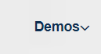
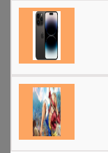
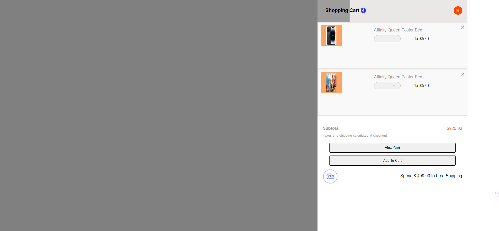
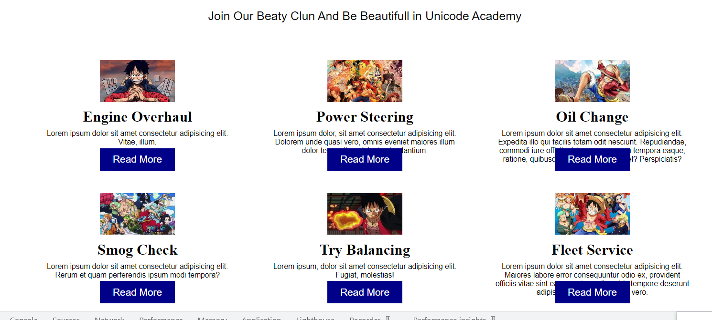
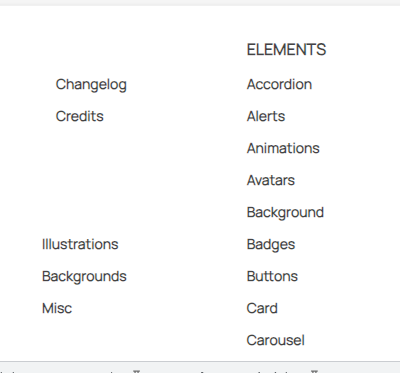
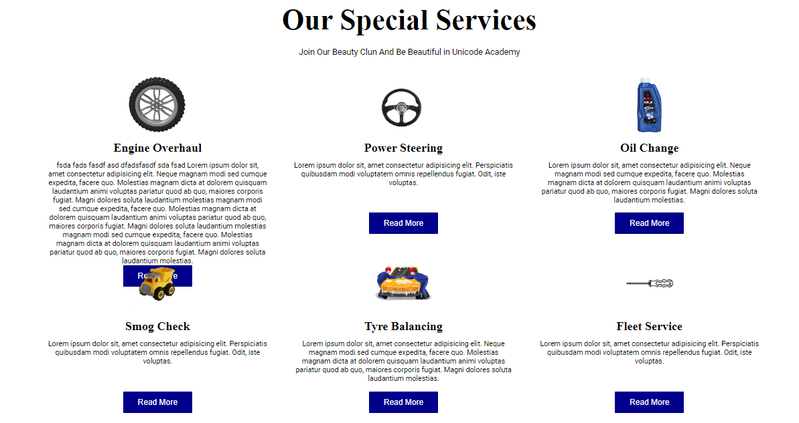
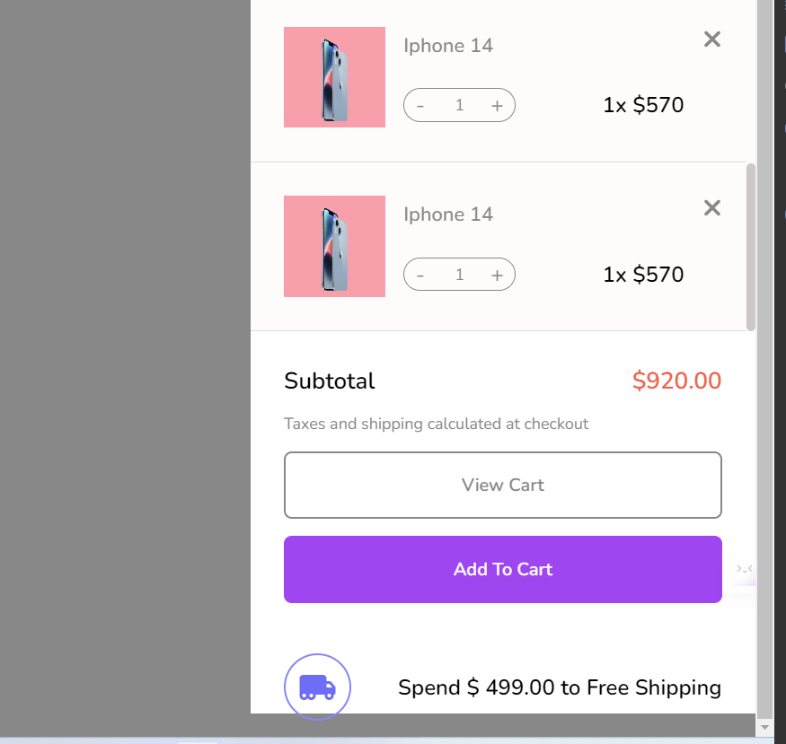

# Tuấn Anh đánh giá bài học viên

## [Hoang Van Thanh](https://github.com/YanShu92/F8-Fullstack-K4/tree/main/Day_8)

[x] [Bài 1]: Bài làm rất tốt \*

Nên căn giữa phần **icon** và phần **nội dung**.

Đề xuất.

```css
.project-nav__item {
  display: flex;
  align-items: center;
  gap: 5px;
}
```

[x] [Bài 2]: Bài làm rất tốt \*

---

[x] [Bài 3]: Bài làm rất tốt \*

Thẻ p: tăng line-height `line-height: 1.7rem`.

---

Đánh giá chung bài tập về nhà: Bài làm hầu hết đều rất tốt, chỉ cần điều chỉnh một số lỗi nhỏ để hoàn thiện hơn.

---

## [Thái Duy Tiến](https://thaiduytien1611cunbeo.github.io/NopbaitapF8/index.html)

[x] [Bài 1]: Bài làm tốt

Nên tăng khoảng cách giữa các **icon** và phần **Nội dung**.



Khi **hover** vào thẻ các `class=menu` thì **mega-menu** mới hiện thị.

---

[x] [Bài 2]:

Ảnh bị méo.

.

Đề Xuất:

```css
.body_item img {
  object-fit: contain;
}
```

Phần `.body_item` nên thiết kế thanh cuộn lên xuống khi có nhiều sản phẩm để tăng tính trải nghiệm người dùng.

Bị Vỡ Giao Diện.

;

Code Lại bài 2.

---

[x] [Bài 3]:
Nên Bọc thẻ `<div class = "container">` trong thẻ `<section>` để chia layout cho dễ.

Đề Xuất.

```css
.container {
  width: 1135px;
  margin: 0 auto;
}
```

Khi nên để thẻ `<button` có thuộc tính là `position: absolute;`.

Các button đang bị chèn lên text, cần kiểm tra và sửa lại cho bài làm chỉnh chu hơn.

.

Đề Xuất.

```css
.item {
  display: flex;
  flex-direction: column;
  align-items: center;
  gap: 10px;
}
button {
  margin-top: auto;
}
```

---

Đánh giá chung bài tập về nhà: Bài làm hầu hết tạm ổn, cần cẩn thận khi nộp bài.

---

## [Huy Bui](https://github.com/Huy-Bui4869/f8_fullstack_k4/tree/main/Day_8)

[x] [Bài 1]: Bài làm rất tốt \*

---

[x] [Bài 2]: Bài làm tốt \*

Thiếu **đường** ngăn cách các sản phẩm.

Đề xuất.

```css
.cart-center .product + .cart-center .product {
  border-top: 1px solid #f1f1f1;
}
```

---

[x] [Bài 3]: Bài làm rất tốt \*

Thẻ `<p>` tăng `font-size: 15px`.

Thẻ `<button>` tăng `padding: 12px 24px;`.

---

Đánh giá chung bài tập về nhà: Bài làm hầu hết đều rất tốt, chỉ cần điều chỉnh một số lỗi nhỏ để hoàn thiện hơn

## [Mạnh Huy](https://github.com/HuyNguyen3107/F8_Fullstack_Offline_K4/tree/main/Day_08)

[x] [Bài 1]: Bài làm tốt \*

Thiếu đường ngăn cách giữa thẻ `<div  class ="elements-submenu">`.



---

[x] [Bài 2]: Bài làm rất tốt \*

Thẻ `<ul class="shopping-cart-products">` nên thay giá trị của thuộc tính `overflow: auto`.

Vì khi các items con có chiều dài và chiều rộng lớn hơn.

Thì mới xuất hiện thanh cuốn ngang hoặc dọc.

---

[x] [Bài 3]: Bài làm rất tốt \*

Thẻ `<p>` tăng `line-height: 1.4rem`.

Không lên đặt height cho `.service-item` vì khi tăng **nội dung** thẻ `<p>` nên sẽ bị vỡ giao diện.

.

---

Đánh giá chung bài tập về nhà: Bài làm hầu hết đều tốt, chỉ cần điều chỉnh một số lỗi nhỏ để hoàn thiện hơn

## [Hà Long Việt](https://github.com/Vietha22/f8_fullstack_k4/tree/main/Day_8)

[x] [Bài 1]: Bài làm rất tốt \*

Nên Cần giữa phần **icon** và phần **nội dung**.

Đề Xuất.

```css
.menu-nav-item {
  display: flex;
  align-items: center;
  gap: 5px;
}
```

---

[x] [Bài 2]: Bài làm tốt \*

Thẻ `<section class="shopping-cart">` không nên đặt `height: 100vh`.

Vì khi các phần tử con có height lớn hơn vw sẽ xuất hiện lỗi.

Lỗi.

.

Đề Xuất.

```css
.shopping-cart {
  min-height: 100vh;
}
```

---

[x] [Bài 3]: Bài làm rất tốt \*

Thẻ `<p>` tăng `line-height: 1.4rem`

---

Đánh giá chung bài tập về nhà: Bài làm hầu hết đều tốt, chỉ cần điều chỉnh một số lỗi nhỏ để hoàn thiện hơn

---

## [Lê Đình Hùng](https://github.com/Le-Hung-020903/f8-fullstack-k4/tree/main/buoi_8)

- [x] Bài 1:

  Bài làm rất tốt \*

  `USAGE` đang viết sai chính tả là `USEGE`.

  Độ dày của text trong bài làm đang mỏng hơn so với bản mẫu.

  Icon mũi tên ở menu cấp 1 nên đặt kích thước nhỏ hơn.

---

- [x] Bài 2:

  Bài làm tốt \*

  Độ dày tên sản phẩm đang mỏng hơn so với bản mẫu.

  Nên xử lý hiển thị tên sản phẩm theo kiểu rút gọn có dấu `...` để khi tên sản phẩm quá dài sẽ không bị vỡ layout. Có thể tham khảo đoạn code sau đây:

  ```css
  display: -webkit-box;
  -webkit-line-clamp: 3; /*Số dòng muốn hiển thị*/
  -webkit-box-orient: vertical;
  overflow: hidden; /*Ẩn nội dung vượt quá sẽ bị ẩn đi*/
  ```

  Nên tuân thủ bản mẫu, ở đây số lượng sản phẩm được hiển thị là 1 chứ không phải 01

  Phần text dùng để hiển thị giá đang đậm hơn so với bản mẫu.

  Ở sản phẩm thứ 4 phần giá đang bị xuống hàng do độ rộng không đủ để hiển thị trên 1 hàng nên xử lý lại.

  Phần transition hover vào button đang không thân thiện với người dùng vì thời gian khi hover vào không thực hiện luôn mà lại delay 0.3s và ngoài ra thời gian thực hiện là 0.5s khá lâu. Không nên để delay ở trường hợp này và điều chỉnh lại thời gian thực hiện tối đa là 0.4s sẽ tốt cho trải nghiệm người dùng hơn.

  Phần border của button `View Cart` đang đậm hơn so với bản mẫu

---

- [x] Bài 3:

  Bài làm rất tốt \*

  Phần transition không nên để delay trong trường hợp này.

  Ở đây nội dung trong `service-item__desc` đang giống hệt nhau nên chắc chắn các button sẽ thẳng hàng nhau nhưng khi nội dung đoạn văn của 1 item ngắn hơn thì sẽ kéo theo button bị lệch so với các hàng khác. Do bản mẫu có item có đoạn mô tả ngắn nhưng các button vẫn thẳng hàng nhau. Bài này chưa xử lý trường hợp đó.

---

- [x] Đánh giá: Bài làm khá tốt, tuy nhiên cần lưu ý khi dùng thuộc tính `transition` và một số lỗi khác để hoàn thiện bài làm hơn.

---

## [Nguyễn Chí Nam](https://github.com/chinam197/baitapvenha)

- [x] Bài 1:

  Bài làm chưa tốt.

  `Blocks` đang viết sai chính tả là `Blogks`

  Phần menu cấp 2 ở mục Documentation bị lệch so với các mục khác.

  Xử lý chưa tốt phần menu cấp 2 vì hiện tại không thao tác được với menu cấp 2 do khi di chuyển chuột ra khỏi tên menu cấp 1 bị mất hover nên menu cấp 2 sẽ bị ẩn đi.

  Cần sửa lại.

---

- [x] Bài 2:

  Bài làm chưa tốt

  Không tuân thủ màu như bản mẫu ở nhiều chỗ.

  Background của sản phẩm màu đậm hơn so với bản mẫu.

  Tên sản phẩm cần đặc biệt lưu ý về cách trình bày tên sản phẩm cho chỉnh chu và theo bản mẫu các chữ cái đầu phải viết hoa.

  Xử lý chưa tốt phần border miêu tả số lượng sản phẩm.

  Phần giá của từng sản phẩm độ dày đang dày hơn ở bản mẫu.

  Độ rộng của layout đang bị rộng hơn so với bản mẫu.

  `Cart` viết sai chính tả đang viết là `card`.

  Khối bao quanh sản phẩm đến hết không nên dùng thẻ `form`, sai ngữ nghĩa về mặt HTML.

---

- [x] Bài 3:

  Bài làm tốt \*

  Khi sử dụng `font-family` nên sử dụng font chữ đề phòng ở sau font chữ muốn sử dụng để phòng trường hợp font chữ chính bị lỗi sẽ có font chữ khác dự phòng.

---

- [x] Đánh giá: Bài làm đa phần không chỉnh chu, cần đặc biệt lưu ý để cải thiện hơn.

---

## [Trung Kiên](https://github.com/KIENTT99/F8-Fullstack-k4/tree/main/ngay_8)

- [x] Bài 1:

  Bài làm chưa tốt.

  Xử lý chưa tốt phần menu cấp 2 vì hiện tại không thao tác được với menu cấp 2 do khi di chuyển chuột ra khỏi tên menu cấp 1 bị mất hover nên menu cấp 2 sẽ bị ẩn đi.

  Phần menu cấp 2 làm không chỉnh chu, lệch nhiều so với bản mẫu cần sửa lại.

---

- [x] Bài 2:

  Bài làm chưa tốt.

  Vì không set `height` nên sang màn hình to hơn thì khối `shopping` có chiều cao ngắn hơn so với chiều cao của màn hình to.

  Số `4` ở trên chữ `Shopping Cart` xử lý chưa được tốt, đang bị lệch.

  Background của các sản phẩm chưa đúng so với bản mẫu.

  Độ dày của phần giá sản phẩm hơi mỏng và kích thước hơi nhỏ so với bản mẫu.

  Font chữ của `Subtotal`, font chữ của 2 button đang không đúng font chữ yêu cầu đề bài.

---

- [x] Bài 3:

  Bài làm tốt \*

  Tổng quan font chữ quá nhỏ, gây khó chịu cho người dùng khi sử dụng web.

  Vì đây chỉ là 1 section trong một trang web nên việc sử dụng thẻ `h1` cho tiêu đề là không hợp lý.

  Việc sử dụng thẻ `form` bao tất cả section này cũng không đúng về mặt ngữ nghĩa của HTML.

---

- [x] Đánh giá: Bài làm hầu như chưa tốt, cần chú ý hơn về cách làm bài tập sao cho giống với bản mẫu và cần chỉnh chu hơn để hoàn thiện hơn.

---

## [Nguyễn Hưng Tuân](https://github.com/hungtuan/f8-fullstack-k4/tree/main/Day-8)

- [x] Bài 1:

  Bài làm rất tốt \*

---

- [x] Bài 2:

  Bài làm rất tốt \*

  Số 4 ở trên tiêu đề `Shopping Cart` xử lý chưa tốt lắm đang bị lệch.

  Chữ thể hiện tên sản phẩm có màu hơi đậm so với bản mẫu.

---

- [x] Bài 3:

  Bài làm tốt \*

  Tiêu đề chính, tiêu đề của các item đang dùng sai font chữ so với yêu cầu đề bài.

---

- [x] Đánh giá: Bài làm rất tốt chỉ cần lưu ý một số lỗi nhỏ để có thể hoàn thiện hơn đặc biệt là vấn đề sử dụng font chữ.

---

## [Đặng Khải](https://github.com/AlbertKhai/f8-fullstack-offline/tree/main/Day-8)

- [x] Bài 1:

  Bài làm rất tốt \*

  Ở trường hợp này không nên sử dụng `transition-delay` khi hover vào các item.

---

- [x] Bài 2:

  Bài làm rất tốt \*

---

- [x] Bài 3:

  Bài làm rất tốt \*

---

- [x] Đánh giá: Bài làm rất tốt có tính sáng tạo, rất chỉnh chu, cố gắng tiếp tục phát huy ở các bài tập sau.

---

## [Vinh Nguyễn](https://github.com/vinhh03/vinh_f8_fullstack_k4/tree/main/bai_tap/day08)

- [x] Bài 1:

  Bài làm rất tốt \*

---

- [x] Bài 2:

  Bài làm rất tốt \*

  Chữ thể hiện giá sản phẩm đang có độ dày mỏng hơn so với bản mẫu.

---

- [x] Bài 3:

  Bài làm rất tốt \*

---

- [x] Đánh giá: Bài làm rất tốt, tiếp tục cố gắng ở các bài tập sau.

---

## [Tuấn Kiệt Hoàng](https://github.com/suspiciously36/f8_fullstack_k4/tree/main/day-08)

**Nộp muộn**

- [x] Bài 1:

  Bài làm tốt

  Ở menu cấp 1, mũi tên chỉ xuống nên căn giữa sẽ đẹp hơn.

  Ở menu cấp 2, khoảng cách giữa các mục đang hơi thấp nên tổng quan nhìn menu cấp 2 sẽ bị nhiều chữ và không thoáng. Ngoài ra có cột chưa được căn thẳng hàng nhau. Cần chỉnh sửa lại cho đúng với bản mẫu.

---

- [x] Bài 2:

  Bài làm tốt.

  Chưa có số lượng sản phẩm ở trên tiêu đề `Shopping Cart`.

  Background sản phẩm đang không giống với bản mẫu.

  Phần số lượng của từng sản phẩm cụ thể cần tuân thủ theo bản mẫu.

  Chữ `Spend $ 499.00 to Free Shipping` có độ dày mỏng hơn so với bản mẫu.

---

- [x] Bài 3:

  Bài làm tốt.

  Sai font chữ so với bản mẫu, đây là lỗi cơ bản nhất khi xây dựng layout, cần hết sức chú ý.

---

- [x] Đánh giá: Bài làm ở mức khá và cần lưu ý một số lỗi nhỏ đặc biệt là font chữ ở bài 3, cần tuân thủ theo bản mẫu và chỉnh chu hơn khi làm bài tập.
