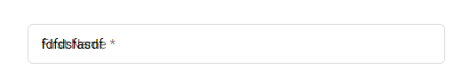
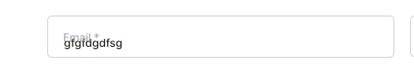
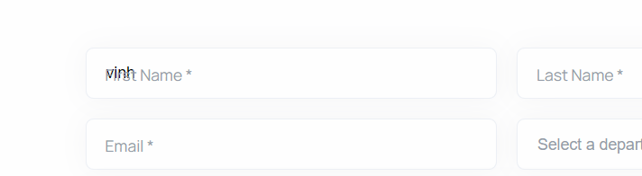
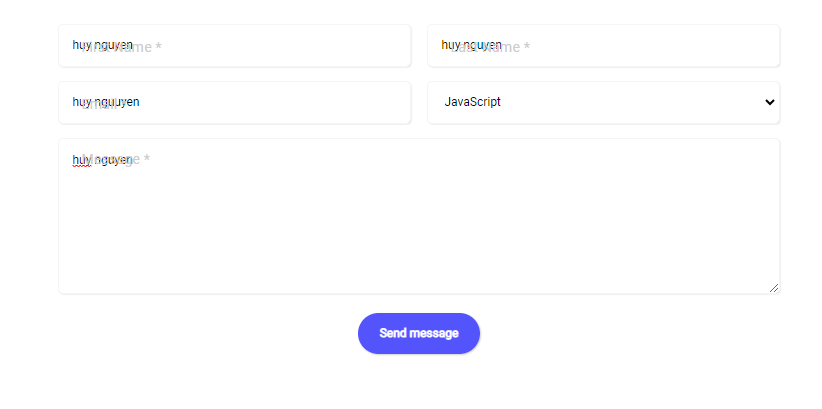

## [Thái Duy Tiến](https://github.com/thaiduytien1611cunbeo/NopbaitapF8/tree/main/Day09)

- [x] Bài 1:

  Bài làm tốt \*

  Chưa có đoạn kẻ xám giữa `content` và `year` như bản mẫu.

  Font chữ của class `year` đang sử dụng là font Times New Roman không đúng với thông tin đề bài đưa ra.

  Khi hover thì màu nền của button chưa đúng.

  Background của số trên ảnh chưa đúng. Có thể tham khảo phần câu hỏi trong bài này đã được hướng dẫn cách làm để hoàn thiện hơn.

---

- [x] Bài 2:

  Bài làm chưa tốt

  Cần TUÂN THỦ màu ở bản mẫu, không nên dùng màu khác vì bất kỳ lý do gì, nên tham khảo một số extension trên google chorme hỗ trợ việc lấy màu một cách chính xác nhất.

  Màu text, màu icon đang sai so với bản mẫu.

  Chưa xử lý phần `Learn more` tốt vì theo bản mẫu khi hover vào mới hiện lên chứ không phải hiện từ đầu.

  Phần background ảnh có màu trắng nên khi hover vào hiện background có màu trắng nên làm cho chữ hơi bị chìm, gây khó chịu cho người dùng mang đến trải nghiệm không tốt.

  Khi hover vào thì có đúng khối đầu tiên là ẩn icon, các khối còn lại chưa ẩn icon.

  Xử lý animation chưa thực sự tốt vì các đoạn text do set delay hơi nhiều nên cảm giác chưa mượt về animation cho lắm, nên xử lý lại cho tốt.

---

- [x] Bài 3:

  Bài làm chưa tốt.

  Màu border của các input và màu nền hơi khác so với bản mẫu. Ở bản mẫu màu nền hơi xám còn background input sẽ màu trắng.

  Phần input dùng để select không chọn được các option.

  Icon select hơi to so với bản mẫu.

  Chưa xử lý phần text trong thẻ `textarea`.

  Khi focus vào các input thì border của các input sẽ chuyển sang màu xanh nhưng hiện tại focus vào các input thì border màu đen.

  Hiện tại khi nhập dữ liệu vào ô input rồi focus ra ngoài thì phần text đang trở về vị trí ban đầu và sẽ đè lên dữ liệu vừa nhập. Điều này không đúng với yêu cầu đề bài là khi có dữ liệu thì kể cả có focus ra ngoài đoạn text đóng vai trò là `placeholder` vẫn sẽ ở trên.

---

- [x] Đánh giá: Bài làm còn nhiều điểm cần cải thiện hơn đặc biệt là việc tuân thủ theo bản mẫu cực kỳ cần thiết khi làm layout của một trang web. Cần chú ý để tiến bộ hơn.

---

## [Trung Kiên](https://github.com/KIENTT99/F8-Fullstack-k4/tree/main/ngay_9)

- [x] Bài 1:

  Bài làm chưa tốt.

  Phần `content` và `image` khi hover đang bị chèn lên nhau.

  Dùng sai Font chữ.

  Phần `button` xử lý tổng thể chưa tốt vì đang bị sát vào viền trên và sát vào bên trái nên layout không đẹp, không chỉnh chu và gây khó chịu cho người dùng.

  Phần số `+76` đang không xử lý giống bản mẫu, có thể tham khảo câu hỏi trong phần đặt câu hỏi đã được hướng dẫn cách làm phần này để hoàn thiện hơn.

  HTML sử dụng đang không đúng ngữ nghĩa rất nhiều chỗ như những phần nào chứa ảnh nên để trong thẻ `img` chứ không phải thẻ `div`.

---

- [x] Bài 2:

  Bài làm tốt \*

  Góp ý: nên để thời gian animation tối đa là 400ms để tăng trải nghiệm người dùng một cách tốt nhất.

  Phần text trong thẻ `p` đang bị tràn một xíu ra viền khi hover vào cần xử lý tốt hơn.

  Chữ `Learn More` hơi to so với bản mẫu.

---

- [x] Bài 3:

  Bài làm chưa tốt.

  Khi focus vào các input thì border của các input sẽ chuyển sang màu xanh nhưng hiện tại focus vào các input thì border màu đen.

  Khi chọn option trong thẻ select thì option đó đang đè lên text `Sales`,

  Hiện tại khi nhập dữ liệu vào ô input rồi focus ra ngoài thì phần text đang trở về vị trí ban đầu và sẽ đè lên dữ liệu vừa nhập. Điều này không đúng với yêu cầu đề bài là khi có dữ liệu thì kể cả có focus ra ngoài đoạn text đóng vai trò là `placeholder` vẫn sẽ ở trên.

  Chưa xử lý font chữ trong thẻ `textarea`.

---

- [x] Đánh giá: Bài làm còn nhiều điểm cần lưu ý và cải thiện đặc biệt là bài 1, cần chỉnh chu hơn trong việc làm bài tập.

---

## [Lê Đình Hùng](https://github.com/Le-Hung-020903/f8-fullstack-k4/tree/main/buoi_9)

- [x] Bài 1:

  Bài làm tốt. \*

  Hiệu ứng khi đổi chỗ vẫn hơi giật.

  Phần số `+76` chưa xử lý giống bản mẫu, có thể tham khảo câu hỏi trong phần đặt câu hỏi đã được hướng dẫn cách làm phần này để hoàn thiện hơn.

  Phần `content` đang bị sát viền dưới nên thêm padding để nhìn tổng thể layout sẽ đẹp hơn.

---

- [x] Bài 2:

  Bài làm rất tốt. \*

  Chưa thay đổi tiêu đề ở thẻ `title`.

  Góp ý: Nên để thời gian animation của icon nhanh hơn sẽ ổn hơn.

---

- [x] Bài 3:

  Bài làm tốt \*

  Chưa thay đổi tiêu đề ở thẻ `title`.

  Hiện tại khi nhập dữ liệu vào ô input rồi focus ra ngoài thì phần text đang trở về vị trí ban đầu và sẽ đè lên dữ liệu vừa nhập. Điều này không đúng với yêu cầu đề bài là khi có dữ liệu thì kể cả có focus ra ngoài đoạn text đóng vai trò là `placeholder` vẫn sẽ ở trên.

  Icon của thẻ `select` hơi sát viền phải, nên điều chỉnh lại sẽ ổn hơn.

---

- [x] Đánh giá: Bài làm khá tốt, chỉ cần lưu ý một số lỗi nhỏ để hoàn thiện hơn.

---

## [Đặng Khải](https://github.com/AlbertKhai/f8-fullstack-offline/tree/main/Day-9)

- [x] Bài 1:

  Bài làm rất tốt. \*

---

- [x] Bài 2:

  Bài làm rất tốt. \*

---

- [x] Bài 3:

  Bài làm rất tốt. \*

---

- [x] Đánh giá: Bài làm rất tốt, cố gắng tiếp tục trong các bài tập sau.

---

## [Nguyễn Ngọc Hùng](https://github.com/Oladayne/f8-fullstack-k98)

- [x] Bài 1:

  Bài làm tốt. \*

  Hiệu ứng khi đổi chỗ vẫn hơi giật.

  Phần số `+76` chưa xử lý giống bản mẫu, có thể tham khảo câu hỏi trong phần đặt câu hỏi đã được hướng dẫn cách làm phần này để hoàn thiện hơn.

  Có sáng tạo animation nhưng nhiều chỗ không cần thiết vì gây rối mắt người đọc, tạo cảm giác trải nghiệm không tốt.

  Khi hover vào phần `title` đổi sang màu vàng gây khó nhìn khi background màu trắng.

  Các khối `content` đang hơi sát nhau nên điều chỉnh lại cho đẹp.

  Chưa thay đổi tiêu đề ở thẻ `title`.

---

- [x] Bài 2:

  Bài làm rất tốt. \*

  Chưa thay đổi tiêu đề ở thẻ `title`.

---

- [x] Bài 3:

  Bài làm chưa tốt.

  Khi nhấn vào text đóng vai trò là `placeholder` của thẻ input thì không focus được thẻ input.

  Do đặt chiều rộng form là `width: 80%` nên chiều rộng các thẻ input khá to làm layout không đẹp.

  Chưa thay đổi tiêu đề ở thẻ `title`.

  Hiện tại khi nhập dữ liệu vào ô input rồi focus ra ngoài thì phần text đang trở về vị trí ban đầu và sẽ đè lên dữ liệu vừa nhập. Điều này không đúng với yêu cầu đề bài là khi có dữ liệu thì kể cả có focus ra ngoài đoạn text đóng vai trò là `placeholder` vẫn sẽ ở trên.

  Button sai về chiều rộng và màu so với bản mẫu.

  Khi focus vào các input thì border của các input sẽ chuyển sang màu xanh nhưng hiện tại focus vào các input thì border màu xám.

  Phần text đóng vai trò là `placeholder` đúng phải là `First Name *` chứ không phải là `* First Name`.

---

- [x] Đánh giá: Bài làm còn khá nhiều chỗ cần lưu ý, đặc biệt là bài 3 cần chỉnh chu hơn trong việc làm bài tập để hoàn thiện hơn.

---

## [Hà Long Việt](images/https://github.com/Vietha22/f8_fullstack_k4/tree/main/Day_8)

- [x] Bài 1:

  Bài làm rất tốt. \*

  Hiệu ứng khi đổi chỗ vẫn hơi giật.

---

- [x] Bài 2:

  Bài làm rất tốt. \*

---

- [x] Bài 3:

  Bài làm chưa tốt.

  Chưa xây dựng được animation như bản mẫu, layout thẻ `textarea` bị lệch so với các thẻ `input` khác.

  Chưa xử lý tốt thẻ `textarea`, vẫn đang để mặc định.

---

- [x] Đánh giá: Bài làm khá tốt ngoại trừ bài 3, cần đầu tư và chỉnh chu hơn khi làm bài tập về nhà.

---

# tuấn anh đánh giá bài học viên

## [Hoang Van Thanh](https://github.com/YanShu92/F8-Fullstack-K4/tree/main/Day_8)

- [x] [Bài 1]: Bài làm rất tốt \*

  Không có hiệu ứng chuyển màu nền của nút **button** chuyển màu đột ngột.

- [x] [Bài 2]: Bài làm rất tốt \*

---

- [x] [Bài 3]: Bài làm rất tốt \*

---

- [x] Đánh giá chung bài tập về nhà: Bài làm hầu hết đều rất tốt, chỉ cần điều chỉnh một số lỗi nhỏ để hoàn thiện hơn.

---

## [Huy Bui](https://github.com/Huy-Bui4869/f8_fullstack_k4/tree/main/Day_9)

- [x] [Bài 1]: Bài làm rất tốt \*

---

- [x] [Bài 2]: Bài làm tốt \*

  Không Có Hiệu ứng **đường viền** trong của thẻ `<div class="container">`.

  Tham Khảo Bài của : [Hoang Van Thanh](https://github.com/YanShu92/F8-Fullstack-K4/tree/main/Day_8)

---

- [x] [Bài 3]: Bài làm tốt \*

  Khi nhập dữ liệu vào thẻ `<input>` sau đó làm mất **focus** xuất hiện lỗi.

  .

  Đề Xuất thêm Thuộc tính **required**.

  ```css
  input:valid ~ label {
    top: 2px;
    transform: translateY(0);
    font-size: 13px;
  }
  ```

  ```html
  <input type="text" id="last-name" required />
  ```

---

- [x] Đánh giá chung bài tập về nhà: Bài làm hầu hết đều rất tốt, chỉ cần điều chỉnh một số lỗi nhỏ để hoàn thiện hơn.

## [Nguyễn Hưng Tuân](https://github.com/hungtuan/f8-fullstack-k4/tree/main/Day-9)

- [x] [Bài 1]: Bài làm rất tốt \*

  Thẻ `<p>` tăng `line-height: 1.4rem`.

---

- [x] [Bài 2]: Bài làm tốt

  Không có đường Viền Trong và Hiệu ứng của nó.

  Tham Khảo Bài của : [Hoang Van Thanh](https://github.com/YanShu92/F8-Fullstack-K4/tree/main/Day_8)

---

- [x] [Bài 3]: Bài làm tốt

  Khi nhập dữ liệu vào thẻ `<input>` sau đó làm mất **focus** xuất hiện lỗi.

  .

  Đang chưa chọn được **selector** `input:valid`.

---

- [x] Đánh giá chung bài tập về nhà: Bài làm hầu hết đều tốt, chỉ cần điều chỉnh một số lỗi nhỏ để hoàn thiện hơn

## [Vinh Nguyễn](https://github.com/vinhh03/vinh_f8_fullstack_k4/tree/main/bai_tap/day09)

- [x] [Bài 1]: Bài làm rất tốt \*

  Không có hiệu ứng chuyển màu nền của nút **button** chuyển màu đột ngột.

---

- [x] [Bài 2]: Bài làm tốt \*

  Hiệu ứng đường Viền Trong Hơi giật.

---

- [x] [Bài 3]:

  Khi nhập dữ liệu vào thẻ `<input>` sau đó làm mất **focus** xuất hiện lỗi.

  Lỗi.

  

  Đề Xuất.

  ```css
  .form-field:valid ~ .form-label {
    font-size: 12px;
    line-height: 16px;
    transform: translateY(-12px);
    transition: 0.2s ease;
  }
  ```

---

- [x] Đánh giá chung bài tập về nhà: Bài làm tốt, chỉ cần điều chỉnh một số lỗi nhỏ để hoàn thiện hơn

## [Mạnh Huy](https://github.com/HuyNguyen3107/F8_Fullstack_Offline_K4/tree/main/Day_09)

- [x] [Bài 1]: Bài làm rất tốt \*

---

- [x] [Bài 2]: Bài làm rất tốt \*

---

- [x] [Bài 3]:

  Khi nhập dữ liệu vào thẻ `<input>` sau đó làm mất **focus** xuất hiện lỗi.

  Lỗi.

  

  Đề Xuất.

  ```css
  input:valid ~ label {
    top: 0;
    left: 5px;
    transform: scale(0.8);
  }
  ```

---

- [x] Đánh giá chung bài tập về nhà: Bài làm tốt, chỉ cần điều chỉnh một số lỗi nhỏ để hoàn thiện hơn

## [Nguyễn Chi Nam](https://github.com/chinam197/baitapday9.git)

- [x] [Bài 1]: Bài làm tốt

  Không có màu nền và hiệu ứng khi **:hover** vào thẻ `<button>`.

---

- [x] [Bài 2]: Bài làm rất tốt \*

  Hiệu ứng đường viền trong hơi giật.

---

- [x] [Bài 3]: Bài làm rất tốt \*

---

- [x] Đánh giá chung bài tập về nhà: Bài làm hầu hết rất tốt, chỉ cần điều chỉnh một số lỗi nhỏ để hoàn thiện hơn
