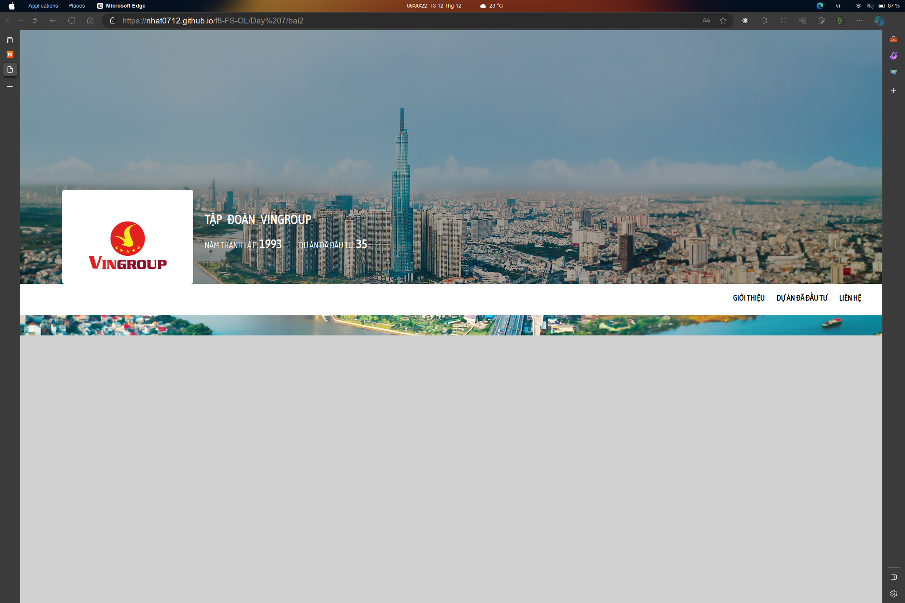
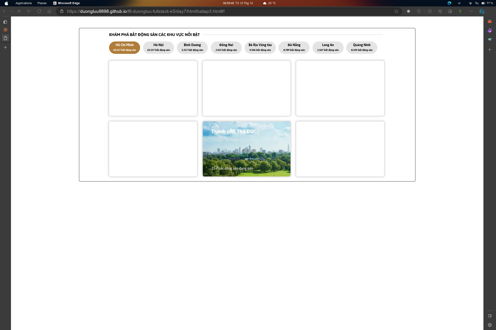

# Dương review bài tập về nhà buổi 7 - Lớp K5

## Chưa làm bài tập về nhà

- Viên Đình Cường
- Lê Tùng Dương

## Nộp muộn

- Đinh Việt Hùng
- Trần Thế Vĩ
- Đào Quang Hùng
- Nguyễn Ngọc Minh

## [Nguyen Tien Dat](view-source:https://tiendat211294.github.io/f8_offline_k5/buoi-7/bai-1.html)

- [x] Bài 1

  Bài làm tốt\*

  Sai chính tả: `mô3.28ha`

  Không nên để style của dự án ở trên gây khó khăn cho việc ghi đè các CSS của thư viện import. Nên để xuống cuối:

  ```html
  <link
    href="https://fonts.googleapis.com/css2?family=Asap&display=swap"
    rel="stylesheet"
  />
  <link rel="stylesheet" href="CSS/bai-1.css" />
  <link
    rel="stylesheet"
    href="https://cdnjs.cloudflare.com/ajax/libs/font-awesome/6.5.1/css/all.min.css"
  />
  ```

  - Đề xuất sửa thành:

    ```html
    <link
      href="https://fonts.googleapis.com/css2?family=Asap&display=swap"
      rel="stylesheet"
    />
    <link
      rel="stylesheet"
      href="https://cdnjs.cloudflare.com/ajax/libs/font-awesome/6.5.1/css/all.min.css"
    />
    <link rel="stylesheet" href="CSS/bai-1.css" />
    ```

  Phần icon và địa điểm không liên quan đến đoạn mô tả, không nên bọc chung vào thẻ `<p>` mà nên tách ra.

  Trong CSS có đoạn import font chữ từ trong folder dự án, nhưng trong HTML vẫn để thẻ link google font của một font khác gây sự không đồng nhất, khó kiểm soát, nên sử dụng 1 loại.

  ```html
  <link
    href="https://fonts.googleapis.com/css2?family=Asap&display=swap"
    rel="stylesheet"
  />
  ```

  Thay vì sử dụng margin thì nên sử dụng position để có thể dễ dàng style và tính toán hơn

- [x] Bài 2

  Bài làm tốt

  Đối với các layout có chữ hiển thị trên ảnh, nên có một bóng mờ, overlay để phủ lên, như vậy sẽ giúp chữ dễ đọc hơn, an toàn hơn khi bị thay ảnh khác.

  Màu chữ và phần highlight của text chưa đúng với bản mẫu

  Phần 3 item ở dưới được thể hiện là một thành phần chuyển trang, nên sử dụng thẻ nav thay vì div. Các item là thẻ a thay vì span.

  Với phần highlight gạch chân khi hiển thị bị đẩy chữ lên, thay vì sử dụng relative có thể sử dụng absolute để tránh bị.

- [x] Bài 3

  Cấu trúc HTML không tốt

  Các item button được thể hiện là một phần điều hướng, nên sử dụng thẻ nav bọc vào.

  Với 1 thành phần lớn như section này, có thể sử dụng H2 thay vì H3

  Không nên chia 2 row và các item, có thể dùng flex, flex-wrap để xử lý thì tốt hơn, nếu với màn hình nhỏ sẽ rất khó để style.

  Hình ảnh và phần màu background không nên quá tương phản với nhau, màu background ở đây với chữ trắng có thể để `#333` hoặc `#555` là được

  Đối với các layout có chữ hiển thị trên ảnh, nên có một bóng mờ, overlay để phủ lên, như vậy sẽ giúp chữ dễ đọc hơn, an toàn hơn khi bị thay ảnh khác.

- [x] Đánh giá chung bài tập về nhà: Các bài làm tốt, tuy nhiên cần chú ý sử dụng thẻ, cấu trúc HTML tốt để dễ dàng scale dự án, tái sử dụng HTML

## [Ngô Hoàng Kim](https://kzau1612.github.io/FSK5/day_7/BT1.html)

- [x] Bài 1

  Bài làm tốt\*

  Không nên để style của dự án ở trên gây khó khăn cho việc ghi đè các CSS của thư viện import. Nên để xuống cuối:

  - Đề xuất sửa thành:

    ```html
    <!-- font awesome -->
    <link
      rel="stylesheet"
      href="https://cdnjs.cloudflare.com/ajax/libs/font-awesome/6.5.1/css/all.min.css"
    />
    <!-- google font -->
    <link rel="preconnect" href="https://fonts.googleapis.com" />
    <link rel="preconnect" href="https://fonts.gstatic.com" crossorigin />
    <link
      href="https://fonts.googleapis.com/css2?family=Asap:ital,wght@0,300;0,400;0,600;0,700;1,300&display=swap"
      rel="stylesheet"
    />

    <link rel="stylesheet" href="./css/BT1.css" />
    ```

  Trong CSS có đoạn import font chữ từ trong folder dự án, nhưng trong HTML vẫn để thẻ link google font của một font khác gây sự không đồng nhất, khó kiểm soát, nên sử dụng 1 loại.

  ```html
  <link
    href="https://fonts.googleapis.com/css2?family=Asap&display=swap"
    rel="stylesheet"
  />
  ```

  Thay vì sử dụng margin thì nên sử dụng position để có thể dễ dàng style và tính toán hơn

  Trong bài sử dụng icon đã download về nhưng lại sử dụng thêm link cdn ở ngoài cho fontawesome, mặc dù không dùng đến, gây nặng dự án và không cần thiết.

- [x] Bài 2

  Bài làm rất tốt

  Không nên để style của dự án ở trên gây khó khăn cho việc ghi đè các CSS của thư viện import. Nên để xuống cuối:

  - Đề xuất sửa thành:

    ```html
    <!-- font awesome -->
    <link
      rel="stylesheet"
      href="https://cdnjs.cloudflare.com/ajax/libs/font-awesome/6.5.1/css/all.min.css"
    />
    <!-- google font -->
    <link rel="preconnect" href="https://fonts.googleapis.com" />
    <link rel="preconnect" href="https://fonts.gstatic.com" crossorigin />
    <link
      href="https://fonts.googleapis.com/css2?family=Asap:ital,wght@0,300;0,400;0,600;0,700;1,300&display=swap"
      rel="stylesheet"
    />

    <link rel="stylesheet" href="./css/BT2.css" />
    ```

  Vì thanh nav chỉ có 1 cấp, cũng không cần thiết phải thêm ul, li vào gây khó hơn trong việc style mặc dù cũng không sai.

  Thay vì fix cứng width cho container rất to, nên khống chế trong khoảng 1200 là đủ, vì không phải máy nào cũng có đủ độ rộng, sẽ gây hiển thị thanh cuộn

- [x] Bài 3

  Bài làm rất tốt

  Không nên để style của dự án ở trên gây khó khăn cho việc ghi đè các CSS của thư viện import. Nên để xuống cuối:

  - Đề xuất sửa thành:

    ```html
    <!-- font awesome -->
    <link
      rel="stylesheet"
      href="https://cdnjs.cloudflare.com/ajax/libs/font-awesome/6.5.1/css/all.min.css"
    />
    <!-- google font -->
    <link rel="preconnect" href="https://fonts.googleapis.com" />
    <link rel="preconnect" href="https://fonts.gstatic.com" crossorigin />
    <link
      href="https://fonts.googleapis.com/css2?family=Asap:ital,wght@0,300;0,400;0,600;0,700;1,300&display=swap"
      rel="stylesheet"
    />

    <link rel="stylesheet" href="./css/BT3.css" />
    ```

  Thay vì fix cứng width cho container rất to, nên khống chế trong khoảng 1200 là đủ, vì không phải máy nào cũng có đủ độ rộng, sẽ gây hiển thị thanh cuộn

- [x] Đánh giá chung bài tập về nhà: Các bài làm tốt, tuy nhiên cần chú ý sử dụng thẻ, cấu trúc HTML tốt để dễ dàng scale dự án, tái sử dụng HTML

## [Tran Quoc Viet](view-source:https://tranquocviet111122.github.io/f8-fullstack-fsk5/Day-7/html/Bai1/bai1.html)

- [x] Bài 1

  Bài làm không tốt

  Sai semantics ở hầu hết các thẻ p

  **Sai font chữ của SFU**

  Không nên để style của dự án ở trên gây khó khăn cho việc ghi đè các CSS của thư viện import. Nên để xuống cuối:

  - Đề xuất sửa thành:

    ```html
    <link
      rel="stylesheet"
      href="https://cdnjs.cloudflare.com/ajax/libs/font-awesome/6.4.2/css/all.min.css"
    />
    <link rel="preconnect" href="https://fonts.googleapis.com" />
    <link rel="preconnect" href="https://fonts.gstatic.com" crossorigin />
    <link
      href="https://fonts.googleapis.com/css2?family=Open+Sans:wght@300&display=swap"
      rel="stylesheet"
    />

    <link rel="stylesheet" href="bai1.css" />
    ```

- [x] Bài 2

  Bài làm tốt

  Sai semantics ở hầu hết các thẻ p

  VÌ đây là 1 nav, nên hover mới highlight thay vì cứ để highlight ở nav đầu tiên

  Đối với các layout có chữ hiển thị trên ảnh, nên có một bóng mờ, overlay để phủ lên, như vậy sẽ giúp chữ dễ đọc hơn, an toàn hơn khi bị thay ảnh khác.

  Phần 3 item ở dưới được thể hiện là một thành phần chuyển trang, nên sử dụng thẻ nav thay vì div. Các item là thẻ a thay vì p.

- [x] Bài 3

  Bài làm không tốt

  Sai semantics ở hầu hết các thẻ p

  Sai màu và giao diện đề bài

  Không nên để style của dự án ở trên gây khó khăn cho việc ghi đè các CSS của thư viện import. Nên để xuống cuối:

  - Đề xuất sửa thành:

    ```html
    <!-- font awesome -->
    <link
      rel="stylesheet"
      href="https://cdnjs.cloudflare.com/ajax/libs/font-awesome/6.5.1/css/all.min.css"
    />
    <!-- google font -->
    <link rel="preconnect" href="https://fonts.googleapis.com" />
    <link rel="preconnect" href="https://fonts.gstatic.com" crossorigin />
    <link
      href="https://fonts.googleapis.com/css2?family=Asap:ital,wght@0,300;0,400;0,600;0,700;1,300&display=swap"
      rel="stylesheet"
    />

    <link rel="stylesheet" href="./css/BT3.css" />
    ```

- [x] Đánh giá chung bài tập về nhà: Các bài làm đều không tốt, hầu hết sai semantics, chỉ tập chung vào CSS mà không viết chuẩn HTML, không format code, nên chú ý lại vào các bài tập lần sau.

## [Nguyễn Đức Nhật](https://nhat0712.github.io/f8-FS-OL/Day%207/bai1html)

Không nên đặt tên folder viết có chứa các ký tự đặc biệt làm cho nó khó sử dụng, gây xấu url

- [x] Bài 1

  Bài làm tốt

  Sai giao diện, `.box` không ở giữa background

  Font chữ hơi bé

  Không cần thiết phải dùng tới bộ kit của fontawsome cho 1 bài nhỏ, gây nặng hơn và không tốt, chỉ cần link CSS là đủ.

  Nên absolute box theo thẻ cha thay vì relative theo body, như vậy sẽ khó tính toán và đang làm sai giao diện

- [x] Bài 2

  Bài làm không tốt

  

  Sai giao diện vì tất cả các thành phần đều dùng position khiến cho mỗi màn hình khác thì đều không đúng bản mẫu.

  Phần 3 item ở dưới được thể hiện là một thành phần chuyển trang, nên sử dụng thẻ nav thay vì div.

- [x] Bài 3

  Bài làm không tốt

  Các font chữ quá bé

  Thiếu phần border-radius như bản mẫu.

  Các item button được thể hiện là một phần điều hướng, nên sử dụng thẻ nav bọc vào.

  Cấu trúc HTML, semantics không tốt, các tiêu đề của một section thường là h2, không phải h4, các tiêu đề bổ nghĩa cho h4 không thể là h3. Tóm lại các tiêu đề đều đang đặt sai trong trường hợp này

- [x] Đánh giá chung bài tập về nhà: Các bài làm tốt, tuy nhiên cần chú ý sử dụng thẻ ở bài 3, cách sử dụng, tối ưu css tốt hơn để các màn hình đều hiển thị tốt(Các màn hình máy tính, không nói tới điện thoại)

## [Trinh Nam Truong](view-source:https://truongtn04.github.io/f8-fullstack-k5/day07/ex03.html)

- [x] Bài 1

  Cần chú ý hơn vào title của bài, không phải lúc nào cũng là Document.

  Bài làm chưa tốt

  Các font chữ quá đậm

  Rất nhiều font chữ được import tuy nhiên trong bài tập không sử dụng tới, gây nặng và không tốt cho bài tập.

  Không nên để style của dự án ở trên gây khó khăn cho việc ghi đè các CSS của thư viện import. Nên để xuống cuối:

  ```html
  <link rel="stylesheet" href="CSS/bai-1.css" />
  <link
    rel="stylesheet"
    href="https://cdnjs.cloudflare.com/ajax/libs/font-awesome/6.5.1/css/all.min.css"
  />
  ```

  - Đề xuất sửa thành:

    ```html
    <link
      rel="stylesheet"
      href="https://cdnjs.cloudflare.com/ajax/libs/font-awesome/6.5.1/css/all.min.css"
    />
    <link rel="stylesheet" href="CSS/bai-1.css" />
    ```

- [x] Bài 2

  Cần chú ý hơn vào title của bài, không phải lúc nào cũng là Document.

  Bài làm không tốt

  **Các font chữ thật sự rất đậm**

  Đối với các layout có chữ hiển thị trên ảnh, nên có một bóng mờ, overlay để phủ lên, như vậy sẽ giúp chữ dễ đọc hơn, an toàn hơn khi bị thay ảnh khác.

  Phần 3 item ở dưới được thể hiện là một thành phần chuyển trang, nên sử dụng thẻ nav thay vì div.

  Thuộc tính href của thẻ a nên có giá trị, nếu không đưa gì thì có thể để # hoặc `#!`

- [x] Bài 3

  Cần chú ý hơn vào title của bài, không phải lúc nào cũng là Document.

  Các item button được thể hiện là một phần điều hướng, nên sử dụng thẻ nav bọc vào.

  Với 1 thành phần như section này chưa đủ nói lên ý nghĩa toàn bộ trang web, có thể sử dụng H2 thay vì H1

  Đối với các layout có chữ hiển thị trên ảnh, nên có một bóng mờ, overlay để phủ lên, như vậy sẽ giúp chữ dễ đọc hơn, an toàn hơn khi bị thay ảnh khác.

- [x] Đánh giá chung bài tập về nhà: Các bài làm tốt, tuy nhiên cần chú ý chỉn chu hơn một chút, có test lại sau khi hoàn thiện và sau khi deploy thì bài làm hoàn chỉnh hơn

## [Lưu Ngọc Dương](view-source:https://duongluu9898.github.io/f8-duongluu-fullstack-k5/day7/html/baitap1.html)

- [x] Bài 1

  Bài làm rất tốt\*

  Trong CSS có đoạn import font chữ từ trong folder dự án, nhưng trong HTML vẫn để thẻ link google font của một font khác gây sự không đồng nhất, khó kiểm soát, nên sử dụng 1 loại.

  ```html
  <link
    href="https://fonts.googleapis.com/css2?family=Asap&display=swap"
    rel="stylesheet"
  />
  ```

- [x] Bài 2

  Bài làm tốt

  Phần quan trọng nhất: Tên nhà thầu nên được đưa vào heading, cụ thể trong bài có thể là H1

  Định dạng ảnh avif không được sử dụng rộng rãi, không support nhiều trình duyệt khiến cho nó không tốt.

  Thay vì sử dụng thẻ img, ở đây nên sử dụng background thì hợp lý hơn

  Đối với các layout có chữ hiển thị trên ảnh, nên có một bóng mờ, overlay để phủ lên, như vậy sẽ giúp chữ dễ đọc hơn, an toàn hơn khi bị thay ảnh khác.

  

  Phần 3 item ở dưới được thể hiện là một thành phần chuyển trang, nên sử dụng thẻ nav thay vì div.

  Không nên absolute theo body vì nó rất khó để tính toán, cần cho thẻ cha relative để dễ căn chỉnh hơn, chính xác hơn theo nhiều màn hình

- [x] Bài 3

  Bài làm chưa tốt

  Phần box ở dưới được thể hiện như các articles, không phải là list, không nên sử dụng ul và cũng không nên bọc ở trong li của nav. Như vậy là sai semantics

  Tương tự như trên, nên chọn định dạng ảnh khác:

  

  Các item được thể hiện là một phần điều hướng, nên sử dụng thẻ nav bọc vào.

  Đối với các layout có chữ hiển thị trên ảnh, nên có một bóng mờ, overlay để phủ lên, như vậy sẽ giúp chữ dễ đọc hơn, an toàn hơn khi bị thay ảnh khác.

- [x] Đánh giá chung bài tập về nhà: Các bài làm tốt, tuy nhiên cần chú ý sử dụng thẻ, cấu trúc HTML tốt hơn.

## [Nguyễn Tuấn Hùng](view-source:https://duongluu9898.github.io/f8-duongluu-fullstack-k5/day7/html/baitap1.html)

Không nên đặt các tên folder có chứa ký tự đặc biệt, viết hoa viết thường lộn xộn gây khó hiểu và gây xấu url

- [x] Bài 1

  Bài làm tốt

  Font chữ quá nhỏ, thông thường với máy tính khoảng 13-14px là tối thiểu, còn với điện thoại là khoảng 11-12.

  Hơi lạm dụng flex với `.price` chỉ cần padding trên dưới rồi text-align center là đủ.

- [x] Bài 2

  Bài làm tốt

  Trong style có đoạn cần sửa lại:

  ```css
  width: 100%px;
  ```

  Đối với các layout có chữ hiển thị trên ảnh, nên có một bóng mờ, overlay để phủ lên, như vậy sẽ giúp chữ dễ đọc hơn, an toàn hơn khi bị thay ảnh khác.

- [x] Bài 3

  Bài làm tốt

  Các item được thể hiện là một phần điều hướng, nên sử dụng thẻ nav bọc vào.

  Không nên đặt thẻ div bọc button có class là btn, làm như vậy sẽ dễ bị nhầm với các class button khác vì thường button sẽ đặt class là btn

  Đối với các layout có chữ hiển thị trên ảnh, nên có một bóng mờ, overlay để phủ lên, như vậy sẽ giúp chữ dễ đọc hơn, an toàn hơn khi bị thay ảnh khác.

- [x] Đánh giá chung bài tập về nhà: Các bài làm tốt, tuy nhiên cần chú ý sử dụng thẻ, cấu trúc HTML tốt hơn.

## [Nguyễn Văn Thắng](view-source:https://nvthang391.github.io/F8-FSK5/Day_7/bai1.html)

- [x] Bài 1

  Bài làm tốt\*

  Cần chú ý hơn vào thẻ title của trang web, không phải lúc nào cũng là Document

  Phần `.info-location` là một địa chỉ, sẽ tốt hơn nếu sử dụng thẻ a và link google map

  Thay vì sử dụng thẻ img, ở đây nên sử dụng background thì hợp lý hơn

- [x] Bài 2

  Bài làm tốt

  Phần quan trọng nhất: Tên nhà thầu nên được đưa vào heading, cụ thể trong bài có thể là H1

  Thay vì sử dụng thẻ img, ở đây nên sử dụng background thì hợp lý hơn

  Phần 3 item ở dưới được thể hiện là một thành phần chuyển trang, nên sử dụng thẻ nav thay vì ul.

- [x] Bài 3

  Bài làm tốt

  Các item được thể hiện là một phần điều hướng, nên sử dụng thẻ nav bọc vào.

  Đã sử dụng before để làm filter rồi, nên xóa div filter đi.

- [x] Đánh giá chung bài tập về nhà: Các bài làm tốt, chỉ cần chú ý thêm chút semantics và viết html có quy tắc hơn.

## [Lê Đức Anh](view-source:https://ducanhprogram.github.io/f8-fullstack-k5/Day-7/Bai1.html)

- [x] Bài 1

  Bài làm tốt\*

  Phần thông tin không phải 2 đoạn văn mà là 2, nên sử dụng 1 thẻ p với thẻ br

  Phần `.price` mới là phần cần position, nếu chỉ position phần span ở trong thì tức là phần `.price` không cần thiết. Có thể relative bằng `.box`

  Không nên căng background-size 100vw 100vh khiến ảnh bị méo.

- [x] Bài 2

  Bài làm tốt

  Avatar của `div.image` thiếu border-radius như trong bản mẫu.

  Phần quan trọng nhất: Tên nhà thầu nên được đưa vào heading, cụ thể trong bài có thể là H1

  Phần 3 item ở dưới được thể hiện là một thành phần chuyển trang, nên sử dụng thẻ nav thay vì ul. Và cũng không nên để class là product, nó không mang ý nghĩa như vậy.

  Đối với các layout có chữ hiển thị trên ảnh, nên có một bóng mờ, overlay để phủ lên, như vậy sẽ giúp chữ dễ đọc hơn, an toàn hơn khi bị thay ảnh khác.

- [x] Bài 3

  Bài làm tốt

  Thiếu border-radius như trong bản mẫu

  Khi hover hiển thị hơi lệch, xấu.

  Đối với các layout có chữ hiển thị trên ảnh, nên có một bóng mờ, overlay để phủ lên, như vậy sẽ giúp chữ dễ đọc hơn, an toàn hơn khi bị thay ảnh khác.

- [x] Đánh giá chung bài tập về nhà: Các bài làm ở mức làm được, tuy có làm đủ các case nhưng nếu chỉn chu theo bản mẫu hơn nữa thì bài làm hoàn thiện.

## [Bùi Minh Chí](view-source:https://ronbanh549.github.io/f8-fullstack-k5/Day-7/bai1.html)

- [x] Bài 1

  Bài làm tốt\*

  Phần tên của dự án là một phần quan trọng, có thể sẽ là h1 hoặc h2 chứ không phải div.

  Phần thông tin không phải 2 đoạn văn mà là 2, nên sử dụng 1 thẻ p với thẻ br

  Phần `.modal__address--position` không phải là một đoạn văn, nếu đúng nên sử dụng thẻ a với đường dẫn, có thể là google map.

- [x] Bài 2

  Bài làm tốt

  Phần `.profile__content-info` không phải một tập hợp nhiều đoạn văn, nó mang hướng giới thiệu nhiều hơn, có thể dùng span với ul li là đủ.

  Phần avatar nên có alt là tên của thì tốt hơn.

  Phần quan trọng nhất: Tên nhà thầu nên được đưa vào heading, cụ thể trong bài có thể là H1

  Phần 3 item ở dưới được thể hiện là một thành phần chuyển trang, nên sử dụng thẻ nav thay vì div với class là `.profile__nav`

  Đối với các layout có chữ hiển thị trên ảnh, nên có một bóng mờ, overlay để phủ lên, như vậy sẽ giúp chữ dễ đọc hơn, an toàn hơn khi bị thay ảnh khác.

- [x] Bài 3

  Bài làm tốt

  Phần style nên đưa xuống dưới để đảm bảo ghi đè và có thể dễ dàng custom style của thư viện hơn.

  Các item button được thể hiện là một phần điều hướng, nên sử dụng thẻ nav bọc vào.

- [x] Đánh giá chung bài tập về nhà: Các bài làm ở mức làm được, tuy có làm đủ các case nhưng nếu chỉn chu theo bản mẫu hơn nữa thì bài làm hoàn thiện.
