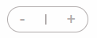

# Huy review bài tập về nhà buổi 8 - Lớp Fullstack K6

## [Phan Van Hai](https://phanvanahai1995.github.io/exercise8/)

- [x] Bài 1:

**Bài làm rất tốt**

- Sai semantics: Trong bài, cách tiêu đề của menu đang là h2, nó đang không bổ nghĩa cho gì của tiêu đề chính, header chỉ nhằm mục đích tiện lợi hơn cho user trong việc sử dụng, mang tính thương hiệu. Không có ý nghĩa nhiều trong semantics, cố gắng không sử dụng tới heading trong header.

- [x] Bài 2:

**Bài làm chưa tốt**

- Shopping Cart Mini trong bản mẫu hiển thị ở bên phải trong khi bài làm đang hiển thị bên trái.

- Ở phần dưới đây giữa dấu cộng và dấu trừ là số và nó thể hiện số lượng sản phẩm đó có trong giỏ hàng chứ không phải vạch ngăn cách dấu cộng và dấu trừ:

  - Bài làm:

  

  ```html
  <div class="btn-action">
  	<button class="btn-calculation">-</button>
  	<span class="btn-calculation__separate"></span>
  	<button class="btn-calculation">+</button>
  </div>
  ```

- `font-weight` của một số thẻ đang nhỏ hơn so với bản mẫu

- Nội dung của thẻ `button` có `class` **btn-cart\_\_add** đang là **Add Cart** trong khi ở bản mẫu là **Add To Cart**

- Màu của thẻ có `class` **title-heading** đang không giống với bản mẫu.

- Icon ở phần **cart-bottom** đang không giống so với bản mẫu có thể tìm hiểu [Font Awesome](https://fontawesome.com/) để tìm và sử dụng icon giống với bản mẫu nhất có thể.

- Số lượng sản phẩm trong giỏ hàng ở bản mẫu đang là 4 sản phẩm trong khi bài làm chỉ có 2 sản phẩm.

- Thẻ `img` nằm trong thẻ `div` có `class` là **product** nên được bọc trong thẻ `a` để khi người dùng click vào có thể chuyển đến trang xem chi tiết sản phẩm đó.

- [x] Bài 3:

**Bài làm rất tốt**

- `font-size` của các thẻ có `class` là **desc**, **service\_\_item--heading**, **service\_\_item--desc**, và **service\_\_item--link** đều đang to hơn so với bản mẫu một chút.

- [x] Đánh giá chung: Bài làm khá tốt, cần chỉnh chu hơn, chú ý đến senmatic và quan sát kỹ bản mẫu để tránh làm nhầm hoặc bỏ sót các chi tiết.

## [Le Duc Anh](https://ducanhprogram.github.io/f8-fullstack-k6/Day-8)

- [x] Bài 1:

**Bài làm chưa tốt**

- Giao diện sai hoàn toàn so với bản mẫu.

- Đây là phẩn **header** của một trang web vì thế nên bọc toàn bộ phần này trong thẻ `header`.

- Thẻ nav để thể hiện các thanh điều hướng, logo không phải một thanh điều hướng mà do khi sử dụng, người dùng có xu hướng bấm vào logo để về trang chủ, nhưng nó không phải là một nav, chỉ bọc nav ở list navigation bên trái.

- Sai semantics: Trong bài, logo đang là h2, vậy nó đang bổ nghĩa cho gì của tiêu đề chính, header chỉ nhằm mục đích tiện lợi hơn cho user trong việc sử dụng, mang tính thương hiệu. Không có ý nghĩa nhiều trong semantics, cố gắng không sử dụng tới heading trong header.

- Thiếu borer-radius menu con giống bản mẫu.

- Mega menu thiếu phần **STYLEGUIDE**

- Bài làm đang chia Mega menu thành các cột tuy nhiên tên `class` của thẻ đại diện cho từng cột lại là **row** điều này dễ gây nhầm lầm cho người đọc code.

- [x] Bài 2:

**Bài làm chưa tốt**

- Số 4 trong heading bị lệch.

- `background-color` của heading không giống với bản mẫu

- Tiêu đề của cart có thể là h2 trong trường hợp là trang shop, tuy nhiên h3 thì chưa bổ nghĩa cho h2 nào trong bài.

- Phần alt của một hình ảnh sản phẩm nên sử dụng tên của sản phẩm làm alt để dễ dàng đọc hiểu hơn, ví dụ như lúc ảnh lỗi,…

- Trong bài có 2 button, nên phân tích xem đâu là button cần người dùng bấm vào hơn, đưa nó thành màu primary từ đầu(màu xanh).

- Trong phần CSS có một số màu giống nhau hoặc gần tương tự, nên đặt biến để có thể dễ dàng tái sử dụng và sửa chữa.

- Với các item có nhiều thuộc tính giống nhau ví dụ như:

```css
.class {
	display: flex;
	justify-content: space-between;
	/*thuoc tinh 1: abc*/
	/*thuoc tinh 2: def*/
}
```

- Nên tách nó thành 1 class chung như: `.flex-between` như sau:

```css
.flex-between {
	display: flex;
	justify-content: space-between;
}
.class {
	/*thuoc tinh 1: abc*/
	/*thuoc tinh 2: def*/
}
```

- Thẻ `label` nằm trong trong thẻ `div` có `class` **header-cart** đang là hình elip trong khi ở bản mẫu là hình tròn

- Số lượng sản phẩm trong giỏ hàng ở bản mẫu đang là 4 sản phẩm trong khi bài làm chỉ có 3 sản phẩm.

- `font-weight` của một số thẻ đang nhỏ hơn so với bản mẫu

- Một số phần mà người dùng có thể click vào được nên thêm thuộc tính `cursor: pointer`.

- Nên thêm thuộc tính `align-items: center` vào thẻ có `class` là **status-info** để căn giữa theo chiều dọc phần giá và tăng giảm số lượng sản phẩm.

- [x] Bài 3:

**Bài làm tốt**

- Sai font chữ của các heading, các heading sử dụng một font chữ có chân.

- Đây chỉ là một `section` của trang web vì vậy không nên sử dụng thẻ `h1` chứ title của `section` vì nó không phải là tiêu đề chính của một trang mà thay vào đó nên sử dụng thẻ `h2`, tương tự nên thay `h2` chứa tên của tên của các dịch vụ thành thẻ `h3`.

- Thẻ `p` tăng line-height: 1.4rem.

- Không lên đặt `height` cho `.service-item` vì khi tăng nội dung thẻ `p` nên sẽ bị vỡ giao diện.

- Thẻ `div` có `class` **item-service** thứ 5 đang có nội dung bên trong bị lệch so với các thẻ khác là do chiều cao của thẻ `img` nằm trong nó đang thấp hơn thẻ `img` trong nằm trong các thẻ còn lại có `class` **item-service**.

- [x] Đánh giá chung: Bài làm chưa tốt, cần chỉnh chu hơn trong việc làm bài tập về nhà, chú ý đến senmatic, cách đặt tên các `class` và làm giống nhất có thể giao diện mà đề bài yêu cầu.

## [Mai Viet Hoang](https://viethoang-mai.github.io/Ex-Fullstack-K6/Day_08)

- [x] Bài 1:

**Bài làm rất tốt**

- Không nên sử dụng thẻ `h3` trong header vì header chỉ nhằm mục đích tiện lợi hơn cho user trong việc sử dụng, mang tính thương hiệu. Không có ý nghĩa nhiều trong semantics, cố gắng không sử dụng tới heading trong header.

- [x] Bài 2:

**Bài làm rất tốt**

- Số lượng sản phẩm trong giỏ hàng ở bản mẫu đang là 4 sản phẩm trong khi bài làm chỉ có 3 sản phẩm.

- Trong phần CSS có một số màu giống nhau hoặc gần tương tự, nên đặt biến để có thể dễ dàng tái sử dụng và sửa chữa.

- Với các item có nhiều thuộc tính giống nhau ví dụ như:

```css
.class {
	display: flex;
	justify-content: space-between;
	/*thuoc tinh 1: abc*/
	/*thuoc tinh 2: def*/
}
.class2 {
	display: flex;
	justify-content: space-between;
	/*thuoc tinh 1: ghi*/
	/*thuoc tinh 2: qka*/
}
```

- Nên tách nó thành 1 class chung như: `.flex-between` như sau:

```css
.flex-between {
	display: flex;
	justify-content: space-between;
}
.class {
	/*thuoc tinh 1: abc*/
	/*thuoc tinh 2: def*/
}
.class2 {
	/*thuoc tinh 1: ghi*/
	/*thuoc tinh 2: qka*/
}
```

- [x] Bài 3:

**Bài làm rất tốt**

- Các hình ảnh không hợp với services. Nên sử dụng ảnh khác.

- Phần alt của một hình ảnh service nên sử dụng tên của service làm alt để dễ dàng đọc hiểu hơn, ví dụ như lúc ảnh lỗi, để bot đọc,…

- [x] Đánh giá chung: Bài làm rất tốt, chỉ cần điều chỉnh một số lỗi nhỏ để hoàn thiện hơn.

## [Trinh Thai Son](https://maisonis95.github.io/f8_fullstack_k6/)

- [x] Bài 1:

**Bài làm chưa tốt**

- Sai font chữ

- Vì đây là phần **header** của một trang vì vậy nên bọc toàn bộ phần này trong thẻ `header`

- Phần điều hướng trong `header` nên được bọc trong thẻ `nav`

- Không nên sử dụng thẻ `h4` trong header vì header chỉ nhằm mục đích tiện lợi hơn cho user trong việc sử dụng, mang tính thương hiệu. Không có ý nghĩa nhiều trong semantics, cố gắng không sử dụng tới heading trong header.

- Giao diện đang bị lệch rất nhiều so với bản mẫu

- Giao diện Mega Menu đang sai hoàn toàn so với bản mẫu

- Người dùng phải di chuyển con trỏ chuột thật nhanh từ phần điều hướng xuống phần Mega Menu thì mới hover vào được Mega Menu

- [x] Bài 2:

**Chưa làm**

- [x] Bài 3:

**Bài làm chưa tốt**

- Sai font chữ

- Đây chỉ là một `section` của trang web vì vậy không nên sử dụng thẻ `h1` chứ title của `section` vì nó không phải là tiêu đề chính của một trang mà thay vào đó nên sử dụng thẻ `h2`

- Giao diện sai hoàn toàn so với bản mẫu

- [x] Đánh giá chung: **Bài làm chưa tốt**

## [Nguyen Van Dat](https://vandar1011.github.io/F8_FullStack_k6/)

- [x] Bài 1:

**Bài làm chưa tốt**

- Các thẻ `span` nằm trong thẻ `li` có `class` là `item-nav` nên được thay bằng thẻ `a` vì đây là phần điều hướng nên người dùng có thể click vào đó để chuyển hướng sang trang khác.

- Không nên sử dụng thẻ `h3` trong header vì header chỉ nhằm mục đích tiện lợi hơn cho user trong việc sử dụng, mang tính thương hiệu. Không có ý nghĩa nhiều trong semantics, cố gắng không sử dụng tới heading trong header.

- Logo và các icon thông tin hay tìm kiếm đang hơi bé so với bản mẫu

- Không hover vào được Mega Menu

- [x] Bài 2:

**Bài làm chưa tốt**

- Số 4 ở phần header đang to hơn so với bản mẫu

- Vị trí của các thành phần trong phần header của giỏ hàng đang không được cân đối do phần header trong bài làm gồm 3 thẻ đứng ngang hàng với nhau rồi sau đó dùng thuộc tính `position` để căn chỉnh vị trí, nên đặt tiêu đề và nút thoát nằm trong cùng một thẻ `div` rồi sau đó sử dụng thuộc tính `display: flex` cùng một vài thuộc tính khác để căn chỉnh.

- Số lượng sản phẩm trong giỏ hàng ở bản mẫu đang là 4 sản phẩm trong khi bài làm chỉ có 2 sản phẩm.

- Thẻ `img` nằm trong thẻ `div` có `class` là **product** nên được bọc trong thẻ `a` để khi người dùng click vào có thể chuyển đến trang xem chi tiết sản phẩm đó.

- Các sản phẩm có trong giỏ hàng chưa được căn giữa.

- `font-size` của một số thẻ đang nhỏ hơn so với bản mẫu

- Phần tăng giảm số lượng của một sản phẩm trong giỏ hàng các dấu cộng và dấu trừ nên được đặt trong thẻ `button` vì nó có chức năng tăng hoặc giảm số lượng sản phẩm khi người dùng click vào thay vì sử dụng các phần tử giả để tạo ra

- [x] Bài 3:

**Bài làm tốt**

- Sai font chữ của các heading, các heading sử dụng một font chữ có chân.

- Các thẻ có `class` là **description-item** nên được thay bằng thẻ `p` vì nội dung ở đây là một đoạn văn.

- `font-size` của tiêu đề chính đang nhỏ hơn so với bản mẫu.

- Thẻ `p` tăng `line-height: 1.4rem`.

- Thẻ `button` đang có kích thước hơi nhỏ so với bản mẫu và nên thêm thuộc tính `cursor: pointer` để người dùng có cảm giác có thể click vào được.

- [x] Đánh giá chung: Bài làm chưa tốt, cần chình chu hơn và chú ý hơn đến senmatic.

## [Pham Xuan Yen](https://yenpham103.github.io/f8_fullstack_k6_btvn/Day8)

- [x] Bài 1:

**Bài làm chưa tốt**

- Icon logo chưa giống bản mẫu. Có thể tìm kiếm trên mạng một hình gần giống, như vậy sẽ giúp bài tập có chút chỉn chu hơn.

- Vì đây là phần **header** của một trang vì vậy nên bọc toàn bộ phần này trong thẻ `header`

- Thẻ nav để thể hiện các thanh điều hướng, logo không phải một thanh điều hướng mà do khi sử dụng, người dùng có xu hướng bấm vào logo để về trang chủ, nhưng nó không phải là một nav

- Mega Menu ở đây là một menu con và chỉ khi hover vào một trong các thẻ `li` cụ thể trong trường hợp này là thẻ `li` chứa thẻ `a` có nội dung là **Documentation** thì Mega Menu mới hiện ra

- Không nên sử dụng thẻ `h2` trong header vì header chỉ nhằm mục đích tiện lợi hơn cho user trong việc sử dụng, mang tính thương hiệu. Không có ý nghĩa nhiều trong semantics, cố gắng không sử dụng tới heading trong header.

- Thẻ `p` **chỉ được dùng để thể hiện một đoạn văn bản** vì thế không sử dụng thẻ `p` cho các nội dung của Mega Menu trong trường hợp này, thay vào đó sử dụng thẻ `a` để khi người dùng click vào có thể chuyển hướng đến trang mong muốn.

- [x] Bài 2:

**Bài làm chưa tốt**

- Thẻ `p` **chỉ được dùng để thể hiện một đoạn văn bản**, trong trường hợp này không dùng thẻ `p` để chứa tiêu đề của giỏ hàng

- `background-color` của header đậm hơn so với bản mẫu

- Bài làm đang sửa dụng thẻ `p` **một cách bừa bãi**

- Phần alt của một hình ảnh sản phẩm nên sử dụng tên của service làm alt để dễ dàng đọc hiểu hơn, ví dụ như lúc ảnh lỗi, để bot đọc,…

- Chưa có nút xóa sản phẩm

- Ở phần dưới đây giữa dấu cộng và dấu trừ là số và nó thể hiện số lượng sản phẩm đó có trong giỏ hàng chứ không phải vạch ngăn cách dấu cộng và dấu trừ

- Số lượng sản phẩm trong giỏ hàng ở bản mẫu đang là 4 sản phẩm trong khi bài làm chỉ có 3 sản phẩm.

- Các phần từ thẻ `button` có `class` **view-cart** trở xuống hoàn toàn không xuất hiện trên màn hình

- Giao diện phần hiển thị danh sách sản phẩm chưa giống với bản mẫu

- [x] Bài 3:

**Bài làm chưa tốt**

- Sai font chữ của các heading, các heading sử dụng một font chữ có chân.

- `font-size` của tiêu đề chính đang nhỏ hơn so với bản mẫu

- Nội dung của thẻ `p` có `class` là **title** đang không giống với bản mẫu

- Phần alt của một hình ảnh service nên sử dụng tên của service làm alt để dễ dàng đọc hiểu hơn, ví dụ như lúc ảnh lỗi, để bot đọc,…

- Các hình ảnh không hợp với services. Nên sử dụng ảnh khác.

- Tên của các service không giống với bản mẫu

- Thẻ `p` tăng `line-height: 1.4rem`.

- [x] Đánh giá chung: **Bài làm chưa tốt**, sử dụng thẻ `p` một các bừa bãi, chưa chỉnh chu cần dành nhiều thời gian hơn cho bài tập về nhà và cần ôn lại về senmatic.

## [Tran Quang Vinh](https://vinhtran202.github.io/hoccode/homework/Day-8/)

- [x] Bài 1:

**Bài làm chưa tốt**

- Giao diện sai hoàn toàn so với bản mẫu

- Icon logo chưa giống bản mẫu. Có thể tìm kiếm trên mạng một hình gần giống, như vậy sẽ giúp bài tập có chút chỉn chu hơn.

- Vì đây là phần **header** của một trang vì vậy nên bọc toàn bộ phần này trong thẻ `header`

- Thẻ `nav` để thể hiện các thanh điều hướng, logo không phải một thanh điều hướng mà do khi sử dụng, người dùng có xu hướng bấm vào logo để về trang chủ, nhưng nó không phải là một nav

- Không nên sử dụng thẻ `h1` trong header vì header chỉ nhằm mục đích tiện lợi hơn cho user trong việc sử dụng, mang tính thương hiệu. Không có ý nghĩa nhiều trong semantics, cố gắng không sử dụng tới heading trong header.

- [x] Bài 2:

**Bài làm chưa tốt**

- Giao diện sai hoàn toàn so với bản mẫu

- [x] Bài 3:

**Bài làm chưa tốt**

- Đây chỉ là một `section` của trang web vì vậy không nên sử dụng thẻ `h1` chứ title của `section` vì nó không phải là tiêu đề chính của một trang mà thay vào đó nên sử dụng thẻ `h2`

- Tên các dịch vụ có thể đặt trong thẻ `h3` để bỏ nghĩa cho tiêu đề của `section`

- Phần mô tả dịch vụ có thể được đặt trong thẻ `p` vì đây là một đoạn văn bản

- Sai font so với bản mẫu

- Tiêu đề chính và phần mô tả ở dưới đang hơi sát nhau

- Tên của các dịch vụ đang giống nhau và không giống với bản mẫu về mặt `css`

- Thẻ `div` chưa phần mô tả dịch vụ tăng `line-height: 1.4rem`.

- Thêm thuộc tính `cursor: pointer` vào các thẻ `button` để người dùng có cảm giác có thể click vào được

- `css` để set font chữ trong bài làm sai cú pháp vì thế font Roboto không được áp dụng:

```css
body {
        background-color: rgb(255, 255, 255);
        width: 100%;
        font-family: font-family: "Roboto", sans-serif;
    }
```

- Không lên đặt height cho `.cart-first` vì khi tăng nội dung thẻ `p` nên sẽ bị vỡ giao diện.

- [x] Đánh giá chung: **Bài làm chưa tốt**, chưa chỉnh chu cần dành nhiều thời gian hơn cho bài tập về nhà và cần ôn lại về senmatic.
